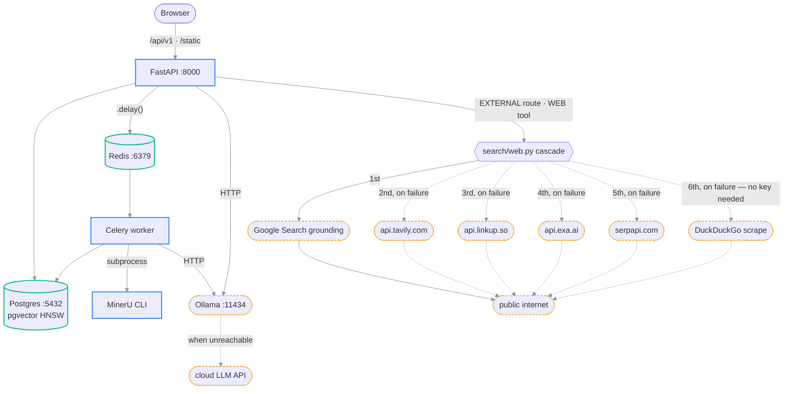

# Runtime topology & ports

> **What this is:** what runs, where it listens, what talks to what, and which parts are optional.
> Read this before debugging anything that looks like a connection problem.
>
> **Owns:** the service inventory and the network edges between services.
> **Does not own:** how to start them ([setup.md](setup.md)), env-var meanings
> ([configuration.md](../03-reference/configuration.md)).
>
> **Status:** current · **Last verified:** 2026-07-25 against
> [`docker-compose.yml`](../../backend/docker-compose.yml) and
> [`main.py`](../../backend/app/main.py)
> **Verify with:** `docker compose ps` · `curl localhost:8000/api/v1/health`

---

## Service inventory

| Service | Default URL | Required | Notes |
| --- | --- | --- | --- |
| FastAPI | `http://localhost:8000` | Yes | `uvicorn app.main:app` |
| Vite dev server | `http://localhost:5173` | Dev only | Proxies `/api` and `/static` to `:8000` |
| PostgreSQL | `localhost:5432` | Yes | `pgvector/pgvector:pg16`; needs `vector` + `uuid-ossp` |
| Redis | `localhost:6379` | Yes | Celery broker **and** result backend |
| Celery worker | n/a | Yes | No port; consumes from Redis |
| Ollama | `http://localhost:11434` | Optional* | Chat / VLM / classifier / embedding host |
| MinerU CLI | binary on `$PATH` | Yes | Subprocess, not a service. `ALLOW_PYMUPDF_FALLBACK=true` degrades gracefully |
| Web search | n/a | Optional | Cascade of 6 providers (google, tavily, linkup, exa, serpapi, then duckduckgo — see `search/web.py`); no local service. The last needs no key, so this is never fully off. |
| autoheal | n/a | Compose only | Restarts containers whose healthcheck goes unhealthy |

\* **One AI backend is required**: either Ollama or a cloud API key. Neither ⇒ chat returns
503 `NO_LLM_CONFIGURED` with configure-me instructions, but stored papers still serve.

---

## Topology

```text
        ┌──────────────────────────────────────┐
        │  Browser                             │
        │  dev:  localhost:5173  (Vite)        │
        │  prod: localhost:8000  (SPA from API)│
        └──────────────┬───────────────────────┘
                       │ /api/v1/*  ·  /static/*
                       │ (dev: proxied by Vite → :8000)
                       ▼
        ┌──────────────────────────────────────┐
        │  FastAPI  :8000                      │
        │   middleware: CORS → RateLimit →     │
        │               SecurityHeaders        │
        │   /api/v1/*         (router)         │
        │   /static/images    /static/assets   │
        │   /static/extracted /static/images/research
        └───┬──────────────────────┬───────────┘
            │ asyncpg              │ .delay()
            ▼                      ▼
  ┌───────────────────┐   ┌──────────────────┐
  │ Postgres :5432    │   │ Redis :6379      │
  │  + pgvector HNSW  │   │  broker + result │
  └───────────────────┘   └────────┬─────────┘
            ▲                      │ consumes
            │ psycopg2 (sync)      ▼
            │            ┌──────────────────────────┐
            └────────────┤ Celery worker            │
                         │  process_ingestion       │
                         │  embed_document          │
                         │  generate_section_summaries
                         │  reconstruct_reading_order
                         └──┬────────────────┬──────┘
                            │ subprocess     │ HTTP
                            ▼                ▼
                  ┌──────────────┐  ┌─────────────────────────┐
                  │ MinerU CLI   │  │ Ollama :11434           │
                  │ PDF → md+img │  │  chat · vlm · classifier│
                  └──────────────┘  │  · embedding            │
                                    │ OR cloud API fallback   │
                                    └─────────────────────────┘

                  ┌──────────────────────────────┐
                  │ search/web.py — cascade,     │
                  │ first configured one to      │
                  │ answer wins:                 │
                  │   1. google    4. exa        │  ⚠ leaves the host
                  │   2. tavily    5. serpapi     ─┼──► whichever answers
                  │   3. linkup    6. duckduckgo  │     (query string only)
                  └──────────────────────────────┘     — #6 needs no key,
                     the ONLY egress to the public internet, and only on the   always eligible
                     EXTERNAL route or the paper agent's WEB tool
```

### (rendered)



> 🟦 owned process · 🟩 data store · 🟨 external / optional.
> Two edges are worth memorising: **the worker talks to Postgres over psycopg2 (sync), the API
> over asyncpg (async)**, two separate pools against one database; and **web search is the only
> arrow leaving the machine**, which is what makes the local-first claim true.

---

## Deployment modes

| Mode | Command | UI | API | Notes |
| --- | --- | --- | --- | --- |
| Host dev | `uvicorn` + `npm run dev` + compose infra | `:5173` | `:8000` | Hot reload both sides. The normal loop. |
| Single-port server | `docker compose --profile server up` | `:8000` | `:8000` | `frontend-build` one-shot builds the SPA into a volume; the API serves it at `/`. No CORS. |
| LAN server | `backend/start-lan-server.sh` | `:8000` | `:8000` | Same as above + removes the upload cap, prints the LAN URL, tears down on Ctrl+C. |

⚠ In compose, `OLLAMA_BASE_URL` is deliberately **not** inherited from the host `.env`. It is
hardcoded to `http://host.docker.internal:11434`, because a value like `http://localhost:11434`
inside a container resolves to *that container* and every model call fails with
connection-refused. The four web search providers don't have this trap — they're all reached over
the public internet by a fixed hostname, not a compose service name, so their API keys ARE
inherited from the host `.env` unchanged.

---

## Recovery layers

Two mechanisms, covering two different failure modes:

| Mechanism | Covers | Applies to |
| --- | --- | --- |
| `restart: unless-stopped` | Process **exits**, crash, OOM-kill (exit 137) | `postgres`, `redis`, `celery_worker`, `api` |
| `autoheal` watchdog | Process **hangs**, running but healthcheck unhealthy | containers labeled `autoheal=true`: `api`, `postgres`, `redis` |

`restart:` cannot see a hung-but-alive container, which is why autoheal exists; it needs
`/var/run/docker.sock` mounted to issue restarts. Neither mechanism touches data volumes.

The worker has a memory limit (`WORKER_MEM_LIMIT`, default 12 G) so a MinerU OOM on a large book
kills *that container* cleanly and it restarts, rather than pressuring the host. ⚠ This limit must
stay below Docker Desktop's total VM memory or the worker is OOM-killed mid-extraction every time.
