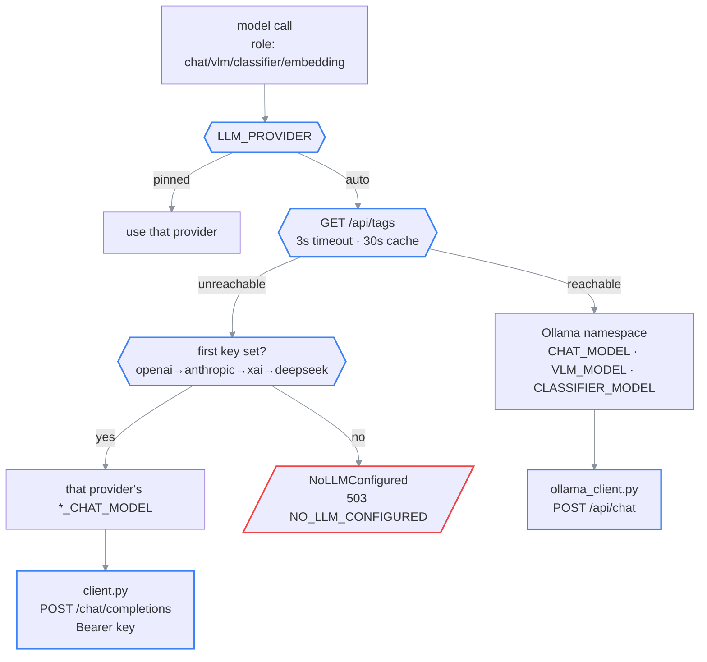

# AI backend: provider resolution and roles

> **What this is:** how the app decides which model answers which call. Nothing in the codebase
> hardcodes a model or a provider; this doc explains the machinery that replaces that.
>
> **How to read it:** §1 the two namespaces → §2 the resolution chain → §3 roles →
> §4 the embedding pin → §5 sharp edges.
>
> **Owns:** provider selection, role→model mapping, embedding-model lifecycle.
> **Does not own:** env-var defaults ([configuration.md](../03-reference/configuration.md)),
> prompt content ([chat-and-ask.md](chat-and-ask.md)).
>
> **Status:** current · **Last verified:** 2026-07-25 against
> [`llm/resolver.py`](../../backend/app/llm/resolver.py) and
> [`llm/client.py`](../../backend/app/llm/client.py)
> **Verify with:** `cd backend && pytest tests/test_provider_resolver.py -v`

---

## Invariants

1. No call site names a model. Call sites pass a **role** (`chat`, `vlm`, `classifier`,
   `embedding`); the resolver maps role → model for the active provider.
2. An Ollama tag is **never** sent to a cloud API, and vice versa: the two namespaces are
   disjoint (§1).
3. A missing AI backend is never fatal at startup. It logs, and chat requests fail with
   503 `NO_LLM_CONFIGURED` carrying configure-me instructions. Stored papers still serve.
4. Within one process lifetime, the **embedding** provider is pinned after first successful
   resolution: a mid-run provider switch can never mix incomparable vectors into one library.
5. Provider reachability is probed, not assumed, and the probe result is cached for 30 s.

---

## 1. Two model namespaces

This is the detail that surprises people, so it comes first.

```text
OLLAMA NAMESPACE                        CLOUD NAMESPACE
(also used by LLM_PROVIDER=custom)      (one setting per provider)
────────────────────────────────        ──────────────────────────────────
CHAT_MODEL         gemma4:26b           OPENAI_CHAT_MODEL     gpt-4o
VLM_MODEL          (→ CHAT_MODEL)       ANTHROPIC_CHAT_MODEL  claude-sonnet-4-6
CLASSIFIER_MODEL   (→ CHAT_MODEL)       XAI_CHAT_MODEL        grok-4
EMBEDDING_MODEL    qwen3-embedding:0.6b DEEPSEEK_CHAT_MODEL   deepseek-chat  ⚠ no vision
                                        OPENAI_EMBEDDING_MODEL text-embedding-3-small
```

Because the namespaces are separate, switching to a cloud provider requires **pasting one API key
and nothing else**, your Ollama tags stay where they are and are simply not used.

---

## 2. Resolution chain

```text
                      ┌─────────────────────────┐
   every model call ──►  LLM_PROVIDER == ?      │
                      └───────────┬─────────────┘
                                  │
           ┌──────────────────────┼──────────────────────┐
           │ "auto" (default)     │ pinned               │
           ▼                      ▼                      │
   probe GET {OLLAMA_BASE_URL}/api/tags            use that provider
   timeout 3s · result cached 30s                  (error if unusable)
           │
     ┌─────┴─────┐
  reachable   unreachable
     │             │
     ▼             ▼
  OLLAMA      walk cloud keys in order:
  namespace   openai → anthropic → xai → deepseek
                   │                          │
             first key set                 none set
                   │                          │
                   ▼                          ▼
             that provider's         raise NoLLMConfigured
             CLOUD namespace         → HTTP 503 NO_LLM_CONFIGURED
                                     → verbatim setup instructions
```

### (rendered)



Transport differs by target: Ollama goes through
[`ollama_client.py`](../../backend/app/llm/ollama_client.py) (`POST {base}/api/chat`); every cloud
provider speaks the OpenAI-compatible `POST {base}/chat/completions` with a Bearer key. All four
cloud providers therefore share one code path.

⚠ `httpx.Timeout` is `connect=10s, **read=600s**, write=10s, pool=10s`. The 10-minute read is
deliberate: a large local model on cold start will blow through any default, and the previous
120-second timeout produced HTTP 500s at exactly 2 minutes.

---

## 3. Roles

| Role | Ollama model | Cloud model | Called from | Frequency |
| --- | --- | --- | --- | --- |
| `chat` | `CHAT_MODEL` | `*_CHAT_MODEL` | orchestrator, synthesis, **paper agent** | 1× per question (agent mode: 1× per tool round + 1) |
| `vlm` | `VLM_MODEL` → `CHAT_MODEL` | provider chat model | `figure_describer_sync` | 1× **per figure**, at ingestion |
| `classifier` | `CLASSIFIER_MODEL` → `CHAT_MODEL` | provider chat model | `router.py`, `guardrail.py` | ≤ 2× per question |
| `embedding` | `EMBEDDING_MODEL` | `*_EMBEDDING_MODEL` | ingestion + GLOBAL route | 1× per chunk, then 1× per GLOBAL query |
| reading order | (chat role) | (chat role) | `reading_order.py` | on demand; long-context, slow |
| section summary | (chat role) | (chat role) | `section_summarizer_sync` | multi-pass per document |

## 3b. Per-note model override

⚠ **The one place a call site does name a model.** A margin note may specify one, chosen by the
reader from a picker; it is passed through `llm_client.chat/stream_chat(model=…)` and overrides
the role mapping for that call only.

The catalog ([`llm/catalog.py`](../../backend/app/llm/catalog.py)) reads Ollama's `/api/tags` and
splits it:

- **local**: real weights on disk, non-zero `size`.
- **cloud**: run on Ollama's infrastructure, name ending in `cloud`, `size: 0`.

Embedding models are filtered out; they share the tag list but cannot chat. When Ollama is
unreachable the catalog degrades to the single configured cloud model.

⚠ This does not break invariant 1. Nothing *hardcodes* a model: the name comes from the user at
request time, and `requested_model` is persisted on the note so the answer stays attributable. A
follow-up reuses its parent's model and cannot be overridden.

**The classifier row is the performance lever.** Router and guardrail are cheap classification
problems that a 1–3B model answers instantly. Left empty they inherit `CHAT_MODEL`, putting two
full-size model calls in front of every question. Setting `CLASSIFIER_MODEL` to a small model is
usually the single biggest `/ask` speedup available.

Two further mitigations already in place: the orchestrator runs guardrail and router
**concurrently** via `asyncio.gather` (they depend only on the prompt), and
`GUARDRAIL_SKIP_IN_PAPER=true` short-circuits the guardrail entirely while reading a paper. In the
common case an in-paper question costs **one** classifier call, not two.

**The `vlm` row is the cost lever.** It runs once per figure at ingestion time, so a figure-heavy
paper is dozens of vision calls before anyone asks anything. On a metered provider, this, not
chat, is where the money goes.

---

## 4. The embedding pin

Vectors produced by different models are not comparable. Mixing them inside one library silently
destroys retrieval quality: there is no error, just worse answers. Three mechanisms defend this:

1. **Per-process pinning.** After the first successful embedding resolution, the choice is fixed
   for that process. A transient Ollama hiccup mid-ingestion cannot switch models halfway.
2. **Startup mismatch detection.** The lifespan compares stored `chunk_embeddings.embedding_model`
   against the active target:

   | `EMBEDDING_PROVIDER` | Stored ≠ active | Action |
   | --- | --- | --- |
   | pinned (`ollama`/`openai`/`custom`) | yes | ⚠ **Wipes all vectors and re-embeds the library.** Summaries and figure descriptions are prompt-hash cached and do not re-run. |
   | `auto` | yes | Loud warning only: a temporarily-down Ollama must never trigger a destructive re-embed. |

3. **Dimension normalization.** Whatever the model emits is coerced to `VECTOR_DIMENSION`
   (default 1024): larger outputs are truncated and re-normalized (valid for MRL-trained models
   like `qwen3-embedding` and `text-embedding-3-*`); smaller ones are
   zero-padded. ⚠ Keep it ≤ 2000: pgvector's HNSW index has a hard 2000-dim limit, and without the
   index every search degrades to a brute-force scan.

⚠ Changing `VECTOR_DIMENSION` or, with a pinned provider, `EMBEDDING_MODEL`, is a **destructive
operation with no confirmation prompt**. It happens on the next start.

---

## 5. Known sharp edges

- ⚠ **Ollama cloud tags blur the local/cloud line.** A tag like `gemma4:31b-cloud` is served
  through `localhost:11434` but proxied by the Ollama daemon to `ollama.com`. The resolver
  correctly reports provider `ollama`, so **traces cannot distinguish a cloud-served answer from a
  local one**: the API response echoes the model name without the `-cloud` suffix. See
  [plans/ollama-local-gemma4-cloud.md](../plans/ollama-local-gemma4-cloud.md).
- **DeepSeek has no vision.** With it active, figure images cannot be described; captions still
  work. Nothing errors: the feature just quietly does less.
- **The 30 s probe cache means failover is not instant.** When Ollama dies with a cloud key
  present, up to 30 seconds of requests can fail before `auto` reroutes.
- **`custom` reuses the Ollama namespace.** `LLM_PROVIDER=custom` + `LLM_BASE_URL` speaks
  OpenAI-compatible HTTP but reads `CHAT_MODEL`, not `OPENAI_CHAT_MODEL`. Reasonable once you know
  it; surprising until then.
