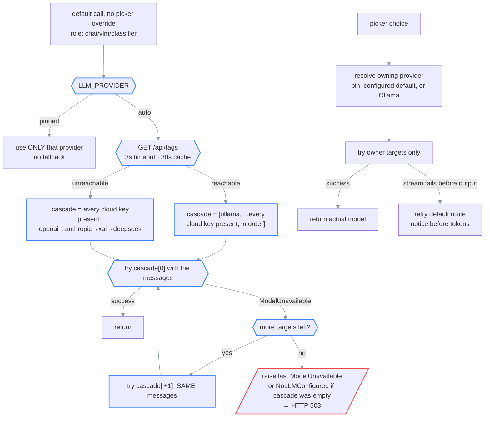

# AI backend: provider resolution and roles

> **What this is:** how the app decides which model answers which call. Ordinary call sites use a
> role; this doc explains provider selection, model ownership, and the reader's request-time choice.
>
> **How to read it:** §1 the two namespaces → §2 the resolution chain → §3 roles →
> §3b the reader model override → §4 the embedding pin → §5 sharp edges.
>
> **Owns:** provider selection, role→model mapping, embedding-model lifecycle.
> **Does not own:** env-var defaults ([configuration.md](../03-reference/configuration.md)),
> prompt content ([chat-and-ask.md](chat-and-ask.md)).
>
> **Status:** current · **Last verified:** 2026-10-06 against
> [`llm/resolver.py`](../../backend/app/llm/resolver.py) and
> [`llm/client.py`](../../backend/app/llm/client.py), [`llm/catalog.py`](../../backend/app/llm/catalog.py),
> and [`llm/availability.py`](../../backend/app/llm/availability.py)
> **Verify with:** `cd backend && pytest tests/test_provider_resolver.py tests/test_llm_client_cascade.py tests/test_model_availability.py tests/test_paper_agent_model_agnostic.py -v`

---

## Invariants

1. Ordinary call sites pass a **role** (`chat`, `vlm`, `classifier`, `embedding`); the resolver
   maps role → model for the active provider. A reader's explicit picker choice is the request-time
   exception and is routed to its owning provider (§3b).
2. A model is sent only to its owner. `MODEL_PROVIDER_PINS` identifies exceptional ownership
   (currently Muse → NVIDIA); other Ollama catalog tags stay on Ollama (§3b).
3. A missing AI backend is never fatal at startup. It logs, and chat requests fail with
   503 `NO_LLM_CONFIGURED` carrying configure-me instructions. Stored papers still serve.
4. Within one process lifetime, the **embedding** provider is pinned after first successful
   resolution: a mid-run provider switch can never mix incomparable vectors into one library.
   Chat without an explicit picker choice uses the default route. An explicit streamed picker
   request may retry the default route only before answer text is visible, and shows a notice.
5. The default `LLM_PROVIDER=auto` route caches Ollama reachability for 30 s to choose its first
   target. An explicit picker model skips that probe and goes to its owner; see §2 and §3b.

---

## 1. Two model namespaces

This is the detail that surprises people, so it comes first.

```text
OLLAMA NAMESPACE                        CLOUD NAMESPACE
(also used by LLM_PROVIDER=custom)      (one setting per provider)
────────────────────────────────        ──────────────────────────────────
CHAT_MODEL         gemma4:26b           OPENAI_CHAT_MODEL     gpt-4o
VLM_MODEL          (→ CHAT_MODEL)       ANTHROPIC_CHAT_MODEL  claude-sonnet-4-6
CLASSIFIER_MODEL   (→ CHAT_MODEL)       XAI_CHAT_MODEL        grok-4
EMBEDDING_MODEL    qwen3-embedding:0.6b DEEPSEEK_CHAT_MODEL   deepseek-chat  ⚠ no vision
                                        OPENAI_EMBEDDING_MODEL text-embedding-3-small
```

Because the namespaces are separate, switching to a cloud provider requires **pasting one API key
and nothing else**, your Ollama tags stay where they are and are simply not used.

---

## 2. Resolution chain

Chat with no explicit model is a default route: `app.llm.client`'s `chat()` / `stream_chat()` /
`chat_sync()` try the targets from `resolver.llm_cascade()` in order. Each target uses its own
configured role model. Under `LLM_PROVIDER=auto`, the resolver probes Ollama's `/api/tags` (3 s
timeout, 30 s cache); if reachable the order is Ollama then configured cloud keys, otherwise the
configured cloud providers. A configured `LLM_PROVIDER` uses only that provider.

A request-time picker model follows different routing. `resolver.targets_for(model)` resolves
`MODEL_PROVIDER_PINS` first, then configured provider defaults, then treats other catalog names as
Ollama tags. It returns only that owner’s target or key-rotation targets; the picked name is never
sent to another provider under its own name. In the reader stream, if that model fails before any
answer output, `stream_chat()` can try the no-override default route. The successful fallback is
buffered until it has answered, then a `notice` event is emitted before its tokens. Its `done.model`
is the actual answering model. Once answer text is visible, a later failure raises without retry.
This closes the gap where a bad tag, plan restriction, or provider error failed without explaining
which model answered.

```text
default call (no picker override)
              │
              ▼
       LLM_PROVIDER == ?
         /           \
      auto            pinned
       │                 │
       │                 └── use only that provider
       │                     (no cross-provider fallback)
       ▼
  probe Ollama /api/tags (3s, 30s cache)
     /             \
 reachable      unreachable
     │                 │
     ▼                 ▼
 [Ollama, cloud   [configured cloud
  keys...]         keys...]
     \                 /
      └──── try in order ────┘
                 │
        success or all failed

picker choice ──► owner targets only
                  MODEL_PROVIDER_PINS, configured cloud default, or Ollama
                       │
                  pre-output stream failure
                       ▼
              retry the default route with its own role models
              notice before fallback tokens; done.model is actual model
```

### (rendered)


```mermaid
%%{init: {'themeVariables': {'fontFamily': 'ui-monospace, SFMono-Regular, Menlo, monospace', 'lineColor': '#8b949e'}}}%%
flowchart TD
    C[default call, no picker override<br/>role: chat/vlm/classifier] --> P{{LLM_PROVIDER}}
    P -->|pinned| USE[use ONLY that provider<br/>no fallback]
    P -->|auto| PROBE{{"GET /api/tags<br/>3s timeout · 30s cache"}}
    PROBE -->|reachable| CASC["cascade = [ollama, ...every<br/>cloud key present, in order]"]
    PROBE -->|unreachable| CASC2["cascade = every cloud key<br/>present: openai→anthropic→xai→deepseek"]
    CASC --> TRY{{"try cascade[0] with the messages"}}
    CASC2 --> TRY
    TRY -->|success| DONE[return]
    TRY -->|ModelUnavailable| NEXT{{"more targets left?"}}
    NEXT -->|yes| TRY2["try cascade[i+1], SAME messages"]
    TRY2 --> TRY
    NEXT -->|no| ERR[/raise last ModelUnavailable<br/>or NoLLMConfigured if cascade was empty<br/>→ HTTP 503/]
    X[picker choice] --> OWNER[resolve owning provider<br/>pin, configured default, or Ollama]
    OWNER --> ONLY[try owner targets only]
    ONLY -->|success| PICK_DONE[return actual model]
    ONLY -->|stream fails before output| RETRY[retry default route<br/>notice before tokens]

    classDef owned stroke:#3b82f6,stroke-width:2px
    classDef bad stroke:#ef4444,stroke-width:2px
    class P,PROBE,CASC,CASC2,TRY,NEXT,TRY2 owned
    class ERR bad
```

Transport differs by target: Ollama goes through
[`ollama_client.py`](../../backend/app/llm/ollama_client.py) (`POST {base}/api/chat`); every cloud
provider speaks the OpenAI-compatible `POST {base}/chat/completions` with a Bearer key. All cloud
providers therefore share one code path — see `app.llm.client._chat_once` /
`_stream_once` / `_chat_sync_once`.

⚠ **Streaming retry boundary.** For the default cascade, a failure after visible output raises
instead of restarting on another target. For an explicit picker choice, a failure before visible
output can try the default route; the stream emits a notice before fallback tokens. A failure after
visible output does not retry. Non-streaming `chat()` and `chat_sync()` use the explicit model's
owner targets and surface an error if they fail.

⚠ `httpx.Timeout` is `connect=10s, **read=600s**, write=10s, pool=10s`, per target attempted. The
10-minute read is deliberate: a large local model on cold start will blow through any default, and
the previous 120-second timeout produced HTTP 500s at exactly 2 minutes. This means a worst case
where every configured provider hangs (not fails fast) rather than erroring could take a while to
exhaust the whole cascade — in practice, every failure mode observed so far (bad model, rate limit,
auth error, connection refused) fails within a few seconds, not minutes.

---

## 3. Roles

| Role | Ollama model | Cloud model | Called from | Frequency |
| --- | --- | --- | --- | --- |
| `chat` | `CHAT_MODEL` | `*_CHAT_MODEL` | orchestrator, synthesis, **paper agent** | 1× per question (agent mode: 1× per tool round + 1) |
| `vlm` | `VLM_MODEL` → `CHAT_MODEL` | provider chat model | `figure_describer_sync` | 1× **per figure**, at ingestion |
| `classifier` | `CLASSIFIER_MODEL` → `CHAT_MODEL` | provider chat model | `router.py`, `guardrail.py` | ≤ 2× per question |
| `embedding` | `EMBEDDING_MODEL` | `*_EMBEDDING_MODEL` | ingestion + GLOBAL route | 1× per chunk, then 1× per GLOBAL query |
| reading order | (chat role) | (chat role) | `reading_order.py` | on demand; long-context, slow |
| section summary | (chat role) | (chat role) | `section_summarizer_sync` | multi-pass per document |

## 3b. Reader model override

⚠ The reader picker is the request-time model override. It is passed through
`llm_client.stream_chat(model=…)`, and the resolver targets the model's owner rather than applying
the ordinary provider cascade. `MODEL_PROVIDER_PINS` currently maps
`meta/muse-glimmer-30b` to NVIDIA and preserves NVIDIA key rotation. Configured provider defaults
also resolve to their provider; other Ollama catalog tags route only to Ollama.

The catalog ([`llm/catalog.py`](../../backend/app/llm/catalog.py)) filters embedding models and
classifies Ollama tags from the endpoint as well as tag metadata. Remote `OLLAMA_BASE_URL` endpoints
are cloud, while local addresses and the usual local HTTP `:11434` endpoint remain local; cloud
suffixes and zero-size rows are cloud signals too. Provider-pinned models are included when their
provider is configured.

Availability comes from real chat outcomes, not catalog probes. [`llm/availability.py`](../../backend/app/llm/availability.py)
caches success and provider HTTP 402, 401, 403, or 404 responses in Redis for six hours. The
catalog displays the provider-specific reason for a cached failure. Missing cache entries, malformed
values, Redis timeouts, and Redis errors default to available. The shared frontend picker shows
unavailable entries disabled after Local and Cloud choices. `requested_model` is persisted on the
note and reused by follow-ups so the selection remains attributable; if a streamed request falls
back before output, a notice appears and terminal metadata names the actual answering model.

**The classifier row is the performance lever.** Router and guardrail are cheap classification
problems that a 1–3B model answers instantly. Left empty they inherit `CHAT_MODEL`, putting two
full-size model calls in front of every question. Setting `CLASSIFIER_MODEL` to a small model is
usually the single biggest `/ask` speedup available.

Two further mitigations already in place: the orchestrator runs guardrail and router
**concurrently** via `asyncio.gather` (they depend only on the prompt), and
`GUARDRAIL_SKIP_IN_PAPER=true` short-circuits the guardrail entirely while reading a paper. In the
common case an in-paper question costs **one** classifier call, not two.

**The `vlm` row is the cost lever.** It runs once per figure at ingestion time, so a figure-heavy
paper is dozens of vision calls before anyone asks anything. On a metered provider, this, not
chat, is where the money goes.

---

## 4. The embedding pin

Vectors produced by different models are not comparable. Mixing them inside one library silently
destroys retrieval quality: there is no error, just worse answers. Three mechanisms defend this:

1. **Per-process pinning.** After the first successful embedding resolution, the choice is fixed
   for that process. A transient Ollama hiccup mid-ingestion cannot switch models halfway.
2. **Startup mismatch detection.** The lifespan compares stored `chunk_embeddings.embedding_model`
   against the active target:

   | `EMBEDDING_PROVIDER` | Stored ≠ active | Action |
   | --- | --- | --- |
   | pinned (`ollama`/`openai`/`custom`) | yes | ⚠ **Wipes all vectors and re-embeds the library.** Summaries and figure descriptions are prompt-hash cached and do not re-run. |
   | `auto` | yes | Loud warning only: a temporarily-down Ollama must never trigger a destructive re-embed. |

3. **Dimension normalization.** Whatever the model emits is coerced to `VECTOR_DIMENSION`
   (default 1024): larger outputs are truncated and re-normalized (valid for MRL-trained models
   like `qwen3-embedding` and `text-embedding-3-*`); smaller ones are
   zero-padded. ⚠ Keep it ≤ 2000: pgvector's HNSW index has a hard 2000-dim limit, and without the
   index every search degrades to a brute-force scan.

⚠ Changing `VECTOR_DIMENSION` or, with a pinned provider, `EMBEDDING_MODEL`, is a **destructive
operation with no confirmation prompt**. It happens on the next start.

---

## 5. Known sharp edges

- ⚠ **Ollama cloud tags blur the local/cloud line.** A tag like `gemma4:31b-cloud` is served
  through `localhost:11434` but proxied by the Ollama daemon to `ollama.com`. The resolver
  correctly reports provider `ollama`, so **traces cannot distinguish a cloud-served answer from a
  local one**: the API response echoes the model name without the `-cloud` suffix. See
  [plans/ollama-local-gemma4-cloud.md](../plans/ollama-local-gemma4-cloud.md).
- **DeepSeek has no vision.** With it active, figure images cannot be described; captions still
  work. Nothing errors: the feature just quietly does less.
- ~~**The 30 s probe cache means failover is not instant.**~~ **Fixed 2026-09-01** by the cascade
  in §2: the probe only decides whether Ollama is *attempted* first, not whether the request
  ultimately succeeds. If the probe is stale (says reachable, Ollama actually isn't) the real call
  fails within its own connect timeout and falls through to the next configured provider on that
  SAME request — no 30-second window where requests are simply lost.
- **`custom` reuses the Ollama namespace.** `LLM_PROVIDER=custom` + `LLM_BASE_URL` speaks
  OpenAI-compatible HTTP but reads `CHAT_MODEL`, not `OPENAI_CHAT_MODEL`. Reasonable once you know
  it; surprising until then. ⚠ `custom` is also always a single target: `LLM_PROVIDER=custom`
  counts as a pin (§2), so it never falls through to anything else even in "auto"'s spirit.
- **Embeddings have no cascade.** Only chat retries across providers — see invariant 4. A mid-run
  embedding failure still surfaces immediately rather than silently switching models, because
  vectors from two different models are not comparable within one library.
