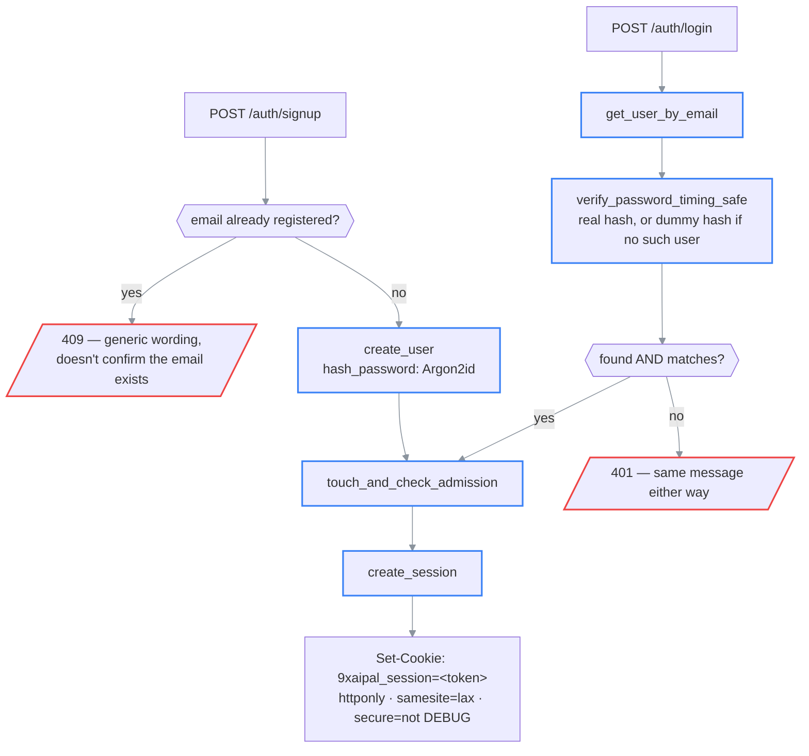
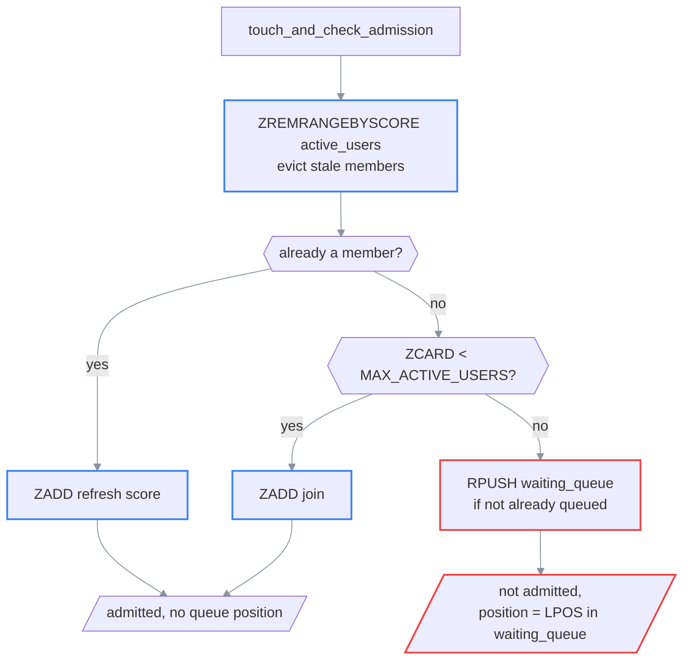

# Auth: sessions, signup, and per-user data isolation

> **What this is:** how a request becomes "logged in as user X", how signup works, how the site
> caps concurrent usage, and how every other table in the app scopes itself to one user.
>
> **How to read it:** §1 signup/login/logout → §2 the session → §3 per-user data isolation →
> §4 capacity: the waiting room → §5 sharp edges.
>
> **Owns:** session mechanics, password handling, the concurrent-user capacity cap, the
> ownership-scoping pattern used by every other resource.
> **Does not own:** the `users` table's columns ([database-schema.md](../03-reference/database-schema.md)),
> the `MAX_ACTIVE_USERS` / `ACTIVE_WINDOW_SECONDS` / `SESSION_*` env vars
> ([configuration.md](../03-reference/configuration.md)),
> exact request/response shapes ([api.md](../03-reference/api.md)).
>
> **Status:** current · **Last verified:** 2026-09-01 against
> [`core/auth.py`](../../backend/app/core/auth.py),
> [`core/capacity.py`](../../backend/app/core/capacity.py),
> [`api/deps.py`](../../backend/app/api/deps.py), and
> [`endpoints/auth.py`](../../backend/app/api/v1/endpoints/auth.py) (`feat/open-signup-capacity-limits`)
> **Verify with:** `cd backend && pytest tests/test_auth_http.py tests/test_ownership.py tests/test_capacity.py -v`

---

## Invariants

1. Every route except `/health` and `/auth/*` itself requires a valid session: enforced by the
   `get_current_user` dependency, not by convention.
2. A request for a resource the caller doesn't own **404s**, never 403: a 403 would confirm the
   resource exists, just not to you. `get_current_user` only establishes *who is asking*; ownership
   is a separate check at the point each resource is loaded.
3. The session is a random opaque token, never a JWT or anything the client can decode or forge.
   Redis holds the only mapping from token → user.
4. Password comparisons and "does this email exist" never differ in observable timing.

---

## 1. Signup, login, logout

```text
POST /auth/signup                          POST /auth/login
  │                                           │
  ▼                                           ▼
email already registered?              get_user_by_email(email)
  │yes → 409 "unable to create              │
  │      account with these details"        ▼
  │no                                verify_password_timing_safe(
  ▼                                     password,
create_user(email, hash_password(pw))    user.password_hash if user else None
  │                                     )        ── real Argon2 verify either way,
  ▼                                               against a precomputed dummy hash
touch_and_check_admission(user.id)               when the email doesn't exist
  │                                           │
  ▼                                     user found AND password ok?
create_session(user.id)  ◄─────────────────────┤no → 401 "Invalid email or password"
  │                                           │yes
  ▼                                           ▼
Set-Cookie: 9xaipal_session=<token>;    touch_and_check_admission(user.id)
  httponly; samesite=lax;                     │
  secure=not DEBUG                            ▼
                                         create_session(user.id) ──► Set-Cookie (as left)
```

### (rendered)



Signup is open to anyone — there's no gate on account *creation* beyond the email not already
being registered. The 409 for a duplicate email is deliberately generic ("unable to create an
account with these details") rather than "email already registered": with signup public, the old
specific wording would let anyone farm which emails have accounts on the site just by trying to
sign up with them. `create_session` runs unconditionally on both signup and login —
`touch_and_check_admission` (§4) never blocks getting a session, only whether the account counts
as one of the `MAX_ACTIVE_USERS` concurrently-active slots; a fresh signup can land straight in
the waiting room if the site's already at capacity.

Passwords are hashed with Argon2id (`argon2-cffi`'s `PasswordHasher`, default parameters).
`login`'s "no such account" and "wrong password" paths are deliberately indistinguishable: a
precomputed dummy hash (`_DUMMY_HASH`, hashed once at import time) stands in for a real one when
the email isn't found, so both paths pay the same real Argon2 verify cost and take similar wall
time. Skipping the verify for an unknown email would make lookups measurably faster than wrong
passwords, a timing side-channel that discloses which emails are registered.

`logout` (`POST /auth/logout`) is idempotent: no session, or an already-expired one, still
succeeds; it also calls `capacity.release(user_id)` so the freed slot is available to the waiting
queue immediately, not after the 5-minute idle window (§4). `GET /auth/me` needs no auth at all:
the frontend calls it once on load, and then polls it while queued, to find out whether anyone is
logged in and whether they're currently admitted
(`{"user": <UserResponse> | null, "admitted": bool, "queue_position": int | null}`).

---

## 2. The session

Redis-backed opaque token, not a signed cookie (JWT-style). [`core/auth.py`](../../backend/app/core/auth.py):

```python
token = secrets.token_urlsafe(32)                      # 256 bits, unguessable
redis.set(f"session:{token}", json({"user_id": ..., "created_at": ...}), ex=SESSION_TTL_SECONDS)
```

⚠ **Why opaque-and-server-side instead of a signed cookie.** A signed cookie needs no storage and
no lookup, but it can't be revoked short of rotating the signing secret, which logs out every
user at once. Redis is already a hard dependency (Celery's broker), so an opaque token costs zero
new infrastructure and buys real server-side revocation: `delete_session` removes exactly one
key, exactly one user, immediately.

**Sliding TTL.** `get_session_user_id` refreshes the key's expiry (`EXPIRE`) on every lookup, so
an active user is never logged out mid-session: only `SESSION_TTL_SECONDS` (default 30 days) of
*inactivity* expires it.

**Cookie flags:** `httponly` (no JS access, defeats a whole class of XSS-driven token theft),
`samesite=lax`, `secure=not settings.debug`. The `secure=not debug` inversion matters for local
testing: a plain-HTTP test client (or `httpx.ASGITransport` in pytest) can't see a `Secure`
cookie, so tests need `DEBUG=true` the same way a non-TLS dev server does, not a workaround, the
correct behavior for a non-TLS target.

`SameSite=Lax` is sufficient here without a separate CSRF token: `/auth/*` and every mutating
route are JSON POSTs with a non-simple `Content-Type`, so a cross-origin request needs a CORS
preflight first, and `CORSMiddleware` never allows a wildcard origin alongside
`allow_credentials=True`. If `CORS_ORIGINS` is ever loosened to something broader, this reasoning
needs revisiting.

`get_current_user` ([`api/deps.py`](../../backend/app/api/deps.py)) is the FastAPI dependency
every protected route carries. It's a thin wrapper: `_resolve_session_user` does the pure session
lookup (reads the cookie → `get_session_user_id` → loads the user row → 401s if any step fails,
`"Not logged in"` with no cookie, `"Session expired — please log in again"` for a missing/expired
session or a user that no longer exists), then `get_current_user` separately calls
`capacity.touch_and_check_admission` and raises `NotAdmitted` (423, see §4) if the caller isn't
currently one of the admitted slots. `get_current_user_optional`, used only by `GET /auth/me`,
calls `_resolve_session_user` **directly** — it does not go through `get_current_user` — so `/me`
can keep answering 200 with a queue position for a logged-in-but-not-yet-admitted caller instead
of 423ing on the one endpoint that exists to explain *why* they're locked out.

**Auth-specific rate limiting.** `enforce_auth_rate_limit` (`api/deps.py`) is a separate, stricter
Redis-backed limiter on `/auth/signup` and `/auth/login` (10 attempts / 60s per client IP),
deliberately not the app-wide `RateLimitMiddleware`, which is in-memory and per-process (see
[roadmap.md](../roadmap.md)) and nowhere near tight enough to blunt credential stuffing, now that
signup has no invite code to also slow down casual abuse.

---

## 3. Per-user data isolation

Every resource in the app belongs to exactly one user. Two different scoping strategies, chosen
per table:

**Top-level owner tables** (`documents`, `studies`, `sticky_notes`, `conversation_turns`) carry
a direct `user_id` column (nullable at the DB level only; see the ⚠ in
[database-schema.md](../03-reference/database-schema.md)). Every repository function for these
takes `user_id` as a required argument and filters by it in the `WHERE` clause: there is no code
path that lists or fetches one of these without a caller-supplied owner.

**Child tables** (`chunks`, `paper_notes`, `chunk_embeddings`, `ask_traces`, and everything else
that hangs off a `document_id`/`study_id`/etc.) have **no `user_id` column of their own**.
Ownership is established once, at the endpoint boundary, by loading the parent resource scoped to
the caller (e.g. `get_document(db, paper_id, current_user["id"])`, which 404s if it doesn't exist *or*
belongs to someone else), and every child lookup that follows within that request trusts the
already-verified `document_id`/`study_id`. Re-checking ownership on every child row would be
redundant: the parent lookup already proved the caller owns the whole subtree.

```text
GET /papers/{paper_id}/chunks
        │
        ▼
get_document(db, paper_id, current_user.id)   ← the ONE ownership check
        │
   found?  ──no──► 404 DocumentNotFound
        │yes
        ▼
get_document_chunks(db, paper_id, ...)        ← trusts paper_id, no user_id needed here
```

⚠ **Cross-tenant access 404s, not 403s.** A 403 on someone else's paper would confirm to a caller
that the ID exists and belongs to *somebody*, information a non-owner has no business learning.
Every ownership check in the app raises the same `DocumentNotFound`/`StudyNotFound`-style 404 a
truly nonexistent ID would.

**Global-scan endpoints were the actual risk.** Before this retrofit, two code paths did an
unscoped table scan with no owner filter at all: `search/vector` (a standalone endpoint, since
removed entirely because paper-scoped search covers its use case) and `pgvector.py`'s
`search_similar_chunks`/`search_chunks_fulltext`, which now return `[]` instead of scanning the
whole table when called with no document filter, rather than silently searching every user's
chunks.

---

## 4. Capacity: the waiting room

The site runs on one box with one Celery worker (`--concurrency=1`, no autoscaling). Signup being
open means anyone can create an account, so there's a separate, cheap cap on how many people can
be *actively using* the app at once — not an access-control gate, a defensive ceiling for a burst
this box genuinely can't serve. [`core/capacity.py`](../../backend/app/core/capacity.py):

```text
touch_and_check_admission(user_id)             called from: login, signup, get_current_user
        │
        ▼
ZREMRANGEBYSCORE active_users  (now - ACTIVE_WINDOW_SECONDS)   ← evict anyone gone stale
        │
        ▼
already a member of active_users?
   │yes ──► ZADD (refresh score) ──────────────────────────► admitted, no queue position
   │no
   ▼
ZCARD active_users < MAX_ACTIVE_USERS?
   │yes ──► ZADD (join) ───────────────────────────────────► admitted, no queue position
   │no
   ▼
RPUSH waiting_queue (if not already queued) ──► not admitted, position = LPOS in waiting_queue
```



**"Active" is a 5-minute sliding window (`ACTIVE_WINDOW_SECONDS`, default 300), not "has a valid
session"** (sessions last 30 days — using that as the admission signal would mean the cap fills
up permanently after the 30th person ever logs in, and never frees again). `active_users` is a
Redis sorted set, member = `user_id`, score = last-seen unix timestamp; every authenticated
request through `get_current_user` refreshes the score, the same "touch on activity" idiom
`core/auth.py`'s session TTL already uses (§2).

**Admission is sticky.** Once a user is in `active_users`, they keep their slot for as long as
they stay active — a newcomer can never bump someone already using the site, no matter how long
the queue behind them grows. A slot frees two ways: idling past `ACTIVE_WINDOW_SECONDS` (the next
`touch_and_check_admission` call, from anyone, evicts them via `ZREMRANGEBYSCORE`), or logging
out (`capacity.release`, called from `auth.py::logout`, `ZREM`s them immediately — no reason to
make someone who explicitly left wait out the idle window).

**Enforcement, not just decoration.** `get_current_user` raises `NotAdmitted` (`api/errors.py`,
→ **423 Locked**, `{"code": "NOT_ADMITTED", "queue_position": N}`) for every protected route when
the caller isn't admitted — a queued user's requests are actually rejected, not just hidden by
the frontend. `GET /auth/me` is the one exception: it goes through `get_current_user_optional`,
which never raises `NotAdmitted` (§2), so it can keep answering with a queue position for the
waiting-room UI (`WaitingRoomView.tsx`) to poll every few seconds until `admitted` flips true.

**The ingestion queue is the same shape, layered on infrastructure that already existed.** Celery
`--concurrency=1` already serializes paper processing one job at a time — that queue isn't new.
What's new is a ceiling and visibility: `services/ingestion.py::check_queue_capacity` counts
non-terminal `ingestion_jobs` rows and rejects new uploads with **429**
(`{"code": "QUEUE_FULL"}`) once `MAX_QUEUED_INGESTION_JOBS` (default 50) is reached, and
`GET /papers/{id}/progress` reports a 1-based `queue_position` while a job is still queued. Unlike
the user cap, this check runs **before any destructive I/O** at each of its three call sites
(`upload_paper`, URL-import, `reextract_paper`) — `reextract_paper` in particular checks capacity
*before* wiping the existing paper's chunks/embeddings, since rejecting after that point would
leave the paper half-deleted with nothing queued to regenerate it.

⚠ Both caps are per-process-safe by construction, not per-process: they live in Redis, shared
across the API's `--workers 2` uvicorn processes and the Celery worker, unlike an in-memory
`asyncio.Semaphore` (used elsewhere in this codebase for `/ask` concurrency), which would give
each process its own independent cap and silently admit `2×` the configured limit.

---

## 5. Known sharp edges

- ⚠ **`/static/{images,extracted,assets}` bypass this entirely.** They're plain `StaticFiles`
  mounts (`app/main.py`), not FastAPI routes, so `get_current_user` never runs for them. A caller
  who already has a file path (they're UUID-derived, not sequential, so not trivially enumerable,
  but also not access-controlled) reads it with no login and no ownership check. See
  [roadmap.md](../roadmap.md).
- **No password reset, no email verification.** Anyone can sign up, but recovering a lost password
  or verifying an email address is still a manual DB fix out of band, not a self-service flow.
- **A stale tab's 423s aren't given bespoke handling.** If a user is evicted from `active_users`
  mid-session (idle timeout) while a tab is still open and they act again, they'll see a raw 423
  on whatever they clicked rather than being routed straight back to the waiting room — a page
  refresh (which re-runs the `GET /auth/me` gate) resolves it. Acceptable for how rarely a 5-minute
  idle eviction lines up with an in-flight click; revisit if it turns out to bite often.
- **Sessions don't survive a Redis flush.** Since the session store *is* Redis with no fallback,
  clearing Redis (or Redis losing its data) logs out every user at once, the same blast radius a
  signing-secret rotation would have had, just from a different cause. The same flush also empties
  `active_users` and `waiting_queue`, which is harmless: everyone just re-admits on their next
  request, up to the cap again.
