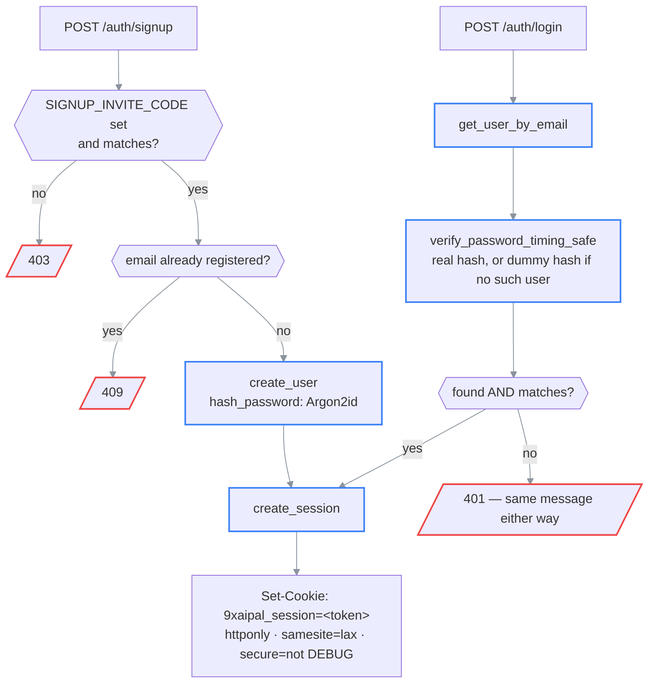

# Auth — sessions, signup, and per-user data isolation

> **What this is:** how a request becomes "logged in as user X", how signup is gated, and how
> every other table in the app scopes itself to one user.
>
> **How to read it:** §1 signup/login/logout → §2 the session → §3 per-user data isolation →
> §4 sharp edges.
>
> **Owns:** session mechanics, password handling, invite-code gating, the ownership-scoping
> pattern used by every other resource.
> **Does not own:** the `users` table's columns ([database-schema.md](../03-reference/database-schema.md)),
> the `SIGNUP_INVITE_CODE` / `SESSION_*` env vars ([configuration.md](../03-reference/configuration.md)),
> exact request/response shapes ([api.md](../03-reference/api.md)).
>
> **Status:** current · **Last verified:** 2026-08-27 against
> [`core/auth.py`](../../backend/app/core/auth.py),
> [`api/deps.py`](../../backend/app/api/deps.py), and
> [`endpoints/auth.py`](../../backend/app/api/v1/endpoints/auth.py) (`main`, 502272b)
> **Verify with:** `cd backend && pytest tests/test_auth_http.py tests/test_ownership.py -v`

---

## Invariants

1. Every route except `/health` and `/auth/*` itself requires a valid session — enforced by the
   `get_current_user` dependency, not by convention.
2. A request for a resource the caller doesn't own **404s**, never 403 — a 403 would confirm the
   resource exists, just not to you. `get_current_user` only establishes *who is asking*; ownership
   is a separate check at the point each resource is loaded.
3. The session is a random opaque token, never a JWT or anything the client can decode or forge.
   Redis holds the only mapping from token → user.
4. Password comparisons and "does this email exist" never differ in observable timing.

---

## 1. Signup, login, logout

```text
POST /auth/signup                          POST /auth/login
  │                                           │
  ▼                                           ▼
SIGNUP_INVITE_CODE set?                get_user_by_email(email)
  │no → 403 "closed"                          │
  │yes                                        ▼
  ▼                                   verify_password_timing_safe(
compare_digest(code, real code)         password,
  │mismatch → 403                        user.password_hash if user else None
  ▼                                     )        ── real Argon2 verify either way,
email already registered?                        against a precomputed dummy hash
  │yes → 409                                      when the email doesn't exist
  │no
  ▼                                           │
create_user(email, hash_password(pw))    user found AND password ok?
  │                                           │no → 401 "Invalid email or password"
  ▼                                           │yes
create_session(user.id)  ◄─────────────────────┘
  │
  ▼
Set-Cookie: 9xaipal_session=<token>; httponly; samesite=lax; secure=not DEBUG
```

### (rendered)



`SIGNUP_INVITE_CODE` gates account *creation*, not login — existing accounts always work,
regardless of the invite code's current value. Comparison is `secrets.compare_digest`, not `==`:
a shared secret compared on every attempt leaks how many leading characters matched via timing
under a naive comparison.

Passwords are hashed with Argon2id (`argon2-cffi`'s `PasswordHasher`, default parameters).
`login`'s "no such account" and "wrong password" paths are deliberately indistinguishable: a
precomputed dummy hash (`_DUMMY_HASH`, hashed once at import time) stands in for a real one when
the email isn't found, so both paths pay the same real Argon2 verify cost and take similar wall
time. Skipping the verify for an unknown email would make lookups measurably faster than wrong
passwords — a timing side-channel that discloses which emails are registered.

`logout` (`POST /auth/logout`) is idempotent: no session, or an already-expired one, still
succeeds. `GET /auth/me` needs no auth at all — the frontend calls it once on load specifically to
find out whether anyone is logged in (`{"user": <UserResponse> | null}`).

---

## 2. The session

Redis-backed opaque token, not a signed cookie (JWT-style). [`core/auth.py`](../../backend/app/core/auth.py):

```python
token = secrets.token_urlsafe(32)                      # 256 bits, unguessable
redis.set(f"session:{token}", json({"user_id": ..., "created_at": ...}), ex=SESSION_TTL_SECONDS)
```

⚠ **Why opaque-and-server-side instead of a signed cookie.** A signed cookie needs no storage and
no lookup — but it can't be revoked short of rotating the signing secret, which logs out every
user at once. Redis is already a hard dependency (Celery's broker), so an opaque token costs zero
new infrastructure and buys real server-side revocation: `delete_session` removes exactly one
key, exactly one user, immediately.

**Sliding TTL.** `get_session_user_id` refreshes the key's expiry (`EXPIRE`) on every lookup, so
an active user is never logged out mid-session — only `SESSION_TTL_SECONDS` (default 30 days) of
*inactivity* expires it.

**Cookie flags:** `httponly` (no JS access — defeats a whole class of XSS-driven token theft),
`samesite=lax`, `secure=not settings.debug`. The `secure=not debug` inversion matters for local
testing: a plain-HTTP test client (or `httpx.ASGITransport` in pytest) can't see a `Secure`
cookie, so tests need `DEBUG=true` the same way a non-TLS dev server does — not a workaround, the
correct behavior for a non-TLS target.

`SameSite=Lax` is sufficient here without a separate CSRF token: `/auth/*` and every mutating
route are JSON POSTs with a non-simple `Content-Type`, so a cross-origin request needs a CORS
preflight first, and `CORSMiddleware` never allows a wildcard origin alongside
`allow_credentials=True`. If `CORS_ORIGINS` is ever loosened to something broader, this reasoning
needs revisiting.

`get_current_user` ([`api/deps.py`](../../backend/app/api/deps.py)) is the FastAPI dependency
every protected route carries: reads the cookie → `get_session_user_id` → loads the user row →
401s if any step fails (`"Not logged in"` with no cookie, `"Session expired — please log in
again"` for a missing/expired session or a user that no longer exists).
`get_current_user_optional` is the same lookup but returns `None` instead of raising — used only
by `GET /auth/me`.

**Auth-specific rate limiting.** `enforce_auth_rate_limit` (`api/deps.py`) is a separate, stricter
Redis-backed limiter on `/auth/signup` and `/auth/login` (10 attempts / 60s per client IP) —
deliberately not the app-wide `RateLimitMiddleware`, which is in-memory and per-process (see
[roadmap.md](../roadmap.md)) and nowhere near tight enough to blunt credential stuffing or
invite-code brute-forcing.

---

## 3. Per-user data isolation

Every resource in the app belongs to exactly one user. Two different scoping strategies, chosen
per table:

**Top-level owner tables** — `documents`, `studies`, `sticky_notes`, `conversation_turns` — carry
a direct `user_id` column (nullable at the DB level only; see the ⚠ in
[database-schema.md](../03-reference/database-schema.md)). Every repository function for these
takes `user_id` as a required argument and filters by it in the `WHERE` clause — there is no code
path that lists or fetches one of these without a caller-supplied owner.

**Child tables** — `chunks`, `paper_notes`, `chunk_embeddings`, `ask_traces`, and everything else
that hangs off a `document_id`/`study_id`/etc. — have **no `user_id` column of their own**.
Ownership is established once, at the endpoint boundary, by loading the parent resource scoped to
the caller (e.g. `get_document(db, paper_id, current_user["id"])` — 404s if it doesn't exist *or*
belongs to someone else), and every child lookup that follows within that request trusts the
already-verified `document_id`/`study_id`. Re-checking ownership on every child row would be
redundant: the parent lookup already proved the caller owns the whole subtree.

```text
GET /papers/{paper_id}/chunks
        │
        ▼
get_document(db, paper_id, current_user.id)   ← the ONE ownership check
        │
   found?  ──no──► 404 DocumentNotFound
        │yes
        ▼
get_document_chunks(db, paper_id, ...)        ← trusts paper_id, no user_id needed here
```

⚠ **Cross-tenant access 404s, not 403s.** A 403 on someone else's paper would confirm to a caller
that the ID exists and belongs to *somebody* — information a non-owner has no business learning.
Every ownership check in the app raises the same `DocumentNotFound`/`StudyNotFound`-style 404 a
truly nonexistent ID would.

**Global-scan endpoints were the actual risk.** Before this retrofit, two code paths did an
unscoped table scan with no owner filter at all: `search/vector` (a standalone endpoint, since
removed entirely — paper-scoped search covers its use case) and `pgvector.py`'s
`search_similar_chunks`/`search_chunks_fulltext`, which now return `[]` instead of scanning the
whole table when called with no document filter, rather than silently searching every user's
chunks.

---

## 4. Known sharp edges

- ⚠ **`/static/{images,extracted,assets}` bypass this entirely.** They're plain `StaticFiles`
  mounts (`app/main.py`), not FastAPI routes, so `get_current_user` never runs for them. A caller
  who already has a file path (they're UUID-derived, not sequential — not trivially enumerable,
  but also not access-controlled) reads it with no login and no ownership check. See
  [roadmap.md](../roadmap.md).
- **No password reset, no email verification.** Signup is invite-gated instead — the assumption is
  a small, trusted user set who can be handed a new invite code or a manual DB fix out of band, not
  self-service account recovery at scale.
- **One shared `SIGNUP_INVITE_CODE`.** It's a single secret for every new signup, not a per-invite
  token — anyone who has it can create an account, and it can't be revoked for one specific person
  without rotating it for everyone waiting to sign up.
- **Sessions don't survive a Redis flush.** Since the session store *is* Redis with no fallback,
  clearing Redis (or Redis losing its data) logs out every user at once — the same blast radius a
  signing-secret rotation would have had, just from a different cause.
