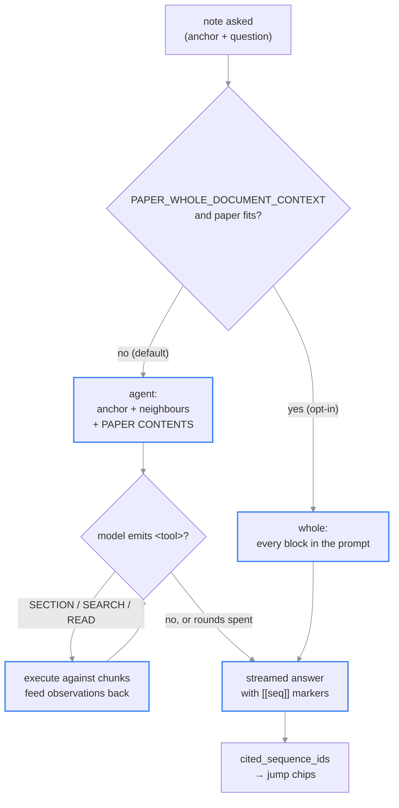

# Chat & /ask

> **What this is:** how a question becomes a grounded, cited answer.
>
> **Owns:** the paper agent (`/notes`), the four context routes (`/ask`), the guardrail, the
> research agent, citation hygiene.
> **Does not own:** which model serves each call ([ai-backend.md](ai-backend.md)), where the
> external results come from ([plans/exa-firecrawl-research-stack.md](../plans/exa-firecrawl-research-stack.md)).
>
> **Companions:** [overview.md](overview.md) — system context ·
> [api.md](../03-reference/api.md) — request and response shapes ·
> [database-schema.md](../03-reference/database-schema.md) — `paper_notes`, `conversation_turns`.
>
> **Status:** current · **Last verified:** Part 1 on 2026-08-18 against
> [`chat/paper_agent.py`](../../backend/app/chat/paper_agent.py) (`8fb153b`); Part 2 on
> 2026-07-25 against [`chat/orchestrator.py`](../../backend/app/chat/orchestrator.py)
> (`main`, 9b75500)
> **Verify with:** the `NOTE[...]` and `ASK[stepN]` log lines emitted on every question
> **Volatile:** the EXTERNAL section — the provider is being replaced.

## Two answering paths

There are now two, and they share nothing but the LLM client.

| | **Paper agent** (`/notes`) | **Orchestrator** (`/ask`) |
| --- | --- | --- |
| Serves | the article reader's margin notes | books, and any remaining `/ask` caller |
| Source | [`chat/paper_agent.py`](../../backend/app/chat/paper_agent.py) | [`chat/orchestrator.py`](../../backend/app/chat/orchestrator.py) |
| Retrieval | the anchor + the contents index, then `SECTION`/`SEARCH`/`READ` over chunks | LOCAL / GLOBAL / OVERVIEW / EXTERNAL |
| Needs embeddings | ✗ | ✅ for GLOBAL |
| Router | ✗ | ✅ |
| Guardrail | ✗ | ✅ |
| Compaction | ✗ | ✅ |
| Persists to | `paper_notes` | `conversation_turns` + `ask_traces` |

⚠ The paper agent deliberately drops routing, the guardrail, and compaction. A note is anchored to
a place the reader is already looking at, so there is nothing to route; paper Q&A is in-scope by
definition, so there is nothing to guard; and a note is one Q+A rather than a rolling transcript,
so there is nothing to compact. Each omission removes a model call from the critical path.

---

# Part 1 — The paper agent (`/notes`)

## The paper is not in the prompt

A note is a question about one passage. The model gets that passage, its neighbours, and the
paper's **contents** — the heading spine, every entry carrying the block number it starts at.
Everything else it has to go and get.

⚠ **This reverses the old default.** Until 2026-08-18 a paper under `WHOLE_PAPER_MAX_TOKENS` was
stuffed into the prompt whole, and only a paper too large for that got tools. Whole-document
stuffing is now opt-in via `PAPER_WHOLE_DOCUMENT_CONTEXT` (default `False`) — a paper that merely
*fits* is not a reason to spend the context window on it.

**What makes the omission safe is the contents index, not the tools.** A model that cannot see the
document but can see its shape knows what exists and can name the section it wants; a model with
neither has only guesses at the paper's vocabulary and no way to tell a gap in its knowledge from a
gap in the paper.

```text
                        note asked
                             │
                  ┌──────────┴──────────┐
                  │ PAPER_WHOLE_        │  default: False
                  │ DOCUMENT_CONTEXT    │
                  │ and paper fits?     │
                  └──────────┬──────────┘
              yes            │            no
          ┌──────────────────┘            └──────────────────┐
          ▼                                                  ▼
    ── whole ──                                       ── agent ──
  every block in the prompt          the anchor + surrounding blocks
  one streamed call                  + PAPER CONTENTS (the index)
          │                                                  │
          │                                    ┌─────────────┴─────────────┐
          │                                    │  up to PAPER_AGENT_       │
          │                                    │  MAX_STEPS rounds         │
          │                                    │                           │
          │                                    │  model emits <tool>       │
          │                                    │   SECTION: <seq>          │
          │                                    │   SEARCH: <terms>         │
          │                                    │   READ: <a>-<b>           │
          │                                    │  backend executes,        │
          │                                    │  feeds results back       │
          │                                    └─────────────┬─────────────┘
          │                                                  ▼
          │                                   rounds spent → forced answer
          └──────────────────┬───────────────────────────────┘
                             ▼
                answer + [[42]] block markers
                             ▼
                cited_sequence_ids → jump chips
```

### (rendered)



The diagram rules out one thing worth naming: there is no size check on the default path. A
one-page paper and a 90-page one take the same route, and the only thing `WHOLE_PAPER_MAX_TOKENS`
still does is cap the opt-in branch.

⚠ **The answer does not stream on the default path when the model answers without a tool.** The
first call is a non-streamed probe, because the reply may turn out to be a tool block and streaming
`<tool>SEARCH: …` into the margin would be nonsense on screen. Generation time is unchanged; only
the reveal is — [`lib/pacer.ts`](../../frontend/src/lib/pacer.ts) still paints it at a readable
rate. Streaming returns for the forced final answer after a tool round.

## The tools

| Tool | Syntax | Backed by |
| --- | --- | --- |
| `SECTION` | `SECTION: 31` | the contents entry at that `sequence_id`, expanded to its whole section |
| `SEARCH` | `SEARCH: reference sliding window attention` | Postgres full-text **plus** a literal `ILIKE` substring pass |
| `READ` | `READ: 40-52` | `chunks` in that `sequence_id` range, capped in SQL |

`SECTION` is the tool that makes the index usable: it takes a number the model read off the
contents and returns everything under that heading, down to the next heading of the same or higher
level. Asking for a chapter gets its subsections; asking for a subsection gets only itself.
Resolution is [`paper_agent.py::_section_range`](../../backend/app/chat/paper_agent.py), and it
reads the already-loaded chunk list rather than going back to the database.

⚠ **A block number that is not a heading resolves to the section containing it** rather than
failing. Models routinely pass a `SEARCH` hit to `SECTION` to mean "give me the rest of whatever
this was in", and that is both what they want and the only useful thing to do with the number.

⚠ **The `SECTION` parser is deliberately loose** — `SECTION: [[31]] Method` works. Models echo the
contents line they are following, brackets and title included, and a strict `SECTION:\s*(\d+)$`
throws the call away, which reads to the reader as the index quietly not working.

⚠ **A paper with no detected headings has no index, so one is synthesised** — every Nth block,
sampled by `PAPER_AGENT_MAP_STRIDE`, labelled as a sample rather than a table of contents
([`_format_block_map`](../../backend/app/chat/paper_agent.py)). Without it such a paper loses the
index *and* the document in one move: nothing to browse and nothing in the prompt, leaving a wrong
guess at the vocabulary as a dead end.

⚠ **The tools are a text protocol, not provider tool-calling.** This app fans out to Ollama and
five OpenAI-compatible clouds whose tool-calling support and schemas differ; a fenced block every
model can emit works on all of them, including local models with no tool support at all. The cost
is a parser, and it is a deliberate trade. Tool calls are only recognised inside a `<tool>` block,
so a model that writes "SEARCH:" in prose cannot trigger a round trip.

⚠ **The substring leg is not redundant.** `to_tsvector` discards single Greek letters, equation
numbers, and symbol subscripts entirely — a reader asking "why is τ so small here" gets zero
full-text hits on the one term that matters.

⚠ The two search legs run **sequentially, not gathered**. An `AsyncSession` is a single connection
in a single greenlet context; concurrent statements on it are unsupported and fail under the wrong
interleaving. Both legs are indexed lookups measured in single-digit milliseconds.

## What the anchor tells the model

`anchor.kind` changes the instruction the model is given, not just the text it sees
([`paper_agent.py::_format_anchor`](../../backend/app/chat/paper_agent.py)):

| Kind | The model is told | Quote carries |
| --- | --- | --- |
| `text` | the reader highlighted this passage; answer about it specifically | the highlighted text |
| `figure` | the image is attached — look at it | the caption |
| `equation` | explain what it says and what each symbol means; **trust the attached crop over the transcription** | its LaTeX |
| `table` | this is the whole table, not one cell; **trust the crop over the transcription**, and read the caption for what the columns mean | its recovered table body |
| `block` | the reader is reading around this point | nothing |

⚠ Both `equation` and `table` say to trust the image over the text, for the same reason: MinerU's
transcription is machine-generated. For a table it specifically loses merged cells, spanning
headers, and footnote markers — the parts that decide what a number means.

## Citations

The prompt asks the model to mark each grounded claim with its block number, `[[42]]`. Those are
parsed into `cited_sequence_ids` and rendered as chips that scroll the article.

⚠ The parser matches a whole bracket blob, not a single number. Models routinely group references
as `[[16], [42]]` or `[[16, 42]]`; a strict `\[\[(\d+)\]\]` silently returns nothing for those,
and the note renders with no chips — making a well-grounded answer look ungrounded.

## Model selection

A note records both `requested_model` (what the reader picked) and `model` (what the provider
reported). The catalog comes from [`llm/catalog.py`](../../backend/app/llm/catalog.py).

⚠ **A follow-up always uses its parent's `requested_model`, and the client cannot override it.**
A thread that switched models halfway would destroy the comparison the picker exists for — you
would no longer know which model said what.

---

# Part 2 — The orchestrator (`/ask`)

⚠ `[historical]` for papers. The article reader never calls `/ask`; this path now serves books and
any external caller. The routes below are unchanged.

## The four context modes

| Context  | When                                                       | What we retrieve                              | Model receives                                                |
| -------- | ---------------------------------------------------------- | --------------------------------------------- | ------------------------------------------------------------- |
| LOCAL    | The question is about what's currently on screen           | The current chunk (± neighbors) + its image   | `system + "Context:\n<chunks>"` + image as base64 (multimodal) |
| GLOBAL   | The question requires searching the whole paper            | Top-K similar chunks by pgvector cosine       | `system + "Context:\n<chunks with similarity scores>"`        |
| OVERVIEW | The question is paper-level ("summarize the paper")        | Pre-computed section_summaries (hierarchical) | `system + "Context:\n<structured outline>"`                   |
| EXTERNAL | The question is about something outside the paper          | Top-K web results from SearXNG                | `system + "Context:\n<title/url/snippet rows>"`               |

## The flow ([chat/orchestrator.py](../../backend/app/chat/orchestrator.py))

```python
async def handle_ask(session, *, prompt, document_id, current_chunk_id, conversation_id):
    # Step 0: Topic guardrail (is this about IT/CS?)
    guardrail_result = await check_guardrail(prompt, in_paper_context=...)

    # Step 1: Route the prompt
    decision = await route_prompt(prompt, has_current_chunk=..., has_document=...)
    # decision.context_type ∈ {LOCAL, GLOBAL, OVERVIEW, EXTERNAL}

    # Step 2: Build context
    if LOCAL:
        ctx = build_local_context(session, document_id, current_chunk_id, window_size=1)
        context_text = format_local_context(ctx["chunks"])
        citations = citations_from_chunks(ctx["chunks"])
        image_paths = [asset.file_path for asset in ctx["assets"] if asset_type=="image"]
        system_prompt = LOCAL_SYSTEM_PROMPT

    elif GLOBAL:
        ctx = build_global_context(session, query=prompt, document_id, limit=3)
        context_text = format_global_context(ctx["chunks"])
        citations = citations_from_chunks(ctx["chunks"])
        system_prompt = GLOBAL_SYSTEM_PROMPT

    elif OVERVIEW:
        ctx = build_overview_context(session, document_id)
        context_text = format_overview_context(ctx["summaries"])
        citations = citations_from_summaries(ctx["summaries"])
        system_prompt = OVERVIEW_SYSTEM_PROMPT

    else:  # EXTERNAL
        ctx = build_external_context(prompt, max_results=5)
        context_text = format_external_context(ctx["results"])
        citations = citations_from_web_results(ctx["results"])
        system_prompt = EXTERNAL_SYSTEM_PROMPT

    # Step 3: Build multimodal messages
    messages = build_multimodal_messages(prompt, system=system_prompt,
                                         context_text=context_text,
                                         image_paths=image_paths)

    # Step 4: Call LLM
    result = await ollama_client.chat(messages)

    # Step 5: If the model signals NEEDS_RESEARCH, run the research agent loop
    if result.get("needs_research"):
        result = await research_agent.loop(prompt, document_id)

    # Step 6: Persist turn + trace
    return AskResponse(answer, context_type, router_reason, citations, model, conversation_id)
```

## The router ([chat/router.py](../../backend/app/chat/router.py))

Two-tier:

1. **Cheap heuristic first.** Three keyword lists:
   - `_LOCAL_KEYWORDS` — `"this formula"`, `"this figure"`, `"above"`,
     `"shown here"`, `"bring a picture"`, etc. Only fires if the request
     carries a `current_chunk_id`.
   - `_OVERVIEW_KEYWORDS` — `"summarize the paper"`, `"main contribution"`,
     `"tl;dr"`, `"executive summary"`, etc.
   - `_EXTERNAL_KEYWORDS` — `"latest"`, `"recent"`, `"who is"`,
     `"wikipedia"`, etc.
2. **Fallback to LLM** for ambiguous queries: outputs `LOCAL`, `GLOBAL`,
   `OVERVIEW`, or `EXTERNAL` as JSON.

Special cases:
- No document context → EXTERNAL wins.
- LLM routing failure → default is GLOBAL when document exists.
- Sub-threads default to paper-free (`is_sub_thread=True`).

Each decision carries a `reason` string stored in `ask_traces.router_reason`.

## LOCAL context ([chat/local_context.py](../../backend/app/chat/local_context.py))

1. Fetches a **window** of chunks centered on `current_chunk_id` (default ±1).
2. Fetches every `chunk_assets` row for any chunk in the window.
3. Images are base64-encoded and attached to the Ollama user message.

If the current chunk is a figure, the model literally sees the picture.

## GLOBAL context ([chat/global_context.py](../../backend/app/chat/global_context.py))

1. Calls `get_query_embedding(prompt)` — embeds the query with the active embedding backend (same resolver as ingestion, so query and stored vectors always match).
2. Calls `embeddings.search_embeddings` — pgvector cosine-similarity.
3. Returns top-K (default 3) chunks.
4. Surfaces images attached to retrieved chunks for inline rendering.

## OVERVIEW context ([chat/overview_context.py](../../backend/app/chat/overview_context.py))

1. Fetches all `section_summaries` rows (level 0 + level 1 + level 2).
2. Formats them as a structured document outline.
3. Citations come from each summary's `source_chunk_ids`.

## EXTERNAL context ([chat/external_context.py](../../backend/app/chat/external_context.py))

1. Calls SearXNG with the raw prompt.
2. Ranks results via `search/ranking.py` (dedup + scoring).
3. Returns at most 5 results.

## Research Agent ([chat/research_agent.py](../../backend/app/chat/research_agent.py))

For complex queries, an iterative research loop:
- Tools: `web_search`, `read_paper_section`, `describe_figure`.
- Maintains a research log and synthesizes a final response.
- Triggered when the LLM emits a `NEEDS_RESEARCH` signal.

## Multimodal request shape ([llm/multimodal.py](../../backend/app/llm/multimodal.py))

```python
messages = [
  {"role": "system", "content": <prompt>},
  {"role": "user",
   "content": "Context:\n<context_text>\n\n<original prompt>",
   "images": ["<base64 PNG/JPEG>", ...]},   # only LOCAL with images
]
```

The client POSTs to `{OLLAMA_BASE_URL}/api/chat` with `stream: false`.

## Citations ([chat/citations.py](../../backend/app/chat/citations.py))

Two builders:
- `citations_from_chunks` → `chunk_id`, `sequence_id`, `page`, `text_snippet`, `source="document"`.
- `citations_from_web_results` → `url`, `text_snippet`, `source=<engine>`.

Persisted as JSON on the assistant's `conversation_turns` row.

## Conversation continuity

`conversation_id` is optional on first turn. If absent, the orchestrator
mints a new UUID. The frontend stores and passes it on every subsequent
`/ask` call.

## Sub-threads

Turns can have a `parent_turn_id` creating a tree of sub-threads.
`get_thread_subtree(root_turn_id)` fetches only the sub-thread's turns
using a recursive CTE. Sub-threads default to paper-free context.

## Compaction

When a conversation grows past a token threshold, it is automatically
compacted: earlier turns are summarized into a compact form and replaced
with a single `role='compaction'` turn. This keeps context from overflowing.

## Tracing

Every `/ask` call inserts an `ask_traces` row with:
`context_type`, `router_reason`, `model`, `prompt_tokens`,
`completion_tokens`, `latency_ms`.