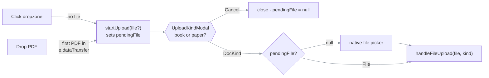

# Frontend

> **What this is:** the React SPA — routing, state, views, and how it talks to the API.
>
> **Owns:** client-side state and view behavior.
> **Does not own:** endpoint contracts ([api.md](../03-reference/api.md)).
>
> **Status:** current · **Last verified:** the library, the assistant panel and the agent trail
> 2026-08-26, driven in a real browser against a live backend;
> [`frontend/src/App.tsx`](../../frontend/src/App.tsx) 2026-08-18 (`main`, 79903be).
> The ArticleReader's anchoring and table sections were verified 2026-08-18 against
> [`views/ArticleReader.tsx`](../../frontend/src/views/ArticleReader.tsx) and
> [`views/ArticleBlock.tsx`](../../frontend/src/views/ArticleBlock.tsx) (`8fb153b`); its
> remaining sections 2026-07-28 (`main`, 5471870).
> **Verify with:** `cd frontend && npm run build` (runs `tsc` first)

Vite + React + Tailwind, no router library — a tiny state machine in
[App.tsx](../../frontend/src/App.tsx) toggles between four views.

## Two readers, chosen by `doc_kind`

[`ReadingView.tsx`](../../frontend/src/views/ReadingView.tsx) is now a dispatcher, not a view. It
fetches the paper's metadata and mounts one of:

| `doc_kind` | Component | Experience |
| --- | --- | --- |
| `paper` | [`ArticleReader.tsx`](../../frontend/src/views/ArticleReader.tsx) | The whole document at once, as continuous prose, with margin notes. |
| `book` | [`BookReadingView.tsx`](../../frontend/src/views/BookReadingView.tsx) | The original chapter-by-chapter reveal reader, with `<ChatPane>`. Preserved verbatim. |

⚠ It holds the frame for one round-trip rather than flashing the wrong reader and swapping it out.
Nothing on the paper path mounts `ChatPane`.

## Top-level state ([App.tsx](../../frontend/src/App.tsx))

```ts
type Route = 'library' | 'processing' | 'reading' | 'pdf-viewer';
```

Held in `useState<Route>`:

- **`library`** → `<LibraryView>`.
- **`processing`** → `<LibraryView>` underneath + `<ProcessingOverlay>` on top.
- **`reading`** → `<ReadingView>` (dispatches to `<ArticleReader>` or `<BookReadingView>`).
- **`pdf-viewer`** → reserved for an in-browser PDF viewer.

`App.tsx` also owns:
- `activePaper` — the `Paper` currently open in `ReadingView`.
- `activePaperId` — the backend UUID.
- `uploadingFile` — UX data for the processing overlay.
- `pollRef` — the `setInterval` ref for status polling.

## The fetch client ([api.ts](../../frontend/src/api.ts))

All calls go through `/api/v1` and are proxied by Vite to `http://localhost:8000`.

| Function                | Method/Path                                         |
| ----------------------- | --------------------------------------------------- |
| `listPapers()`          | `GET /papers` → `PaperMeta[]`                       |
| `uploadPaper(file)`     | `POST /papers/upload` (multipart)                   |
| `getPaperProgress(id)`  | `GET /papers/{id}/progress`                         |
| `getChunk(id, seq)`     | `GET /papers/{id}/chunks/{seq}` → `ChunkData` (book reader) |
| `getFullDocument(id)`   | `GET /papers/{id}/document` → `FullDocument` (article reader) |
| `listNotes(id)`         | `GET /papers/{id}/notes` → `PaperNote[]`            |
| `askNoteStream(...)`    | `POST /papers/{id}/notes/stream` (SSE)              |
| `moveNote(id, noteId, side)` | `PATCH /papers/{id}/notes/{noteId}/margin`     |
| `deleteNote(id, noteId)`| `DELETE /papers/{id}/notes/{noteId}`                |
| `getPersonalState(id)`  | `GET /papers/{id}/personal` → bookmarks + notes + decks |
| `createBookmark(id, b)` / `deleteBookmark` / `renameBookmark` | `POST` / `DELETE` / `PATCH` `/papers/{id}/bookmarks` |
| `createPersonalNote(id, n)` / `updatePersonalNote` / `deletePersonalNote` | `POST` / `PATCH` / `DELETE` `/papers/{id}/personal-notes` |
| `putDecks(id, decks)`   | `PUT /papers/{id}/decks` — replaces the whole arrangement |
| `listModels()`          | `GET /models` → `ModelCatalog`                      |
| `askPaper(id, q, seq, conv)` | `POST /papers/{id}/ask` → `AskResponse` (book reader) |
| `checkHealth()`         | `GET /health`                                       |
| `getRawPdfUrl(id)`      | `/api/v1/papers/{id}/raw`                           |
| `getStaticPdfUrl(id)`   | `/static/assets/{id}.pdf`                           |

All functions throw on non-`2xx`.

## LibraryView ([views/LibraryView.tsx](../../frontend/src/views/LibraryView.tsx))

A shelf, not a table. Every card leads with the paper's own first page, because at ten papers a
filename tells them apart and at fifty it does not — and the filenames here are routinely arXiv
ids. On mount, calls `listPapers()`. Features:

- Drag-and-drop and click-to-upload dropzone. Both call the same `onUpload` prop; a drop
  passes the dropped `File`, a click passes nothing. See
  [Upload + processing](#upload--processing-apptsx).
- **Cover thumbnails** — [`PaperCover.tsx`](../../frontend/src/views/PaperCover.tsx) renders
  `GET /papers/{id}/cover`, the first page as a JPEG, rendered server-side on first request.
- **Inline rename** — the pencil on hover swaps the title for an input. Enter commits, Escape
  reverts, blur commits.
- Local search (substring match over title and authors).
- Local sort cycle: `recent → title → pages`.
- Two layouts: grid (cards) and list (rows). Both share `CardActions` and the cover.

### Renaming

`PATCH /papers/{id}` sets `documents.title`, a display name that overrides the filename.
[`lib/titles.ts::displayTitle`](../../frontend/src/lib/titles.ts) is the single resolver — a
rename wins, else the filename minus `.pdf` — and every surface that shows a name uses it.

⚠ **A rename never touches disk.** `filename` is the on-disk key every storage path is built from,
and `original_filename` is what `/raw` serves the download as. Renaming those to match a label
would break both. The Raw files panel therefore still lists real filenames, correctly.

⚠ **The library poll is paused while a rename is open.** The poll replaces the whole paper list
every 2.5–10s; a tick landing mid-edit would blow away the input being typed in
(`renamingRef` in [LibraryView.tsx](../../frontend/src/views/LibraryView.tsx)).

⚠ **The card's open target is an inner `div`, not the `<article>`.** Rename and delete are real
buttons, and a button nested inside something that is itself `role="button"` is invalid — assistive
tech announces the card as one control named "… 17p · read Rename this paper Delete this paper".
Keeping the actions as siblings of the open target yields three correctly-named controls.

### Covers

| Concern | Decision |
| --- | --- |
| When rendered | Lazily, on first `GET /cover` — never at ingestion. Ingestion is already the slow path the reader waits on, and a cover is worth nothing until the library is looked at. Papers ingested before covers existed get them for free. |
| Cache | `storage/covers/<id>.jpg`, keyed by document id alone. A document's first page cannot change — re-extraction rewrites derived text, never the source PDF — so there is no invalidation problem. |
| Missing | The endpoint answers **204, not 404**. The grid asks for one cover per card; a wall of 404s makes a working library look broken. `` reports 204 as a load error, so `PaperCover` must keep its `onError` fallback. |
| Aspect | Fixed `1 / 1.294` with `object-position: top`. A Letter page and an A4 page are different shapes, and rows of mismatched heights read as a broken layout; cropping from the bottom keeps the title and authors. |
| Off the event loop | `run_in_threadpool` — rasterising is 50–200ms of CPU in a native extension, and the grid requests every cover at once. |

## Upload + processing ([App.tsx](../../frontend/src/App.tsx))

### Getting in — two entry paths, one chooser

Upload is two steps, and **the kind chooser always runs first**. Nothing can be uploaded without a
`DocKind`: it decides which reader the document opens in and whether the embedding pass runs at all
([ingestion-pipeline.md](ingestion-pipeline.md)), and a drop cannot state it. What differs between
the two entries is only *where the file comes from*.

| Entry | `startUpload` receives | After the chooser (`pickFileWithKind`) |
| --- | --- | --- |
| Click the dropzone | nothing | Builds an `<input type=file accept=.pdf>` and clicks it |
| Drop a PDF on it | the `File` off `e.dataTransfer` | Uploads `pendingFile` directly — **no picker** |

```text
  click ──┐                                    ┌── pendingFile === null ──► native file picker ──┐
          ├─► startUpload(file?) ─► kind modal ─┤                                                 ├─► handleFileUpload(file, kind)
  drop ───┘   sets pendingFile     (DocKind)   └── pendingFile !== null ──► use it, clear it ────┘
```



What the diagram rules out: a path where a drop reaches `handleFileUpload` without passing through
the chooser, and a path where a dropped file is uploaded *and* the picker opens.

⚠ **The drop handler must consume `e.dataTransfer` synchronously.** It reads the first PDF (by MIME
type or `.pdf` extension) inside `onDrop` before any state update; the `DataTransfer` is neutered
once the event handler returns, so a file plucked out later — for example after the modal
resolves — is already gone.

`pendingFile` is cleared on **both** exits from the modal: consumed on choose, discarded on cancel.
A file left there would be silently uploaded by the *next* click-initiated upload instead of the
one the user picked. **[untested]** — no test covers the upload entry path.

### Then the upload itself

`handleFileUpload(file, kind)`:

1. Sets `uploadingFile`, switches to `route='processing'`.
2. Calls `uploadPaper(file)`. Gets back `{id, status:'processing'}`.
3. Starts `setInterval` every 1000 ms polling `/progress`.
4. On `status === 'complete'`: switch to `route='reading'`.
5. On `status === 'failed'`: go back to `library`.
6. Clear interval on cancel/unmount.

## ArticleReader ([views/ArticleReader.tsx](../../frontend/src/views/ArticleReader.tsx))

Reading is scrolling. One `getFullDocument()` call returns every block; nothing is revealed,
gated, or paced. Asking is anchoring: highlight something and the answer arrives as a card beside
it.

### Layout — three columns, always

```text
 ┌── margin ──┐ ┌────── article ──────┐ ┌── margin ──┐
 │            │ │                     │ │  ┌───────┐ │
 │            │ │  Recently, end-to-  │ │  │ note  │ │
 │  ┌──────┐  │ │  end OCR models…    │ │  │ card  │ │
 │  │ note │◄─┼─┼─ highlighted quote  │ │  └───────┘ │
 │  └──────┘  │ │                     │ │            │
 └────────────┘ └─────────────────────┘ └────────────┘
     360px              680px               360px
```

⚠ **The article column never moves.** Both margins are real grid columns whether or not they hold
a card, so a note appearing cannot shift the text under the reader's eye — the most disruptive
thing a margin can do. The cost is empty space on a paper with no notes.

Three tiers by viewport width: `both` (≥1560px), `right-only` (≥1180px, left column present but
empty so centring holds), `inline` (below that, cards fall into normal flow under the article).

### Anchoring

| Anchor kind | How the reader creates it |
| --- | --- |
| `text` | Drag-select inside a block → an "Ask" pill appears at the selection. |
| `figure` | Hover a figure → "Ask about this figure". |
| `equation` | Hover a formula → "Ask about this equation". |
| `table` | Hover a table → "Ask about this table" — **or drag-select inside it**, which is promoted to the whole table. |
| `block` | Press `A` with nothing selected → anchors to the block at the top of the viewport. |
| `document` | Open the panel (the one bottom-left button, or `P`) → not anchored at all. See [The assistant panel](#the-assistant-panel-the-holistic-level). |

Figures, equations and tables need an explicit affordance because none of them can be
drag-selected usefully — one is an image, one a tree of KaTeX spans that selects into gibberish,
and the third selects into cell values stripped of the header and row label that give them meaning.

⚠ **A selection inside a table does not produce a `text` anchor.**
[`ArticleReader.tsx::openComposerFromSelection`](../../frontend/src/views/ArticleReader.tsx) looks
up the block behind the selection and, if it is a table, hands the whole table over instead. The
quote "8.4 12.1 91.2 7B" is not a worse quote than usual — it is unanswerable in a way that looks
answerable, which is the failure mode worth code to prevent. Both the ask composer and the
personal-note composer apply the rule; a table anchor carries the table's transcription as its
quote and the MinerU crop as its image, exactly like an equation.

⚠ Every block carries `data-seq` and `data-chunk-id`. That is how a selection is traced back to a
chunk and how a card finds the element to sit beside. Do not remove them.

### Quote highlights ([lib/highlight.ts](../../frontend/src/lib/highlight.ts))

Anchors are repainted with the **CSS Custom Highlight API**, not `<mark>` wrapping. Wrapping means
mutating DOM React owns: the next re-render discards the marks, and node-splitting inside a KaTeX
subtree corrupts the equation. Highlight ranges live outside the DOM tree entirely.

Matching is whitespace-insensitive, with a fallback ladder. A quote that can no longer be located
(after a re-chunk, say) degrades to a subtle tint on the whole block rather than vanishing.

### Streaming ([lib/pacer.ts](../../frontend/src/lib/pacer.ts))

⚠ Display is **decoupled from arrival**, deliberately adding a fraction of a second of latency.

Measured from `gemma4:31b-cloud`: 77 token events for one answer, median 5 characters, 19% of them
a single character, inter-event gaps of 79 ms at the median but 474 ms at p90 and 751 ms at worst.
Painting each event on arrival reproduces that stutter exactly.

The pacer buffers incoming text and reveals it on an animation frame at a steady rate, holding a
small **reserve** back so it can keep painting through a stall. Measured after: p50 59 ms, p90
62 ms, worst 141 ms, zero stalls over 300 ms.

It also withholds a half-written LaTeX span until its delimiter arrives, so the reader never
watches `$\mathcal{P` type itself out and then snap into a symbol.

### Block renderer ([views/ArticleBlock.tsx](../../frontend/src/views/ArticleBlock.tsx))

| Type | Rendering |
| --- | --- |
| `heading` | `article-h1/2/3` by `heading_path` depth. |
| `figure` | Centred image + caption, with a hover ask button. |
| `math` | Centred KaTeX, horizontally scrollable, with a hover ask button. |
| `table` | Real `<table>` from `table_json`, falling back to markdown — inside its own scroll box, with a hover ask button. See below. |
| `code` | Fenced monospace block. |
| `footnote` | Quiet side note with a rule. |
| default | Serif prose at 20px/1.72. |

Memoised — without it every keystroke in the composer would re-render the entire paper.

#### Tables get their own scroll box

A paper's tables are the one part of it that is genuinely not the width of the prose column.

| | Before | Now |
| --- | --- | --- |
| Wrapper | `overflow-x: auto` | `.article-table-scroll`: `overflow: auto`, `max-height: 70vh` |
| Table width | `width: 100%` | `width: max-content; min-width: 100%` |
| Header row | scrolls away | `position: sticky; top: 0` |
| Cue that there is more | none | styled scrollbar + edge shadows |

⚠ **`overflow-x: auto` and `width: 100%` cannot both be true and mean anything.** The old pair
never scrolled a single pixel: `100%` told the table to fit, so it always fit, and it bought that
fit by crushing `Params (B)` into four stacked letters. Width has to come from the content before
overflow means anything.

Two landmines in the CSS, both in [`index.css`](../../frontend/src/index.css):

- **Body cells must stay transparent.** The edge shadows are painted on the scroller's own
  background using the `local`/`scroll` background-attachment pair, so an opaque `td` sits on top
  of them and the cue silently disappears. Only `th` gets a fill, and it needs one for the
  unrelated reason that it is sticky.
- **`table_json.headers` is routinely empty, and the header row arrives as `rows[0]`.** MinerU
  emits `<table><tr><td>…` with no `<thead>`, so the parser has nothing to put in `headers` — all
  eight tables in the 47-page sample paper come back that way. The renderer promotes `rows[0]`
  when `headers` is empty; without it the sticky rule pins an empty `<thead>` and a long table
  scrolls its column names away, which is the failure the box exists to prevent. Fixed in the
  renderer rather than the chunker deliberately: `table_json` mirrors what MinerU emitted, and a
  chunker change would only reach papers re-ingested afterwards.
- **A stuck `th` keeps its background and loses its borders.** With `border-collapse: collapse` the
  cell borders belong to the table's paint layer, which is not sticky, so they scroll away and
  leave the header floating with rows cut flush against its text. The header's separators are
  therefore drawn as `box-shadow: inset`, which travels with the cell.

### The margin's scarce resource, and decks

Cards are placed at their anchor and then pushed **downward** past each other by
`ArticleReader.tsx::layoutNotes` — a single top-to-bottom pass per margin, cursor never moving up.
That is what keeps the pass cheap, and it is also the whole problem: one long thread drags every
later card a screen below the passage it annotates.

A **deck** ([views/DeckCard.tsx](../../frontend/src/views/DeckCard.tsx)) is the answer. It collapses
N cards into the height of one, trading simultaneous visibility for locality.

```text
  without a deck                     with a deck
  ┌─────────────┐ ◄─ ¶4              ┌─────────────┐ ◄─ ¶4
  │ long thread │                    │▓ deck  ‹●○○›│    face-up card only
  │             │                    │             │
  │             │                    └─────────────┘
  └─────────────┘                      ╰───────────╯  ← the rest, peeking
  ┌─────────────┐                    ┌─────────────┐ ◄─ ¶9   still at its anchor
  │ note on ¶9  │ ✗ now beside ¶17   │ note on ¶9  │
  └─────────────┘                    └─────────────┘
```

What the diagram rules out: a deck *moving* to make room. It parks at the **lowest sequence id
among its members** (`deckSeq`), so flipping through it never makes it drift.

| Concern | Where |
| --- | --- |
| The stacking rule, as one pure function | `ArticleReader.tsx::stackDecks` |
| Drop below two cards → not a deck | `ArticleReader.tsx::pruneDecks`, mirrored server-side |
| Optimistic write + rollback + stale-response guard | `ArticleReader.tsx::commitDecks` |
| Stack visual, pager, study mode, spread | [`DeckCard.tsx`](../../frontend/src/views/DeckCard.tsx) |
| The card turn | `DeckCard.tsx::flipTo` + `deck-turn-*` keyframes |

**Changing card is a card being turned over**, not a crossfade. `flipTo` runs a two-phase Y
rotation on **one** element and swaps the content at the midpoint, where the card is ~86° to the
viewer and unreadable — so the incoming face arrives from the opposite edge. Mounting two faces
would double every card's state (a follow-up composer, a collapse toggle) and leave the hidden one
in the tab order. The stage height is pinned for the turn and eased to the new card's height on the
way out, so a short card following a tall one cannot snap the margin upward mid-flip. Revealing a
study card uses the same turn — that is the flashcard gesture.

⚠ `FLIP_OUT_MS` / `FLIP_IN_MS` in `DeckCard.tsx` **duplicate** the durations of the `deck-turn-*`
keyframes in `index.css`. The swap is scheduled in JS, so the two must be changed together; a
mismatch either swaps the text in plain view or leaves the card sitting on its edge.

`stackDecks` is kept out of the component and pure because **its result is what gets written** —
the whole arrangement is `PUT` in one request, so it must be correct on its own rather than as a
sequence of state updates. Every drop — card→card, card→deck, deck→card, deck→deck — reduces to one
sentence: whatever was sitting still keeps its place, and the dragged thing joins it.

⚠ **Dragging uses pointer events, not HTML5 drag-and-drop** ([`NoteChrome.tsx::useCardDrag`](../../frontend/src/views/NoteChrome.tsx)).
DnD would give us a drag image and autoscroll for free, but it **does not exist on touch** — and
this app is meant to be opened from a tablet over the LAN, where dragging one note onto another is
exactly the gesture a finger expects. The dragged card gets `pointer-events: none` mid-drag so
`elementFromPoint` reports what is *underneath* it; drop targets are found via `[data-drag-id]`.

**Study mode** hides each answer behind a Reveal and re-hides on every flip, which is what makes a
deck a deck of flashcards rather than a folder.

### Bookmarks

Several per paper. Three surfaces, one state:

- **The bar** — a Bookmark chip that toggles the mark on the block at the top of the viewport, and
  a Resume chip pointing at the newest mark (or saying "You're here" when you are on it).
- **The progress rail** — a tick per bookmark at its position in the document, clickable. The rail
  is a map, not just a fill; a single "resume" pointer hides every other mark you made.
- **The article** — a ribbon in the margin of each bookmarked block, which also removes it. A wash
  is easy to scroll past on a return visit; a silhouette is not.

⚠ `ArticleReader.tsx::topmostBlock` is a **binary search**, not a scan. It runs on every scroll
frame to keep those surfaces honest, and blocks are laid out monotonically, so a scan meant one
`getBoundingClientRect` per block per frame — several hundred forced reflows on a long paper.

### The assistant panel (the holistic level)

[`AssistantPanel.tsx`](../../frontend/src/views/AssistantPanel.tsx) — one docked surface for
questions about the paper as a whole, opened by the single button in the bottom-left corner or `P`.

⚠ **It replaced two floating buttons with one.** "Ask" and "Note" both anchored to whatever block
happened to be at the top of the viewport — a worse version of what highlighting already does,
offered more prominently. Passage-level work now belongs entirely to the selection pill and the
`A` / `N` keys; the corner means exactly one thing.

⚠ **Scope splits the notes before anything renders.**
[`ArticleReader.tsx`](../../frontend/src/views/ArticleReader.tsx) derives `marginNotes`
(`scope !== 'document'`) and `paperNotes_` (`scope === 'document'`) from one `notes` array, and the
gutter's layout pass reads `marginPending`, never `pending`. A document-scope note carries the
first block's sequence id only to satisfy a `NOT NULL` column — laid out in the margin it would
pile onto the paper's title.

```text
                    ┌───────────────── one /notes fetch ─────────────────┐
                    │                                                    │
              scope='anchor'                                    scope='document'
                    │                                                    │
              groupNotes()                                        groupNotes()
                    │                                                    │
           ┌────────┴────────┐                                           │
      gutter left      gutter right                              AssistantPanel
      (positioned by anchor_sequence_id)                         (flow order, newest last)
```

The panel's second tab, **Across papers**, is a deliberate stub: it states what the level will be
and routes back. The level above "this paper" is cross-paper, and leaving the tab out would make
the panel look finished at one level.

### The agent trail ([views/AgentTrail.tsx](../../frontend/src/views/AgentTrail.tsx))

What the model fetched before it answered, rendered from the `step` SSE events and from
`note.agent_steps` on reload. Protocol and field meanings:
[chat-and-ask.md § The trail](chat-and-ask.md#the-trail--every-fetch-is-reported-not-just-logged).

| State | Behaviour |
| --- | --- |
| Streaming (`live`) | Always expanded, no toggle. The trail **is** the progress indicator; collapsing it leaves a blank card. |
| Saved | Collapsed behind one line — "How this was answered · 2 from the paper · 1 from the web". |

⚠ **Upsert by `step.id`, never append** (`onStep` in `ArticleReader.tsx::runNote`). Each call
arrives twice, `running` then `done`; appending renders every fetch as two rows, the first spinning
forever.

⚠ **The trail stays up while the answer types itself out.** Collapsing it on the first token would
snatch away the record of the fetches at the exact moment they become checkable.

⚠ **A `WEB` step is coloured differently from the paper tools** (`--deck`, not `--accent`). Whether
an answer drew on anything outside the paper is the one distinction worth seeing without reading.

### The Marginalia panel

[`MarginaliaPanel.tsx`](../../frontend/src/views/MarginaliaPanel.tsx) — Contents, Bookmarks and
Notes behind one search, replacing the headings-only overlay. Structure, marks and annotations are
the same question asked three ways.

### Personal state and its migration

Bookmarks, personal notes and decks are **server-owned**
([api.md § Personal reading state](../03-reference/api.md#personal-reading-state)) and loaded
together by [`lib/personalState.ts`](../../frontend/src/lib/personalState.ts).

`[historical]` They lived in `localStorage` until 2026-07-28. What remains of that is a one-way
migration on first open, and it is built to be **safe under repetition** rather than to run exactly
once:

| Rule | Why |
| --- | --- |
| Concurrent loads of a paper share one in-flight promise | ⚠ StrictMode mounts every effect twice in development. Without this, both mounts find an empty server and both upload — every note imported in duplicate. This is how the bug was found. |
| Bookmarks upsert by block, decks are a whole-collection replace | Idempotent on their own terms. |
| Notes are matched on `(anchor, body)` before insert | They have no natural key. This also makes a half-finished run resumable — the second pass picks up where the first stopped. |
| `localStorage` is erased only after everything is stored | The worst available outcome is "still local, try again next open", never "some of them are gone". |

Writes are optimistic with rollback, **except creating a personal note**, which waits for the
server. A card rendered under a temporary id cannot be dragged into a deck — deck membership is a
foreign key. The composer keeps its draft until the save lands, so a failure loses nothing typed.

## ChatPane ([views/ChatPane.tsx](../../frontend/src/views/ChatPane.tsx))

⚠ `[historical]` for papers — reached only from `BookReadingView`.

Local state:
- `messages: ChatMessage[]` — turn log.
- `input: string` — textarea value.
- `thinking: boolean` — while a request is in flight.
- `conversationId: string | null` — persisted across turns.

`send()`:

1. Optimistically appends the user turn.
2. Calls `askPaper(paperId, q, currentSequenceOrder, conversationId)`.
3. On success: stores the returned `conversation_id`, appends the assistant
   turn with citation chips (text snippet, source, or `§<sequence_id>`).
4. On failure: appends a polite error message.

Submit key bindings: **Enter** sends, **Shift+Enter** inserts a newline.

## Sub-threads

The chat pane supports nested sub-threads. A sub-threaded turn has a
`parentTurnId`. The main view renders threads indented, and sub-threads
show only the subtree of messages.

## Inline paper figures

When the model responds with `` markdown, a `SafeWebImage`
component renders it directly in the chat. This is used for inline paper
figures in LOCAL and GLOBAL responses.

## Other components

- [`views/NoteCard.tsx`](../../frontend/src/views/NoteCard.tsx) — a margin note: quote, question,
  answer, model tag, citation chips, follow-up box, margin-flip control.
- [`views/PersonalNoteCard.tsx`](../../frontend/src/views/PersonalNoteCard.tsx) — the reader's own
  note, plus the composer that writes one.
- [`views/NoteChrome.tsx`](../../frontend/src/views/NoteChrome.tsx) — the furniture every card
  wears: the eyebrow (grip, tone dot, one word, `¶N`), the drag hook, the collapse clamp. Cards are
  told apart by **shape and colour, not by a border tint** — a margin card is read peripherally.
- [`views/AskComposer.tsx`](../../frontend/src/views/AskComposer.tsx) — the composer that opens on
  an anchor. Owns the model picker; never touches the network.
- [`views/AssistantPanel.tsx`](../../frontend/src/views/AssistantPanel.tsx) — the holistic level.
- [`views/AgentTrail.tsx`](../../frontend/src/views/AgentTrail.tsx) — the tool calls behind an
  answer, live and after the fact.
- [`views/PaperCover.tsx`](../../frontend/src/views/PaperCover.tsx) — a paper's first page, with the
  placeholder that must survive a 204.
- [`lib/titles.ts`](../../frontend/src/lib/titles.ts) — the one resolver for a paper's display name.
- [`components/Icons.tsx`](../../frontend/src/components/Icons.tsx) — inline SVG icons.
- [`components/LogoMark.tsx`](../../frontend/src/components/LogoMark.tsx) — the 9XAIPal wordmark.

## Styling

Tailwind utility classes with CSS variables (`--bg`, `--bg-2`, `--bg-3`,
`--fg`, `--muted`, `--accent`, `--ok`, `--border`) in
[src/index.css](../../frontend/src/index.css). Dark, low-contrast canvas with
serif headlines and mono labels.