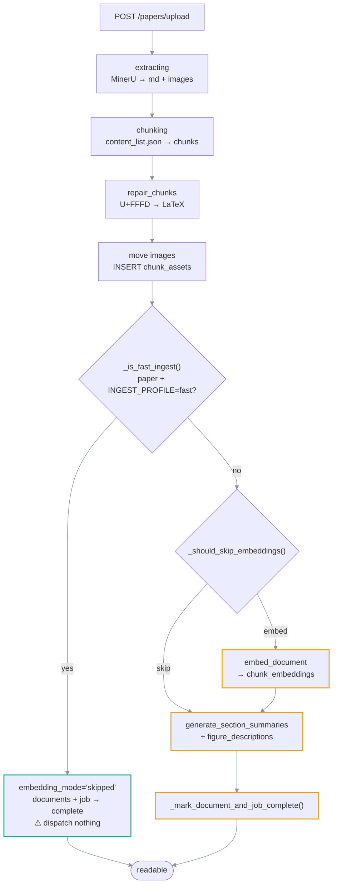
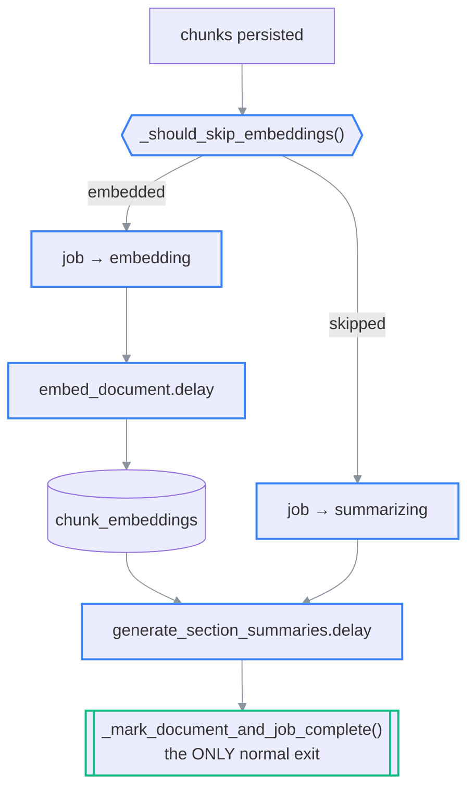

# Ingestion pipeline

> **What this is:** the path a PDF takes from upload to readable, chunk by chunk.
>
> **Owns:** extraction, chunking, glyph repair, asset handling, embedding, and summarization
> order — and which of those actually run.
> **Does not own:** how chunks are retrieved at question time ([chat-and-ask.md](chat-and-ask.md)),
> where files land on disk ([storage.md](../03-reference/storage.md)).
>
> **Companions:** [overview.md](overview.md) — system context ·
> [ai-backend.md](ai-backend.md) — which model embeds and summarizes ·
> [operations.md](../01-orientation/operations.md) — repairing a stuck ingestion.
>
> **Status:** current · **Last verified:** 2026-07-25 against
> [`extraction/pipeline_sync.py`](../../backend/app/extraction/pipeline_sync.py) and
> [`workers/tasks.py`](../../backend/app/workers/tasks.py) (`main`, 9b75500)
> **Verify with:** `pytest tests/test_ingestion_pipeline.py -v`

This is the path a PDF takes from "the user dragged it onto the library" to "I can read it and
ask grounded questions about it."

## The profile decides how much of this runs

`INGEST_PROFILE` (default `fast`) and `doc_kind` together pick one of two chains:

| | `fast` + `doc_kind='paper'` | `full`, or any book |
| --- | --- | --- |
| Extraction + chunking | ✅ | ✅ |
| Glyph repair | ✅ | ✅ |
| Assets linked | ✅ | ✅ |
| Embeddings | ✗ | ✅ (unless paper-only skips them) |
| Section summaries | ✗ | ✅ |
| VLM figure descriptions | ✗ | ✅ |
| Complete after | **chunking** | `generate_section_summaries` |

Under `fast` a paper is readable the moment MinerU and the chunker finish — nothing stands between
dropping a PDF and reading it. Everything the model needs is derived at question time by
[`chat/paper_agent.py`](../../backend/app/chat/paper_agent.py); see
[chat-and-ask.md](chat-and-ask.md).

⚠ Books never take the fast path. A book cannot be stuffed into a context window, and full-text
scanning a 700-page volume is not a substitute for vector retrieval, so it still needs the full
chain to be answerable.

## End-to-end timeline

```
[Client]                  [API]                      [Celery worker]
─────────                 ─────                      ────────────────
drag/drop PDF
   │
   ▼
POST /papers/upload ──►  write to documents/<uuid>.pdf
                         write to assets/<doc_id>.pdf (for /raw download)
                         INSERT documents      (status='queued')
                         INSERT ingestion_jobs (status='queued')
                         process_ingestion.delay(doc_id, job_id, filename)
                         ◄── 201 {id, status:'processing'}
   │
   ▼
poll /papers/{id}/progress every 1s
                                                    run_pipeline_sync()
                                                      │
                                                      ▼
                                                    UPDATE ingestion_jobs → 'extracting'
                                                    mineru -p ... -o extracted/<doc_id>
                                                      → writes extracted/<doc_id>/*.md + images
                                                      │
                                                      ▼
                                                    UPDATE ingestion_jobs → 'chunking'
                                                    parse content_list.json into structural chunks
                                                    INSERT chunks (one row per chunk)
                                                      │
                                                      ▼
                                                    repair_chunks(): undo MinerU's U+FFFD
                                                      │
                                                      ▼
                                                    move images to images/<doc_id>/
                                                    INSERT chunk_assets (link via markdown ref)
                                                      │
                                                      ▼
                                                    _is_fast_ingest()?
                                          ┌───────────┴────────────┐
                                        yes                        no
                                (paper, INGEST_PROFILE=fast)       │
                                          │                        ▼
                                          │              _should_skip_embeddings()
                                          │              UPDATE documents → embedding_mode
                                          │                        │
                                          │            ┌───────────┴───────────┐
                                          │       embedded                 skipped
                                          │            │                       │
                                          │    job → 'embedding'       job → 'summarizing'
                                          │    embed_document.delay()          │
                                          │            │                       │
                                          │      UPDATE documents → 'processing', page_count
   │                                      │            │                       │
   ▼                                      │            ▼                       │
poll continues                            │   embed_document_chunks_sync()     │
                                          │     → batches of 20 chunks         │
                                          │     → INSERT chunk_embeddings      │
                                          │            │                       │
                                          │            └───────────┬───────────┘
                                          │                        ▼
                                          │            generate_section_summaries
                                          │              → section_summaries
                                          │              → figure_descriptions
                                          │              → _mark_document_and_job_complete()
                                          │                        │
                              embedding_mode='skipped'             │
                              (reason: fast_ingest)                │
                              documents + job → 'complete'         │
                              dispatch NOTHING                     │
   │                                      │                        │
   ▼                                      ▼                        ▼
status == 'complete'  ◄──────────────────────────────────────────────
   │
   ▼
open the paper in ArticleReader
```

### (rendered)



⚠ **Completion is set in exactly two places**, and they are mutually exclusive:
`generate_section_summaries` at the end of the full chain, and `run_pipeline_sync` on the fast
path. The fast path may set it only because it dispatches nothing afterwards — there is no
downstream task left to contradict it. Adding a dispatch to that branch without moving the
completion would reintroduce the bug where the UI reported "done" while a worker was still
running.

## Step 1.5 — Glyph repair

MinerU writes **U+FFFD REPLACEMENT CHARACTER** wherever a paper typesets an inline variable using
the Unicode Mathematical Alphanumeric Symbols block (U+1D400–U+1D7FF). Those codepoints are astral
— above U+FFFF — and its text pipeline mangles the surrogate pairs. The reader then shows `�`
where a variable should be:

```text
MinerU:  "limiting output attention to the preceding � tokens (� defaults to 128)"
Truth:   "limiting output attention to the preceding 𝑛 tokens (𝑛 defaults to 128)"
                                                     ^ U+1D45B
```

U+FFFD carries no information — you cannot tell *n* from *t* by looking at it. But the PDF still
does, and PyMuPDF decodes the same glyphs correctly, so
[`glyph_repair.py`](../../backend/app/extraction/glyph_repair.py) re-reads the source page and uses
the surrounding text as a lookup key. The recovered character is emitted as LaTeX (`𝑛` → `$n$`)
so it renders as italic math and the model sees a variable rather than an exotic codepoint.

⚠ Best-effort by design. An ambiguous match is left as `�` — a visible mystery glyph beats a
confidently wrong letter in a formula. Measured on the reference paper: 14 of 14 recovered.

Runs in the pipeline and again on `/rechunk`, so a paper already on disk can be repaired without
re-running MinerU.

## Step 1 — Upload

```http
POST /api/v1/papers/upload
Content-Type: multipart/form-data
file: <PDF bytes>
```

Server:

1. Generates a fresh storage filename: `<uuid4().hex>.pdf`.
2. Reads the file body into memory.
3. Writes it to `<storage_root>/documents/<uuid>.pdf` — this is what MinerU consumes.
4. Inserts a row into `documents` with `status='queued'`.
5. Writes a second copy to `<storage_root>/assets/<doc_id>.pdf`.
6. Inserts a row into `ingestion_jobs` with `status='queued'`.
7. Dispatches `process_ingestion.delay(doc_id, job_id, filename)` to Celery.
8. Returns `201` immediately.

The frontend starts a 1-second poll against `/progress`, showing the `ProcessingOverlay`.

## Step 2 — MinerU extraction

`process_ingestion` calls `run_pipeline_sync`:

1. `UPDATE ingestion_jobs SET status='extracting'`.
2. `mineru -p documents/<uuid>.pdf -o extracted/<doc_id> -m auto`.
3. MinerU writes one or more `.md` files and asset images.
4. `find_markdown_output` picks the largest `.md` file.
5. `find_images` recursively collects every image file.

If `mineru` exits non-zero, the pipeline raises `MinerUError`, the job
+ document are marked `failed`, and the polling frontend exits to the
library.

## Step 3 — Chunking

The chunker is **structural**: a chunk is one heading, one paragraph, one
math block, one table, or one figure.

Implementation:

1. Parse MinerU's `content_list.json` for structure. Fall back to regex
   markdown chunking if that's unavailable.
2. For each section:
   - Assign a monotonically increasing `sequence_id` (1-based).
   - Detect the chunk type: `heading > math ($$…$$) > table (|…|…|) > figure () > text`.
   - Maintain `current_heading_path` — a breadcrumb of H1→H6 titles.
   - Extract any `` image filenames into `image_refs`.
   - Extract `table_json` for table chunks.
   - Normalize markdown and extract plain text for embedding.
3. Returns a list of dicts ready for persistence.

## Step 4 — Persisting chunks + images

1. `UPDATE ingestion_jobs SET status='chunking'`.
2. `store_chunks` inserts one row per chunk into `chunks`.
3. For every image found in MinerU's output, call `move_asset_to_storage`.
   Copies the file to `images/<doc_id>/<uuid>.<ext>` and returns metadata.
4. Build an `original_name → asset_meta` map.
5. For each persisted chunk, look up its `image_refs` against the map.
   Each hit becomes an `INSERT INTO chunk_assets`.

## Step 5 — Embedding (conditional)

The pipeline decides here whether this document needs embeddings at all, then dispatches the
matching downstream task.

1. `_should_skip_embeddings()` — see [paper-only mode](#paper-only-mode-conditional-dispatch).
2. `UPDATE documents SET embedding_mode, embedding_skip_reason` — recorded once, never re-derived.
3. Branch:
   - **embedded** (default): `UPDATE ingestion_jobs SET status='embedding'`, then
     `embed_document.delay(document_id)`.
   - **skipped**: `UPDATE ingestion_jobs SET status='summarizing'`, then
     `generate_section_summaries.delay(document_id)` — the chain is re-attached here.
4. `UPDATE documents SET status='processing', page_count=<pypdf count>`.

⚠ **On the full chain the pipeline does NOT mark the document complete.** Completion is set by
`_mark_document_and_job_complete` at the end of `generate_section_summaries`
([`workers/tasks.py`](../../backend/app/workers/tasks.py)) — the normal exit whenever anything is
dispatched. Marking it complete before that was the bug that made the UI report "done" while the
worker was still embedding and describing figures.

The fast path is the one exception, and only because it dispatches nothing: it sets
`embedding_mode='skipped'` (reason `fast_ingest`), records `page_count`, marks the document and
job complete, and returns. Verified by
`tests/test_ingestion_pipeline.py::test_run_pipeline_success` (nothing dispatched, status
complete) and `::test_run_pipeline_book_still_runs_full_chain` (book still dispatches
`embed_document` and stays at `processing`).

### Paper-only mode: conditional dispatch

⚠ `[historical]` for papers under the default profile — the fast path returns before
`_should_skip_embeddings` is ever reached. This section still describes `INGEST_PROFILE=full` and
every book.

```text
                     chunks persisted
                            │
                            ▼
                  _should_skip_embeddings()
              (PAPER_ONLY_MODE? · doc_kind != book?
               · SUM(token_count) <= PAPER_ONLY_MAX_TOKENS?)
                            │
              ┌─────────────┴─────────────┐
         embedded                      skipped
              │                            │
    job → 'embedding'             job → 'summarizing'
    embed_document.delay()                 │
              │                            │
              ▼                            │
    embed_document_chunks_sync()           │
    → chunk_embeddings                     │
              │                            │
              └──────────┬─────────────────┘
                         ▼
          generate_section_summaries.delay()
                         │
                         ▼
          _mark_document_and_job_complete()   ← the ONLY normal exit
```



> ⚠ The **dispatcher** is conditional; the **chain** is not. Both branches must terminate at
> `_mark_document_and_job_complete`. A skip path that simply dropped `embed_document` would leave
> the document at `processing` forever — the frontend polls `/progress` every second and would
> spin indefinitely with no error raised anywhere. Verified by
> `tests/test_paper_only_mode.py::test_skipped_document_still_reaches_complete`.

The gate is **measured token count**, not `doc_kind`. `doc_kind == 'book'` disqualifies a document,
but it is a guard only: it defaults to `'paper'`, so every document predating the book/paper
chooser already carries that label. Full rationale:
[paper-only-embedding-skip.md](../plans/paper-only-embedding-skip.md).

When embeddings run, the Celery worker:

1. Opens its own DB session.
2. Calls `embed_document_chunks_sync(session, document_id, batch_size=20)`.
3. Loops fetching chunks with no `chunk_embeddings` row.
4. Sends `plain_text` in batches to Ollama's embedding API.
5. Inserts each result into `chunk_embeddings` (`vector(VECTOR_DIMENSION)`, default 1024) along with the resolved `embedding_model` name.
6. Commits after each batch.

## Step 6 — Summarization (background)

Reached from either branch of Step 5 — after embeddings when they run, directly from the pipeline
when they are skipped. `generate_section_summaries`:

1. Hierarchical section summarization (level 0 = paper, level 1 = H1, level 2 = H2).
2. VLM figure descriptions for every `chunk_type='figure'` chunk.
3. Results stored in `section_summaries` and `figure_descriptions` tables.

This step is slow (minutes per paper) but doesn't block the user — they
can start reading and asking questions as soon as `status='complete'` — which, under the default
fast profile, is as soon as chunking finishes.

⚠ The upload overlay shows a **different step list per `doc_kind`**: two steps for a paper
(extract, chunk), four for a book (plus embed, summarize). Showing a paper an "Embedding" step it
never runs would tick green having done nothing — see
[`ProcessingOverlay.tsx`](../../frontend/src/views/ProcessingOverlay.tsx).

## Status taxonomy

| Job status                    | Doc status   | Frontend behavior |
| ----------------------------- | ------------ | ----------------- |
| `queued`                      | `queued`     | overlay: queued   |
| `extracting`                  | `queued`     | overlay: extracting |
| `chunking`                    | `queued`     | overlay: chunking |
| `embedding`                   | `queued`     | overlay: embedding · skipped entirely in paper-only mode |
| `summarizing`                 | `complete`   | overlay closes    |
| `complete`                    | `complete`   | flip to the reader |
| `failed`                      | `failed`     | back to LibraryView |

## Deletion

`DELETE /papers/{id}` removes:
- DB cascade: chunks, chunk_embeddings, chunk_assets, ingestion_jobs,
  section_summaries, figure_descriptions.
- Disk cleanup (best effort): `documents/<filename>`, `assets/<id>.pdf`,
  `extracted/<id>/`, `images/<id>/`.
- Conversation turns survive with `document_id` set to null.