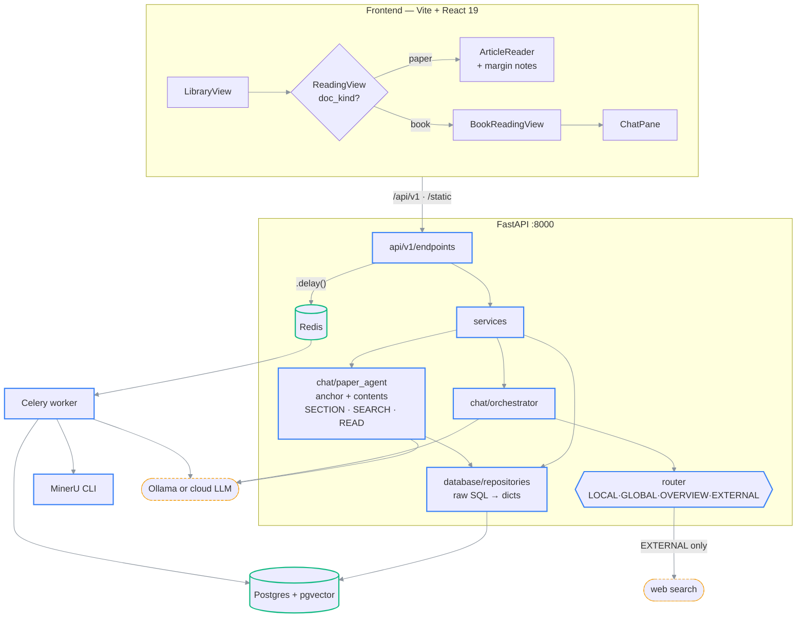

# Architecture overview

> **What this is:** the master architecture doc. It opens at god view and descends; every
> subsystem's detail lives in a companion linked from here.
>
> **How to read it:** §1 what the product is → §2 the whole system → §3 layering and dependency
> direction → §4 code map → §5 architectural rules → §6 the two pipelines → §7 what never happens.
>
> **Companions (detail):**
> [ingestion-pipeline.md](ingestion-pipeline.md) — PDF → readable chunks ·
> [chat-and-ask.md](chat-and-ask.md) — question → grounded answer ·
> [ai-backend.md](ai-backend.md) — which model serves which call ·
> [frontend.md](frontend.md) — the React SPA ·
> [runtime-topology.md](../01-orientation/runtime-topology.md) — ports and processes ·
> [database-schema.md](../03-reference/database-schema.md) — tables and columns.
>
> **Status:** current · **Reflects code as of:** §1 and §6b 2026-08-26 against
> [`chat/paper_agent.py`](../../backend/app/chat/paper_agent.py) and
> [`chat/study_agent.py`](../../backend/app/chat/study_agent.py); everything else
> 2026-07-25 (`main`, 9b75500)

---

## 1. What the product is

A **single-tenant, local-first reading companion** for research papers, technical books, and
long-form PDFs. Drop a file; it is structurally extracted, chunked, embedded, and served back one
piece at a time while a side chat answers grounded, citation-backed questions.

Three halves:

1. **Library / upload** — drag a PDF, watch a live overlay, get a clickable card. A paper shows
   two steps (`extracting → chunking`) and is done; a book continues through `embedding →
   summarizing`.
2. **Reading** — two readers, chosen by `doc_kind`. A **paper** renders as a continuous article
   with a note margin either side. A **book** keeps the chapter-by-chapter reveal reader and its
   chat pane.
3. **Asking** — three levels, all agentic, all showing their work. **Passage**: highlight text,
   get a margin note answered from that passage plus the paper's contents index. **Paper** and
   **across papers**: the **desk** (`#/desk`), where a *study* — a named group of papers, or the
   whole library — scopes a rolling chat whose citations expand in place. For books, the routed
   `/ask` orchestrator with its four context sources.
4. **The desk** — the surface for reading papers *without opening them*: studies on the left, the
   chat in the middle, sticky notes on the right.

**Why local-first:** privacy (papers and chats never leave the machine), latency (LLM and vector
search colocated with the data), cost (no per-token billing). The price is the cold-start latency
of a local model and the throughput of one machine.

⚠ That claim has two deliberate holes. The EXTERNAL chat route reaches the public internet, and
so does the paper agent's `WEB` tool — both opt-in per question, one chosen by the router and one
by the model. Everything else — extraction, embedding, retrieval, reading — is local.

⚠ **Since 2026-08-26 the default web provider is Tavily, which is a third party.** SearXNG ran on
localhost, so even a web search stayed on the machine; a Tavily query does not. Only the query
string leaves. `WEB_SEARCH_PROVIDER=searxng` takes the trade back in one line — see
[configuration.md § Web search](../03-reference/configuration.md#web-search).

---

## 2. The whole system

```text
┌───────────────────────────────────────────────────────────────────────────┐
│ Frontend — Vite + React 19 + Tailwind (hash-routed, no router library)    │
│                                                                           │
│   LibraryView ──► ReadingView ──┬──► ArticleReader  (doc_kind='paper')   │
│        │ /papers                │      │ /document      │ /notes/stream  │
│        │                        │      ▼                ▼                │
│        │                        │  whole paper as    margin note beside  │
│        │                        │  one article       the anchored text   │
│        │                        │                                        │
│        │                        └──► BookReadingView ──► ChatPane        │
│        ▼                               │ /chunks/{seq}    │ /ask         │
│   list + upload                        ▼                  ▼              │
│                                   one chunk at a time   routed answer    │
└───────────────────────────┬───────────────────────────────────────────────┘
                            │ HTTP  /api/v1/*  ·  /static/*
                            ▼
┌───────────────────────────────────────────────────────────────────────────┐
│ FastAPI :8000                                                             │
│                                                                           │
│   api/v1/endpoints  →  services  →  database/repositories  →  raw SQL     │
│         │                  │                                              │
│         │                  ├─► chat/paper_agent      extraction/pipeline  │
│         │                  │     ├ anchor + contents  (dispatched to      │
│         │                  │     └ SECTION/SEARCH/READ Celery, not run    │
│         │                  │                           inline)            │
│         │                  └─► chat/orchestrator                          │
│         │                        ├ guardrail                              │
│         │                        ├ router                                 │
│         │                        ├ local_context                          │
│         │                        ├ global_context                         │
│         │                        ├ overview_context                       │
│         │                        ├ external_context                       │
│         │                        └ research_agent                         │
│         ▼                                                                 │
│   workers/tasks.py  ──.delay()──►  Redis  ──►  Celery worker             │
└───────┬──────────────────────────────────────────────┬────────────────────┘
        │                                              │
        ▼                                              ▼
┌────────────────────┐              ┌──────────────────────────────────────┐
│ Postgres + pgvector│              │ Celery worker                        │
│  documents         │              │  ├ MinerU CLI      (PDF → md + imgs) │
│  chunks            │◄─────────────┤  ├ glyph repair                       │
│  chunk_embeddings  │   psycopg2   │  ├ embeddings        ┐                │
│  chunk_assets      │    (sync)    │  ├ section summaries ├ full profile   │
│  section_summaries │              │  └ VLM figure descr. ┘  / books only  │
│  figure_descriptions              └──────────────────────────────────────┘
│  paper_notes       │
│  conversation_turns│              ┌──────────────────────────────────────┐
│  ask_traces        │              │ Ollama :11434  OR  cloud LLM API     │
│  ingestion_jobs    │              │  chat · vlm · classifier · embedding │
└────────────────────┘              └──────────────────────────────────────┘
```

### (rendered)



---

## 3. Layering and dependency direction

```text
endpoints  →  services  →  repositories  →  SQL
      \          │
       \         └→ chat.orchestrator  /  extraction.pipeline   (use-cases)
        \
         → schemas   (pydantic; wire format only)
```

| Layer | Owns | Never does |
| --- | --- | --- |
| `api/v1/endpoints/` | Parse + validate input, call a service, shape the response | Business logic, SQL |
| `services/` | Use cases, transactions, cross-cutting workflows | Raw SQL, HTTP concerns |
| `database/repositories/` | Pure SQL via `sqlalchemy.text`, returns plain dicts | Business logic |
| `schemas/` | Pydantic models mirroring the wire format | Persistence concerns |
| `chat/`, `extraction/` | The two non-trivial pipelines | — |

The dependency arrow only points right. An endpoint never imports a repository directly; a
repository never imports a service.

⚠ Repositories return **plain dicts**, not ORM objects or pydantic models. The codebase uses
SQLAlchemy Core (`text()`), not the ORM. Do not expect model classes — there are none.

---

## 4. Code map

| Concern | Source |
| --- | --- |
| App entrypoint, middleware, static mounts | [`app/main.py`](../../backend/app/main.py) |
| Startup sequence | [`app/core/lifecycle.py`](../../backend/app/core/lifecycle.py) |
| Settings | [`app/core/config.py`](../../backend/app/core/config.py) |
| Disk paths | [`app/core/paths.py`](../../backend/app/core/paths.py) |
| Security headers + rate limit | [`app/core/security.py`](../../backend/app/core/security.py) |
| Route table | [`app/api/v1/router.py`](../../backend/app/api/v1/router.py) |
| Paper answering (§6b) | [`app/chat/paper_agent.py`](../../backend/app/chat/paper_agent.py) |
| Cross-paper answering (§6b) | [`app/chat/study_agent.py`](../../backend/app/chat/study_agent.py) |
| The tool layer both agents share | [`app/chat/agent_tools.py`](../../backend/app/chat/agent_tools.py) |
| The desk (studies, chat, stickies) | [`frontend/src/views/DeskView.tsx`](../../frontend/src/views/DeskView.tsx) |
| Note endpoints | [`app/api/v1/endpoints/notes.py`](../../backend/app/api/v1/endpoints/notes.py) |
| Model catalog | [`app/llm/catalog.py`](../../backend/app/llm/catalog.py) |
| MinerU glyph repair | [`app/extraction/glyph_repair.py`](../../backend/app/extraction/glyph_repair.py) |
| Chat orchestration, books (§6b) | [`app/chat/orchestrator.py`](../../backend/app/chat/orchestrator.py) |
| Intent routing | [`app/chat/router.py`](../../backend/app/chat/router.py) |
| Prompts | [`app/chat/prompts.py`](../../backend/app/chat/prompts.py) |
| Provider resolution | [`app/llm/resolver.py`](../../backend/app/llm/resolver.py) |
| Structural chunking | [`app/extraction/chunker.py`](../../backend/app/extraction/chunker.py) |
| MinerU subprocess wrapper | [`app/extraction/mineru_client.py`](../../backend/app/extraction/mineru_client.py) |
| Sync pipeline (Celery path) | [`app/extraction/pipeline_sync.py`](../../backend/app/extraction/pipeline_sync.py) |
| Vector + full-text search SQL | [`app/database/pgvector.py`](../../backend/app/database/pgvector.py) |
| Celery tasks | [`app/workers/tasks.py`](../../backend/app/workers/tasks.py) |
| Canonical schema | [`app/database/schema.sql`](../../backend/app/database/schema.sql) |
| Frontend state machine | [`frontend/src/App.tsx`](../../frontend/src/App.tsx) |
| Article reader (papers) | [`frontend/src/views/ArticleReader.tsx`](../../frontend/src/views/ArticleReader.tsx) |
| Reveal reader (books) | [`frontend/src/views/BookReadingView.tsx`](../../frontend/src/views/BookReadingView.tsx) |
| Quote highlighting | [`frontend/src/lib/highlight.ts`](../../frontend/src/lib/highlight.ts) |
| Stream pacing | [`frontend/src/lib/pacer.ts`](../../frontend/src/lib/pacer.ts) |

---

## 5. Architectural rules

Falsifiable claims. Each is a bug if violated.

1. `sequence_id` is the source of truth for physical document order. **Vector similarity never
   reorders it** — retrieval ranks, it does not renumber.
2. API routers stay thin. Logic lives in `services/` or a pipeline module.
3. MinerU extraction completes before embedding runs; embedding completes before section
   summarization runs. The chain is dispatched, not polled. Under `INGEST_PROFILE=fast` a paper
   has no chain at all — it is complete once chunked.
4. `/ask` records the chosen route, the router's reason, the model, and latency for **every**
   call — `ask_traces` has one row per assistant turn.
4b. A note records the model that answered it and how it was grounded — `retrieval_mode`
   (`agent` by default, `whole` only when whole-document context is switched on) **and
   `agent_steps`, the full list of tool calls it made** — so two answers to the same question are
   always attributable, and an answer can be checked against the sections it actually read.
5. The app works with no cloud service configured, provided Ollama is running.
6. Conversation compaction fires at ≥ 5 user turns, so context never grows unbounded.
7. Sub-threads isolate tangents via `parent_turn_id` and are deliberately paper-free.
8. Repositories return dicts; nothing above them writes SQL.
9. A note's anchor is `anchor_sequence_id`, never `anchor_chunk_id`. Re-chunking recreates every
   chunk row, so the id is a convenience that may go NULL; the sequence survives.
10. A follow-up note uses its parent's model. The client cannot override it.

---

## 6. The two pipelines

### 6a. Ingestion — detail in [ingestion-pipeline.md](ingestion-pipeline.md)

`upload → MinerU → structural chunks → assets → embeddings → summaries + figure descriptions`.
Everything after the HTTP 201 runs in a Celery worker; the API never blocks on extraction.

### 6b. Answering — detail in [chat-and-ask.md](chat-and-ask.md)

Two paths that share only the LLM client.

**Papers → the paper agent** (`/notes`). `anchor + question + the paper's contents index → an
agentic SECTION/SEARCH/READ/WEB loop → answer → persist to paper_notes`. No router, no guardrail,
no compaction, no embeddings.

**Groups of papers → the study agent** (`/studies/{id}/chat`). `study index (every paper's heading
spine) + question + history → the same loop, paper-qualified → answer → persist to
conversation_turns`. Citations are `[[P2:41]]` and expand inline, which is what lets the desk serve
reading without opening a document.

Both share [`chat/agent_tools.py`](../../backend/app/chat/agent_tools.py), and both report every
tool call to the reader and persist it (`paper_notes.agent_steps` / `conversation_turns.agent_steps`).

| Mode | When | Cost |
| --- | --- | --- |
| `agent` | **the default, at every paper size** | Up to `PAPER_AGENT_MAX_STEPS` tool rounds, then an answer |
| `whole` | `PAPER_WHOLE_DOCUMENT_CONTEXT=true` **and** `SUM(token_count) <= WHOLE_PAPER_MAX_TOKENS` | One call, large prompt |

⚠ The paper itself is not in the prompt on the default path — the model gets the anchored passage
and the heading spine, and fetches the rest. Size stopped being the deciding factor on 2026-08-18;
see [chat-and-ask.md](chat-and-ask.md#the-paper-is-not-in-the-prompt).

**Books → the orchestrator** (`/ask`). `guardrail + router (concurrent) → context retrieval →
multimodal prompt → LLM → citations → persist + trace → maybe compact`. Four context sources,
chosen per question:

| Route | Source | Cost |
| --- | --- | --- |
| `LOCAL` | Current chunk ± `LOCAL_CONTEXT_WINDOW` neighbours + inline images | No retrieval |
| `GLOBAL` | pgvector cosine search across the document | 1 embed + 1 query |
| `OVERVIEW` | Pre-computed `section_summaries` | No vector search |
| `EXTERNAL` | Live web search | Network egress |

---

## 7. What never happens

1. **No document leaves the machine.** Paper text, chunks, and chat history are never sent to a
   web search provider. Only the query string goes out, and only on EXTERNAL or the paper agent's
   `WEB` tool. ⚠ Choosing a `:cloud` model in the note picker does send the paper to Ollama's
   infrastructure — that is what the local/cloud split in the picker exists to make visible.
   ⚠ With `WEB_SEARCH_PROVIDER=tavily` (the default) the query reaches `api.tavily.com`; with
   `searxng` it reaches only the compose service.
2. **No route except EXTERNAL and the `WEB` tool touches the network** (beyond the LLM host, which
   may be local).
3. **Vector search never changes reading order** — see rule 1.
4. **A failed chat never marks a document failed.** Ingestion and chat are unrelated subsystems.
5. **A missing AI backend never crashes startup.** It degrades to 503 on chat only.
6. **`DELETE /papers/{id}` never deletes chat history.** `conversation_turns.document_id` is
   `ON DELETE SET NULL` — deliberately, so conversations survive paper deletion.
