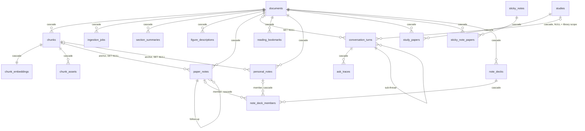

# Database schema

> **What this is:** every table and column, with the relationships between them. Look-up only.
>
> **Owns:** table/column meanings and FK behavior.
> **Does not own:** how the schema is applied ([migrations.md](migrations.md)), what the data
> means in flow ([overview.md](../02-architecture/overview.md)).
>
> **Status:** current · **Last verified:** `documents.title` and `paper_notes.scope` /
> `agent_steps` on 2026-08-26 against a live database (the migration was applied and the columns
> read back); the rest 2026-07-28 against
> [`database/schema.sql`](../../backend/app/database/schema.sql) (`main`, 5471870), and the
> `paper_notes` anchor/retrieval columns 2026-08-18 (`8fb153b`) — against the file, **not** a live
> database.
> **Verify with:** `\d+ <table>` in psql — the live database is authoritative
>
> ⚠ One FK deviates from the pattern: `conversation_turns.document_id` is `ON DELETE SET NULL`,
> not `CASCADE`, so chat history survives paper deletion. Everything else cascades.

Canonical schema is in [database/schema.sql](../../backend/app/database/schema.sql).
It is applied on startup by [database/migrations.py](../../backend/app/database/migrations.py)
(idempotent `CREATE TABLE IF NOT EXISTS …`).

Two Postgres extensions are required: `vector` (pgvector) and `uuid-ossp`.

## ERD

```
documents (1) ─────< (N) chunks ─────────< (1) chunk_embeddings
                        │ \───< (N) chunk_assets
                        │ \───< (N) figure_descriptions
                        ▲
                        │
            conversation_turns ──< (1) ask_traces
            conversation_turns ── parent_turn_id → conversation_turns.id (sub-threads)

documents (1) ─────< (N) ingestion_jobs
documents (1) ─────< (N) section_summaries
documents (1) ─────< (N) figure_descriptions
documents (1) ─────< (N) paper_notes
            paper_notes ── anchor_chunk_id → chunks.id  (SET NULL)
            paper_notes ── parent_note_id  → paper_notes.id (follow-ups)

documents (1) ─────< (N) reading_bookmarks
documents (1) ─────< (N) personal_notes
            personal_notes ── anchor_chunk_id → chunks.id (SET NULL)
documents (1) ─────< (N) study_papers >───── (1) studies
                                          studies (1) ─────< (N) conversation_turns
                                                              (study_id, NULL = whole library)
documents (1) ─────< (N) sticky_note_papers >───── (1) sticky_notes

documents (1) ─────< (N) note_decks
            note_decks ─────< (N) note_deck_members
                              note_deck_members ── ai_note_id       → paper_notes.id    ┐ exactly
                              note_deck_members ── personal_note_id → personal_notes.id ┘ one set
```

What the deck edges rule out: a member row pointing at nothing, and a member row pointing at both.
The `CHECK` makes "exactly one" a storage guarantee, so a deck can never hold a card that is
neither an answer nor a note.

### (rendered)



All FKs use `ON DELETE CASCADE` except `conversation_turns.document_id`
which uses `SET NULL` (so a chat about a deleted paper survives).

Two `documents` sub-trees, deliberately not merged: **`paper_notes`** is what the model answered,
**`reading_bookmarks` / `personal_notes` / `note_decks`** are what the reader did. A deck spans
both — it is the one place they meet, and it owns neither.

## Tables

### `documents`

The library row.

| Column                      | Type        | Notes                                                 |
| --------------------------- | ----------- | ----------------------------------------------------- |
| `id`                        | `UUID`      | PK, server-generated.                                 |
| `filename`                  | `TEXT`      | The opaque `<uuid>.pdf` on disk under `documents/`.   |
| `original_filename`         | `TEXT`      | What the user uploaded (used by `/raw`). ⚠ Never rewritten by a rename. |
| `title`                     | `TEXT`      | Reader-chosen display name, `NULL` = no override. Set by `PATCH /papers/{id}`. Deliberately separate from `original_filename` so the uploaded name is never lost and `/raw` still hands back a file named the way it arrived. |
| `file_size_bytes`           | `BIGINT`    |                                                       |
| `page_count`                | `INTEGER`   | Set by `pypdf` after pipeline completes.              |
| `status`                    | `TEXT`      | `queued / complete / failed`.                         |
| `error_message`             | `TEXT`      | Last failure message.                                 |
| `reading_order`             | `JSONB`     | LLM-corrected sequence of chunk sequence_ids.         |
| `reading_order_model`       | `TEXT`      |                                                       |
| `reading_order_updated_at`  | `TIMESTAMPTZ` |                                                     |
| `extractor`                 | `TEXT`      | `mineru` or `pymupdf_fallback`.                      |
| `doc_kind`                  | `TEXT`      | `paper` (default) or `book`. Chosen at upload; decides which reader opens it and which ingest chain it takes. |
| `embedding_mode`            | `TEXT`      | `embedded` (default) or `skipped`. Decided once at ingestion, never re-derived. |
| `embedding_skip_reason`     | `TEXT`      | Why, for audit: `fast_ingest`, `fits(N<=M)`, `too_large(...)`, `feature_disabled`. |
| `created_at`                | `TIMESTAMPTZ` | `DEFAULT NOW()`.                                    |
| `updated_at`                | `TIMESTAMPTZ` | Bumped by `update_document_status`.                 |

### `chunks`

One row per structural unit (heading, paragraph, math, table, figure).

| Column               | Type       | Notes                                       |
| -------------------- | ---------- | ------------------------------------------- |
| `id`                 | `UUID`     | PK.                                         |
| `document_id`        | `UUID`     | FK → `documents.id`, cascade delete.        |
| `sequence_id`        | `INTEGER`  | 1-based reading order within the document.  |
| `parent_sequence_id` | `INTEGER`  | Reserved for nested structures.             |
| `chunk_type`         | `TEXT`     | `text / heading / math / table / figure / footnote`. |
| `heading_path`       | `TEXT[]`   | Breadcrumb from H1 to current heading.      |
| `markdown`           | `TEXT`     | Normalized markdown body.                   |
| `plain_text`         | `TEXT`     | What we embed.                              |
| `page_start`         | `INTEGER`  | Currently nullable.                         |
| `page_end`           | `INTEGER`  | Currently nullable.                         |
| `bbox_json`          | `JSONB`    | Reserved for bounding boxes.                |
| `token_count`        | `INTEGER`  | `≈ len(plain_text) / 4`.                    |
| `table_json`         | `JSONB`    | Structured table data for `chunk_type='table'`. |
| `created_at`         | `TIMESTAMPTZ` |                                          |

Unique constraint: `(document_id, sequence_id)`.
Index: `idx_chunks_document_sequence(document_id, sequence_id)`.

### `chunk_embeddings`

A 1:1 sidecar to `chunks`. Separate table so heavy embedding rows can be
loaded only when needed.

| Column            | Type           | Notes                                |
| ----------------- | -------------- | ------------------------------------ |
| `chunk_id`        | `UUID`         | PK, FK → `chunks.id`, cascade.       |
| `embedding`       | `vector(N)` | N = `VECTOR_DIMENSION` env (default 1024); changing it re-embeds the library. |
| `embedding_model` | `TEXT`         | Name of the embedding model used.    |
| `created_at`      | `TIMESTAMPTZ`  |                                      |

Cosine search: `ORDER BY embedding <=> :query_embedding`.

### `chunk_assets`

Images extracted from MinerU output, linked back to the chunk that
referenced them.

| Column       | Type       | Notes                                           |
| ------------ | ---------- | ----------------------------------------------- |
| `id`         | `UUID`     | PK.                                             |
| `chunk_id`   | `UUID`     | FK → `chunks.id`, cascade.                      |
| `asset_type` | `TEXT`     | `image`, etc.                                   |
| `file_path`  | `TEXT`     | **Relative** to `images_dir()`. Served at `/static/images/<file_path>`. |
| `mime_type`  | `TEXT`     |                                                 |
| `width`      | `INTEGER`  | Currently null.                                 |
| `height`     | `INTEGER`  | Currently null.                                 |
| `caption`    | `TEXT`     | Currently null.                                 |
| `created_at` | `TIMESTAMPTZ` |                                              |

Index: `idx_chunk_assets_chunk_id(chunk_id)`.

### `conversation_turns`

The append-only chat log.

| Column            | Type          | Notes                                            |
| ----------------- | ------------- | ------------------------------------------------ |
| `id`              | `UUID`        | PK.                                              |
| `conversation_id` | `UUID`        | Groups turns into a thread.                      |
| `document_id`     | `UUID` (null) | FK → `documents.id`, **`SET NULL`** on delete.   |
| `parent_turn_id`  | `UUID` (null) | FK → `conversation_turns.id` cascade (sub-threads). |
| `role`            | `TEXT`        | `user / assistant / compaction`.                 |
| `content`         | `TEXT`        | The prompt or the answer.                        |
| `context_type`    | `TEXT`        | `LOCAL / GLOBAL / OVERVIEW / EXTERNAL / OUT_OF_SCOPE / COMPACTION`. |
| `router_reason`   | `TEXT`        | Why the router picked this context.              |
| `model`           | `TEXT`        | The actual model name the LLM returned.          |
| `citations`       | `JSONB`       | JSON-serialized list of `Citation` dicts.        |
| `created_at`      | `TIMESTAMPTZ` |                                                  |

Index: `idx_conversation_turns_conversation(conversation_id, created_at)`.

### `ask_traces`

Per-call telemetry attached to the assistant turn.

| Column                  | Type          | Notes                                           |
| ----------------------- | ------------- | ----------------------------------------------- |
| `id`                    | `UUID`        | PK.                                             |
| `conversation_turn_id`  | `UUID`        | FK → `conversation_turns.id`, cascade.          |
| `context_type`          | `TEXT`        |                                                 |
| `router_reason`         | `TEXT`        |                                                 |
| `retrieved_chunk_ids`   | `UUID[]`      | Currently always null — reserved.               |
| `model`                 | `TEXT`        |                                                 |
| `prompt_tokens`         | `INTEGER`     | From Ollama.                                    |
| `completion_tokens`     | `INTEGER`     |                                                 |
| `latency_ms`            | `INTEGER`     | Wall-clock time inside `handle_ask`.            |
| `created_at`            | `TIMESTAMPTZ` |                                                 |

### `ingestion_jobs`

One row per upload; tracks the pipeline state machine.

| Column          | Type          | Notes                                                  |
| --------------- | ------------- | ------------------------------------------------------ |
| `id`            | `UUID`        | PK.                                                    |
| `document_id`   | `UUID`        | FK → `documents.id`, cascade.                          |
| `status`        | `TEXT`        | `queued / extracting / chunking / embedding / summarizing / complete / failed`. |
| `error_message` | `TEXT`        |                                                        |
| `started_at`    | `TIMESTAMPTZ` | Set on first non-queued transition (idempotent).       |
| `completed_at`  | `TIMESTAMPTZ` | Set on `complete` or `failed`.                         |
| `created_at`    | `TIMESTAMPTZ` |                                                        |

Index: `idx_ingestion_jobs_status(status)`.

### `section_summaries`

Pre-computed hierarchical overviews used by the OVERVIEW chat route.

| Column                | Type          | Notes                                             |
| --------------------- | ------------- | ------------------------------------------------- |
| `id`                  | `UUID`        | PK.                                               |
| `document_id`         | `UUID`        | FK → `documents.id` cascade.                      |
| `section_id`          | `TEXT`        | Stable ID (e.g. `h1-03-introduction`).            |
| `level`               | `INTEGER`     | `0` = whole paper, `1` = H1, `2` = H2.            |
| `heading_path`        | `TEXT[]`      | Heading breadcrumb.                               |
| `sequence_start`      | `INTEGER`     | Inclusive source sequence range.                  |
| `sequence_end`        | `INTEGER`     |                                                    |
| `summary_markdown`    | `TEXT`        | LLM-generated summary.                            |
| `summary_plain`       | `TEXT`        | Plain-text version.                               |
| `source_chunk_ids`    | `UUID[]`      | Chunk IDs fed to the LLM (citations).             |
| `model`               | `TEXT`        |                                                    |
| `prompt_hash`         | `TEXT`        | Hash of prompt template + version.                |
| `created_at`          | `TIMESTAMPTZ` |                                                    |

`UNIQUE(document_id, section_id, model)`.

### `figure_descriptions`

VLM-generated technical descriptions of figures/diagrams.

| Column                       | Type          | Notes                                    |
| ---------------------------- | ------------- | ---------------------------------------- |
| `id`                         | `UUID`        | PK.                                      |
| `document_id`                | `UUID`        | FK → `documents.id` cascade.             |
| `chunk_id`                   | `UUID`        | FK → `chunks.id` cascade.                |
| `image_path`                 | `TEXT`        | Relative path under `images/`.           |
| `description_markdown`       | `TEXT`        | VLM-generated description.               |
| `description_plain`          | `TEXT`        | Plain-text version.                      |
| `source_sequence_start`      | `INTEGER`     |                                          |
| `source_sequence_end`        | `INTEGER`     |                                          |
| `referenced_by_chunk_ids`    | `UUID[]`      | Text chunks that mention this figure.    |
| `model`                      | `TEXT`        | eg. `gemma4:31b-cloud` (the resolved chat/VLM model at generation time).                    |
| `prompt_hash`                | `TEXT`        |                                          |
| `created_at`                 | `TIMESTAMPTZ` |                                          |

`UNIQUE(chunk_id, model)`.

⚠ Only populated under `INGEST_PROFILE=full`. The fast profile never runs the VLM pass — a
question about a figure hands the image to the model live instead.

### `paper_notes`

One question the reader asked about a specific place in a paper, plus its answer. The margin
annotations that replaced the side chat pane.

⚠ Deliberately **not** `conversation_turns`. A note is anchored to a location, is a single Q+A
rather than a rolling transcript, and none of the conversation machinery (routing, compaction,
sub-threads) applies. Sharing that table would give every note five columns it never uses and
surface notes in the chat-history endpoints.

| Column                 | Type          | Notes                                                     |
| ---------------------- | ------------- | --------------------------------------------------------- |
| `id`                   | `UUID`        | PK.                                                        |
| `document_id`          | `UUID`        | FK → `documents.id` cascade.                              |
| `anchor_chunk_id`      | `UUID`        | FK → `chunks.id` **SET NULL**. A convenience, not the anchor. |
| `anchor_sequence_id`   | `INTEGER`     | **The durable anchor.** What the margin positions by.      |
| `scope`                | `TEXT`        | `anchor` (default — a margin card beside a passage) or `document` (asked about the whole paper, from the assistant panel). Decides which surface renders it. |
| `anchor_kind`          | `TEXT`        | `text` (highlighted passage) / `figure` / `equation` / `table` (the whole table, including when the reader selected inside it) / `block` (no selection — anchored to what was in view) / `document` (the holistic level — not anchored at all). |
| `anchor_quote`         | `TEXT`        | The exact highlighted text; re-located in the DOM to repaint the highlight. For an equation, its LaTeX. |
| `anchor_image_path`    | `TEXT`        | Relative path under `images/` for figure and equation anchors. |
| `question`             | `TEXT`        |                                                            |
| `answer`               | `TEXT`        | `''` until generation completes — a failed call leaves a visible, retryable card. |
| `cited_sequence_ids`   | `INTEGER[]`   | Blocks the answer referenced via `[[42]]` markers; renders as jump chips. |
| `agent_steps`          | `JSONB`       | The trail of tool calls that produced the answer — one entry per `SECTION`/`SEARCH`/`READ`/`WEB`, with what was asked for, the model's stated reason, and a one-line summary of what came back. `NULL`/`[]` for notes predating 2026-08-26 and for answers that used no tool. Shape: [api.md `AgentStep`](api.md#post-papers_paper_idnotesstream). |
| `retrieval_mode`       | `TEXT`        | `agent` (the default: anchor + contents index, with a SECTION/SEARCH/READ/WEB loop available) or `whole` (the whole paper was in the prompt — only reachable with `PAPER_WHOLE_DOCUMENT_CONTEXT`, and never for `scope='document'`). |
| `model`                | `TEXT`        | What the provider reported answering.                      |
| `requested_model`      | `TEXT`        | What the reader picked. Authoritative for follow-ups.      |
| `margin_side`          | `TEXT`        | `right` (default) or `left`.                               |
| `parent_note_id`       | `UUID`        | FK → `paper_notes.id` cascade. Follow-ups chain here.      |
| `created_at`           | `TIMESTAMPTZ` |                                                            |

⚠ **A `scope='document'` row still carries an `anchor_sequence_id`** — the paper's first block —
because the column is `NOT NULL`. Nothing positions by it, and margin-balancing
(`notes.py::_choose_margin`) explicitly excludes these rows: they all share one sequence id, so
counting them would make every note near the top of the paper look crowded.

⚠ `anchor_chunk_id` is `SET NULL` rather than `CASCADE` on purpose. Re-chunking deletes every
chunk row, so cascading would delete the reader's notes along with them. `anchor_sequence_id`
survives, so a re-chunk degrades an anchor's precision instead of destroying the note.

Indexes: `(document_id, anchor_sequence_id, created_at)` — the exact order the margin lays cards
out in — and `(parent_note_id)` for thread loading.

### `studies`, `study_papers`

A named group of papers that scopes an answer. **Not a folder** — a paper can sit in several studies
at once, and removing it from one takes nothing away from the library.

| Column | Type | Notes |
| --- | --- | --- |
| `studies.id` | `UUID` | PK. |
| `studies.name` | `TEXT` | |
| `studies.description` | `TEXT` | |
| `study_papers.study_id` | `UUID` | FK → `studies.id` cascade. PK with `document_id`. |
| `study_papers.document_id` | `UUID` | FK → `documents.id` cascade. |
| `study_papers.position` | `INTEGER` | **The citation order.** Index in this list is the `P<n>` an answer names the paper by. |

⚠ **`position` is load-bearing, not cosmetic.** Answers cite `[[P2:41]]`, so re-ordering a study
repoints every citation the reader has already read. That is why membership is written
whole-collection (`PUT /studies/{id}/papers`) — the list order *is* the numbering.

### `sticky_notes`, `sticky_note_papers`

A note the reader keeps in front of them, with no anchor.

| Column | Type | Notes |
| --- | --- | --- |
| `sticky_notes.id` | `UUID` | PK. |
| `sticky_notes.body` | `TEXT` | Markdown, rendered by the shared pipeline. |
| `sticky_notes.color` | `TEXT` | `yellow` \| `blue` \| `green` \| `pink` \| `plain`. A **name**, not a hex — the UI maps it to CSS variables so it survives the light/dark switch. |
| `sticky_notes.pinned` | `BOOLEAN` | Sorts first. |
| `sticky_note_papers` | | `(sticky_id, document_id)`, both cascade. |

⚠ **Deliberately not `personal_notes`.** A personal note is anchored to a block in one document and
lives in that document's margin; a sticky has no anchor, may name several papers or none, and lives
on the desk. Sharing a table would give every sticky an `anchor_sequence_id` that means nothing and
would surface stickies in the margin layout.

⚠ **Zero rows in `sticky_note_papers` is a scope, not an incomplete row.** A note about nothing in
particular shows on every desk. Code that treats an empty scope as "not yet assigned" hides exactly
the notes the reader most wanted pinned.

## Personal reading state

What the reader did to a paper, as opposed to what the model answered. Four tables, written by
[repositories/personal.py](../../backend/app/database/repositories/personal.py), served by
[endpoints/personal.py](../../backend/app/api/v1/endpoints/personal.py).
Endpoints: [api.md § Personal reading state](api.md#personal-reading-state).

`[historical]` These lived in browser `localStorage` until 2026-07-28.

### `reading_bookmarks`

A place worth coming back to. Several per paper.

| Column        | Type          | Notes                                                        |
| ------------- | ------------- | ------------------------------------------------------------ |
| `id`          | `UUID`        | PK.                                                           |
| `document_id` | `UUID`        | FK → `documents.id`, cascade.                                 |
| `sequence_id` | `INTEGER`     | The durable anchor — same rule as `paper_notes`.              |
| `snippet`     | `TEXT`        | Preview of the block, cached at save time so the list renders without loading the document. A re-chunk can make it stale: a slightly wrong preview beats an empty one. |
| `kind`        | `TEXT`        | `text / figure / equation / block`, for labelling the row.    |
| `page`        | `INTEGER`     | Page the mark sits on, when known.                            |
| `progress`    | `REAL`        | Scroll fraction when the mark was made.                       |
| `label`       | `TEXT`        | Optional name the reader gave it.                             |
| `created_at`  | `TIMESTAMPTZ` |                                                               |
| `updated_at`  | `TIMESTAMPTZ` |                                                               |

⚠ **Unique on `(document_id, sequence_id)` — one mark per block, guaranteed.** The reader treats a
second press on a bookmarked block as "actually, not here", so a duplicate is always a bug rather
than an intent worth storing. `POST /bookmarks` is therefore an upsert, not an insert.

### `personal_notes`

Something the reader wrote, anchored beside the passage that prompted it. Deliberately **not** a
row in `paper_notes`: it has no question, no model, no citations, and no thread, and sharing that
table would mean carrying eight unused columns into every endpoint that lists answers.

| Column               | Type          | Notes                                                  |
| -------------------- | ------------- | ------------------------------------------------------ |
| `id`                 | `UUID`        | PK.                                                     |
| `document_id`        | `UUID`        | FK → `documents.id`, cascade.                           |
| `anchor_chunk_id`    | `UUID`        | FK → `chunks.id`, **`SET NULL`** — same re-chunk reasoning as `paper_notes`. |
| `anchor_sequence_id` | `INTEGER`     | The durable anchor.                                     |
| `anchor_quote`       | `TEXT`        | The highlighted passage, re-located and painted on load. |
| `body`               | `TEXT`        | Markdown, rendered by the same pipeline as an answer.   |
| `margin_side`        | `TEXT`        | `right` (default) or `left`.                            |
| `created_at`         | `TIMESTAMPTZ` |                                                         |
| `updated_at`         | `TIMESTAMPTZ` | Bumped on every edit.                                   |

Index: `(document_id, anchor_sequence_id, created_at)` — the margin's layout order.

### `note_decks`

A stack of cards sharing one slot in the margin. **A deck owns nothing**: its members are notes
that go on existing independently, so spreading a deck leaves every note exactly as it was. What it
buys is vertical space, which is the gutter's scarce resource.

| Column        | Type          | Notes                                                        |
| ------------- | ------------- | ------------------------------------------------------------ |
| `id`          | `UUID`        | PK. ⚠ **Supplied by the client** and preserved across writes, so an untouched deck keeps its identity. |
| `document_id` | `UUID`        | FK → `documents.id`, cascade.                                 |
| `label`       | `TEXT`        | Optional name.                                                |
| `top_index`   | `INTEGER`     | Which member is face-up. Clamped to the member count on write. |
| `margin_side` | `TEXT`        | `right` (default) or `left`. Members keep their own side, restored when the deck is spread. |
| `study`       | `BOOLEAN`     | Study mode hides each answer until the reader asks for it.    |
| `created_at`  | `TIMESTAMPTZ` | Also the ordering key when listing.                           |
| `updated_at`  | `TIMESTAMPTZ` |                                                               |

### `note_deck_members`

Deck membership, in stacking order.

| Column             | Type      | Notes                                                     |
| ------------------ | --------- | --------------------------------------------------------- |
| `deck_id`          | `UUID`    | FK → `note_decks.id`, cascade. PK with `ordinal`.          |
| `ordinal`          | `INTEGER` | Position in the stack, 0-based.                            |
| `ai_note_id`       | `UUID`    | FK → `paper_notes.id`, cascade.                            |
| `personal_note_id` | `UUID`    | FK → `personal_notes.id`, cascade.                         |

`CHECK ((ai_note_id IS NULL) <> (personal_note_id IS NULL))` — exactly one is set. A member is
either an answer or a note, never both and never neither.

⚠ **Two nullable foreign keys rather than one polymorphic id, on purpose.** This buys real
referential integrity: deleting a note removes it from its deck automatically, instead of leaving
a dangling reference for the client to notice and skip. The cost is the `CHECK` above.

Partial unique indexes `idx_deck_members_ai` and `idx_deck_members_personal` make **"a card belongs
to at most one deck"** a storage guarantee rather than something the client is trusted to maintain.

⚠ That guarantee has a sharp edge for writers. The index does not care that the row it collides
with is one the same statement is about to delete, so **membership must be cleared for the whole
document before any row is inserted** — otherwise swapping two cards between two decks fails with a
unique violation. See `personal.py::replace_decks` and
`tests/test_personal_state.py::test_two_cards_can_swap_decks_in_one_write`.

**A deck of fewer than two cards is not a deck.** Membership rows vanish with their notes, so a
deck can be reduced from the outside at any time; `personal.py::prune_thin_decks` drops those and
runs on every read of `GET /personal` and `GET /decks`, and after a personal-note delete.

## Status state machines

**`documents.status`**

```
queued ──► complete
      └──► failed
```

**`ingestion_jobs.status`** — the path depends on `INGEST_PROFILE` and `doc_kind`.

```
                                    ┌─ fast profile + doc_kind='paper' ─┐
queued → extracting → chunking ─────┴──────────────────────────────────► complete
                          │
                          ├─ full profile ──► embedding ──► summarizing ──► complete
                          │
                          └─ paper-only skip ─────────────► summarizing ──► complete

any state ─────────────────────────────────────────────────────────────► failed
```

⚠ `chunking → complete` is the fast path, and it is the one place other than
`generate_section_summaries` that sets completion. That is safe only because nothing is
dispatched afterwards — see
[`pipeline_sync.py`](../../backend/app/extraction/pipeline_sync.py).