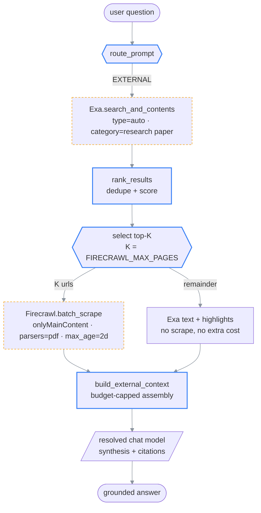
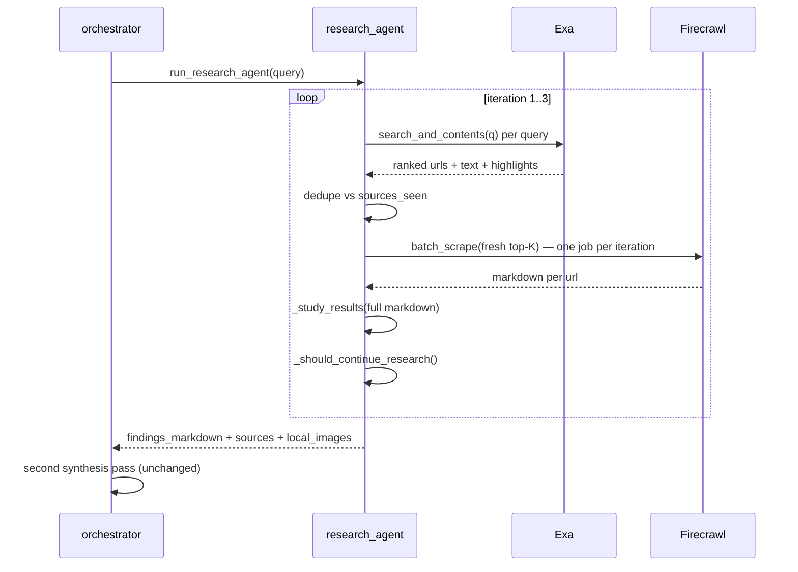

# Plan — Replace SearXNG with Exa (search) + Firecrawl (read)

> **What this is:** the design and migration plan for swapping the EXTERNAL research path
> from a self-hosted SearXNG metasearch proxy to a two-stage **Exa → Firecrawl** pipeline:
> Exa finds the right documents semantically, Firecrawl turns each one into clean markdown
> the LLM can actually read.
>
> **How to read it:** §1 why the current path is weak → §2 the two-stage contract →
> §3 architecture (dual-render) → §4 exact code surface that changes → §5 configuration →
> §6 cost & latency envelope → §7 failure catalog → §8 what never happens → §9 sharp edges →
> §10 segmentation for handoff.
>
> **Companions (detail):**
> [chat-and-ask.md](../../02-architecture/chat-and-ask.md) — how EXTERNAL is routed and cited ·
> [ai-backend.md](../../02-architecture/ai-backend.md) — provider resolution this plan mirrors ·
> [configuration.md](../../03-reference/configuration.md) — canonical env-var table.
>
> **Status:** `[historical]` — **superseded, not implemented.** On 2026-08-26 the web-search path
> was replaced with **Tavily** instead, behind the provider dispatch in
> [`app/search/web.py`](../../../backend/app/search/web.py). Tavily returns ranked, already-extracted
> page text in one call, which is what the two-stage Exa → Firecrawl pipeline below existed to
> assemble from two vendors. Kept for the failure catalog (§7) and the "what never happens" analysis
> (§8), which still describe the shape of the problem correctly.
> See [decisions.md](../../decisions.md), entry 2026-08-26.
>
> **Reflects code as of:** 2026-07-25 (`main`, ad43845)
> **Language decision:** the backend is **Python 3.11 / FastAPI** — every integration below is
> Python (`exa-py`, `firecrawl-py`). The React frontend never calls Exa or Firecrawl directly.

---

## Table of contents

1. [Why the current EXTERNAL path is weak](#1-why-the-current-external-path-is-weak)
2. [The two-stage contract](#2-the-two-stage-contract)
3. [Architecture](#3-architecture)
4. [Code surface that changes](#4-code-surface-that-changes)
5. [Configuration](#5-configuration)
6. [Cost & latency envelope](#6-cost--latency-envelope)
7. [Failure catalog](#7-failure-catalog)
8. [What never happens](#8-what-never-happens)
9. [Known sharp edges](#9-known-sharp-edges)
10. [Segmentation](#10-segmentation)

---

## 1. Why the current EXTERNAL path is weak

The problem is not that SearXNG is a bad metasearch proxy. It is that **the system never reads
anything it finds.**

Trace the EXTERNAL route as it exists today:

| Step | Code | What actually happens |
| --- | --- | --- |
| Search | [`searxng_client.py::search`](../../../backend/app/search/searxng_client.py) | Returns `title`, `url`, `snippet`, `source_engine`, `score` — SERP metadata only. |
| Rank | [`ranking.py::rank_results`](../../../backend/app/search/ranking.py) (L22-25) | Dedupes by URL, sorts by engine `score`, **truncates every snippet to 500 chars**. |
| "Study" | [`research_agent.py::_study_results`](../../../backend/app/chat/research_agent.py) (L211-217) | Takes `snippet[:280]` and calls it a `key_point`. That is the entire study phase. |
| Synthesize | [`orchestrator.py`](../../../backend/app/chat/orchestrator.py) | Feeds those 280-char fragments to the LLM as `RESEARCH FINDINGS`. |

⚠ **The landmine:** `run_research_agent` is documented as an "iterative Observe → Reason → Act
loop" and runs up to `MAX_ITERATIONS = 3` rounds against `RESULTS_PER_SEARCH = 6` results. After
three rounds of real network traffic, the model's entire knowledge of the outside world is at most
**18 × 280 characters ≈ 5 KB of Google-style blurbs**. It has never seen a single paper.

Two consequences that the guardrail and prompt engineering exist to paper over:

- **Grounding is theatrical.** Citations point at URLs whose contents were never fetched, so the
  model is synthesizing from titles and blurbs while the answer presents as source-backed.
- **The domain bias is a string hack.** [`external_context.py::rewrite_query_for_papers`](../../../backend/app/chat/external_context.py)
  appends `"machine learning OR deep learning OR computer science"` to the query because keyword
  search cannot tell CS "transduction" from genetics "transduction". A semantic search engine
  resolves that at the embedding level and the hack becomes unnecessary.

Exa fixes the *finding*. Firecrawl fixes the *reading*. Neither alone closes the gap.

---

## 2. The two-stage contract

### Stage 1 — Exa (the map maker)

**Why:** embeddings-native search over a web index built for LLM consumption. Ranks by meaning,
not keyword overlap, and exposes a `category` filter (`research paper`, `pdf`, `news`, `github`)
that replaces the hand-rolled `_TECH_HINT_WORDS` bias list.

**When:** every EXTERNAL route, and every iteration of the research agent.

**How:** `search_and_contents` returns ranked URLs *plus* Exa's own extracted text and highlights
in one round trip. That text is good enough for ranking and for cheap questions — which matters,
because it lets Stage 2 be selective rather than automatic.

```python
# [spec] app/search/exa_client.py
from exa_py import AsyncExa

exa = AsyncExa(api_key=settings.exa_api_key)
res = await exa.search_and_contents(
    query,
    type="auto",                    # neural when semantic, keyword when literal
    category="research paper",      # or "pdf" / None — replaces the query-bias hack
    num_results=6,
    text={"max_characters": 2000},  # cheap pre-read for ranking
    highlights={"num_sentences": 3, "highlights_per_url": 2},
    start_published_date="2023-01-01",   # only when the query is recency-flavored
)
```

### Stage 2 — Firecrawl (the reader)

**Why:** Exa's extracted text is a summary layer. For a paper the model must reason over —
methods, equations, tables, ablations — the system needs the **whole document as clean markdown**.
Firecrawl strips nav/ads/cookie walls (`onlyMainContent: true`, default), handles anti-bot
pages via its proxy tiers, and — critically for this app — **converts PDFs to markdown natively**
(`parsers: ["pdf"]`, the default).

**When:** *selectively*, on the top `FIRECRAWL_MAX_PAGES` Exa hits — never on all of them. This is
the single most important cost control in the plan (see §6).

**How:** `batch_scrape` over the selected URLs in one job rather than N sequential scrapes.

```python
# [spec] app/search/firecrawl_client.py
from firecrawl import AsyncFirecrawl

fc = AsyncFirecrawl(api_key=settings.firecrawl_api_key)
job = await fc.batch_scrape(
    urls,                                  # top-K from Exa only
    formats=["markdown"],
    only_main_content=True,
    max_age=172_800_000,                   # 2-day cache; repeat URLs cost ~nothing
    timeout=120,
    poll_interval=1,
)
# job.status ∈ {scraping, completed, failed}; job.data[i].markdown, .metadata.sourceURL
```

> `max_age` is the quiet win. A research session re-visits the same canonical papers constantly
> (arXiv, the same 3 blog posts). Firecrawl serves a cached scrape when the page is younger than
> `max_age` — the upstream docs claim up to a 500 % speedup on repeat hits, and it converts most
> follow-up questions into a near-free path.

### The division of labour, stated as an invariant

> **Exa decides *what* to read. Firecrawl decides *what the text is*. Neither ever decides what
> the answer is** — synthesis stays in [`orchestrator.py`](../../../backend/app/chat/orchestrator.py)
> with the resolved chat model, exactly as it is today.

---

## 3. Architecture

### 3a. EXTERNAL route — before and after

```text
BEFORE (today)
──────────────
user question
     │
     ▼
route_prompt() ── EXTERNAL ──►  rewrite_query_for_papers()
                                  │  appends "machine learning OR ..." (keyword hack)
                                  ▼
                               SearXNG  :8080  ──► [title, url, snippet(≤500ch), score]
                                  │
                                  ▼
                               rank_results()  ──► snippet[:280]
                                  │
                                  ▼
                               LLM  ◄── ~5 KB of SERP blurbs        ⚠ never read a page


AFTER (this plan)
─────────────────
user question
     │
     ▼
route_prompt() ── EXTERNAL ──►  Exa.search_and_contents()
                                  │  type=auto, category="research paper"
                                  │  semantic → no query-bias hack needed
                                  ▼
                               [url, title, exa_text(2k), highlights, score]
                                  │
                                  ├──────────────► rank + dedupe (ranking.py, reused)
                                  │                        │
                                  │                        ▼
                                  │                 select top-K  (K = FIRECRAWL_MAX_PAGES, default 3)
                                  │                        │
                                  ▼                        ▼
                        cheap path: Exa text        Firecrawl.batch_scrape(K urls)
                        (K exhausted / budget off)    │  onlyMainContent, parsers=[pdf]
                                  │                   │  max_age=2d cache
                                  │                   ▼
                                  │            full markdown per URL (papers, PDFs, docs)
                                  │                   │
                                  └────────┬──────────┘
                                           ▼
                                    build_external_context()
                                           │  budget-capped assembly
                                           ▼
                                    LLM  ◄── real document text, cited by sourceURL
```

#### 3a. (rendered)



> 🟦 solid = owned by this repo · 🟨 dashed = external paid API.
> The `SEL` gate is the cost boundary: everything left of it is one Exa call; everything right of
> it bills per page. `CHEAP` exists so that lowering `FIRECRAWL_MAX_PAGES` to `0` degrades the
> system to "Exa-only" rather than breaking it.

### 3b. Research-agent loop, per iteration

```text
iteration N  (MAX_ITERATIONS = 3, unchanged)
  │
  ├─ queries ──► Exa.search_and_contents  ×  len(queries)      [1 call each]
  │                    │
  │                    ▼
  │              dedupe vs sources_seen (existing set, reused)
  │                    │
  ├─ fresh urls ─► Firecrawl.batch_scrape (ONE job for the whole iteration)
  │                    │                    ⚠ not one job per query — batch across the round
  │                    ▼
  │              full markdown  ──►  _study_results()   [REWRITTEN: real text, not snippet[:280]]
  │                    │
  ├─ _should_continue_research()  ── heuristic unchanged
  │                    │
  ▼                    ▼
stop                follow-up queries → iteration N+1
```

#### 3b. (rendered)



---

## 4. Code surface that changes

### 4a. Change recipe

| To add/change | Touch these files (in order) | What to verify |
| --- | --- | --- |
| New search provider | `app/search/exa_client.py` (new) | `search()` returns the same dict keys SearXNG did: `title`, `url`, `snippet`, `source_engine`, `score` |
| New reader | `app/search/firecrawl_client.py` (new) | Returns `{url: markdown}`; missing/failed URLs are absent, never `None`-valued |
| Provider selection | `app/search/resolver.py` (new) | Mirrors [`llm/resolver.py`](../../../backend/app/llm/resolver.py) — `auto` → Exa if key, else SearXNG if reachable, else empty |
| EXTERNAL assembly | `app/chat/external_context.py` (rewrite) | `build_external_context()` keeps its return shape: `{results, images, query, original_query, image_intent}` |
| Research loop | `app/chat/research_agent.py` (`_study_results`, L201-229) | Studies full markdown; batch-scrapes once per iteration, not per query |
| Ranking | `app/search/ranking.py` | Exa `score` is a relevance float, not a SearXNG engine score — confirm sort direction still holds |
| Config | `app/core/config.py`, `backend/.env.example` | New keys in §5 load and default cleanly with no key set |
| Health | `app/api/v1/endpoints/health.py` | `searxng` field becomes `research` (or reports both) — this is a **response-shape change**, see §9 |
| Debug endpoint | `app/api/v1/endpoints/search.py` (`GET /search/web`) | Still returns `{results, query, total}` |
| Compose | `backend/docker-compose.yml` | `searxng` service + `SEARXNG_URL` env in `api` and `celery_worker` become optional |
| Deps | `backend/requirements.txt` | `exa-py`, `firecrawl-py` — **pin them**; nothing else in this file is pinned (known debt) |

### 4b. Interface both providers must satisfy

Keeping this contract is what makes the swap non-destructive — `SEARCH_PROVIDER=searxng` must
remain a working fallback through at least one release.

```python
# [spec] app/search/base.py
async def search(query: str, *, categories: list[str] | None = None,
                 limit: int = 10) -> list[dict]:
    """-> [{title, url, snippet, source_engine, score}, ...]  (order = rank)"""

async def read(urls: list[str], *, timeout_s: int = 120) -> dict[str, str]:
    """-> {url: clean_markdown}. Failed URLs are OMITTED, never mapped to None/''."""

async def is_available() -> bool: ...
```

> `read()` has no SearXNG implementation — the SearXNG provider returns `{}`. That is the honest
> encoding of "this provider cannot read pages", and it lets `build_external_context` fall back to
> snippets without a branch on provider name.

---

## 5. Configuration

Added to [`app/core/config.py`](../../../backend/app/core/config.py) alongside the existing
provider settings. Canonical table lives in
[configuration.md](../../03-reference/configuration.md); this is the delta.

| Key | Default | Purpose |
| --- | --- | --- |
| `SEARCH_PROVIDER` | `auto` | `auto` = Exa if `EXA_API_KEY` set, else SearXNG if reachable, else EXTERNAL returns empty. Pin with `exa` \| `searxng` \| `none`. |
| `EXA_API_KEY` | (empty) | Enables the Exa path. Absent ⇒ `auto` silently falls back to SearXNG. |
| `EXA_SEARCH_TYPE` | `auto` | `auto` \| `neural` \| `keyword`. `auto` lets Exa pick per query. |
| `EXA_CATEGORY` | `research paper` | Exa category filter. Empty string disables it (general web). |
| `EXA_TEXT_MAX_CHARS` | `2000` | Per-result pre-read used for ranking and the cheap path. |
| `FIRECRAWL_API_KEY` | (empty) | Enables page reading. Absent ⇒ Exa text only; the system still works. |
| `FIRECRAWL_MAX_PAGES` | `3` | **The cost dial.** Pages scraped per EXTERNAL turn. `0` disables reading entirely. |
| `FIRECRAWL_MAX_AGE_MS` | `172800000` | 2 days. Cache window for repeat URLs. |
| `FIRECRAWL_PROXY` | `auto` | `basic` \| `enhanced` \| `auto`. `enhanced` costs up to 5 credits/page; `auto` only escalates after `basic` fails. |
| `FIRECRAWL_TIMEOUT_S` | `120` | Batch-job wall clock. Exceeded ⇒ partial results are used. |
| `RESEARCH_CONTEXT_BUDGET_CHARS` | `24000` | Hard cap on assembled external markdown before it reaches the model. |
| `SEARXNG_URL` | `http://localhost:8080` | **Retained.** Still the fallback provider; unchanged semantics. |

> ⚠ `RESEARCH_CONTEXT_BUDGET_CHARS` is new and load-bearing. Today the EXTERNAL block is
> self-limiting because snippets are tiny. Full markdown is not — three scraped papers can be
> 150 KB+, which will blow past a local model's usable window even at gemma4's 262 k context and
> will be slow and expensive on a cloud key. Truncate per-source, round-robin across sources, so
> one long paper cannot starve the other two.

---

## 6. Cost & latency envelope

Stated per EXTERNAL turn, at the defaults above, as of 2026-07. **Verify against current Exa and
Firecrawl pricing pages before committing spend — these are structural estimates, not quotes.**

| Path | Exa calls | Firecrawl pages | Notes |
| --- | --- | --- | --- |
| Single EXTERNAL question | 1 | ≤ 3 | Cache hits on repeat URLs cost ~nothing (`max_age`). |
| Research agent, 1 iteration | 2–3 (one per query) | ≤ 3 (one batch job) | Batch per *iteration*, not per query. |
| Research agent, full 3 iterations | 6–9 | ≤ 9 | ⚠ The realistic worst case. See the guard below. |
| PDF scrape | — | 1 credit **per page** | A 12-page paper = 12 credits, not 1. This dominates cost. |

> ⚠ **The per-page PDF billing is the sharpest cost edge in this plan.** `parsers: ["pdf"]`
> converts PDFs to markdown at 1 credit per page — exactly the content this app most wants. A
> research agent that scrapes three 15-page papers across three iterations can bill ~135 credits
> for one question. Mitigations, in order of preference:
> 1. Keep `FIRECRAWL_MAX_PAGES` low (3) and scrape only *newly seen* URLs — `sources_seen` in
>    [`research_agent.py`](../../../backend/app/chat/research_agent.py) already tracks this.
> 2. Prefer the arXiv **abs** page over the **pdf** URL when both are available; scrape the PDF
>    only when the model explicitly needs methods/results depth.
> 3. Add a per-conversation scrape counter and stop reading (not searching) past a ceiling.

**Latency.** Exa returns in roughly the time SearXNG did. Firecrawl adds a real batch-scrape wait —
budget **5–25 s** for 3 pages, more when `proxy` escalates to `enhanced`. Against the current
`/ask` EXTERNAL baseline of 30–120 s with the research agent, this is not a regression, but it
does move latency from "several fast useless calls" to "fewer slow useful ones". Say so in the UI:
the processing indicator should read *reading sources* during the scrape phase.

---

## 7. Failure catalog

| Failure | Detected by | Behavior | User-visible | Recovery |
| --- | --- | --- | --- | --- |
| `EXA_API_KEY` missing, `SEARCH_PROVIDER=auto` | `resolver.py` at call time | Falls back to SearXNG | None | Add key, or run SearXNG |
| Exa 401 / invalid key | HTTP 401 from `exa-py` | Log error, fall back to SearXNG, then empty | Answer is ungrounded but returned | Rotate key |
| Exa 429 rate limit | HTTP 429 | Log, return `[]` for that query; other queries in the round still run | Fewer sources | Back off; lower `RESULTS_PER_SEARCH` |
| `FIRECRAWL_API_KEY` missing | `resolver.py` | Exa text + highlights only, no scrape | Shallower answer, still cited | Add key |
| Firecrawl job `failed` | `job.status == "failed"` | Use Exa text for all URLs | Shallower answer | Check Firecrawl status page |
| Firecrawl partial batch | `job.completed < job.total` | Use whatever markdown arrived; missing URLs fall back to Exa text | Mixed depth | None needed — by design |
| URL blocked by robots.txt | `/batch/scrape/{id}/errors` → `robotsBlocked[]` | URL omitted from `read()` result | Source cited from Exa text only | None — respect it |
| Scrape returns huge markdown | `len()` vs `RESEARCH_CONTEXT_BUDGET_CHARS` | Per-source round-robin truncation | Slightly shorter context | Raise budget if the model has room |
| Both providers unavailable | `resolver.py` | `build_external_context` returns empty `results` | Answer is ungrounded but does not crash — matches today's SearXNG-down behavior | Configure one provider |

> The guiding rule, inherited from [`llm/resolver.py`](../../../backend/app/llm/resolver.py): **a
> missing research provider degrades the answer; it never fails the request.** LOCAL, GLOBAL, and
> OVERVIEW routes must remain completely unaffected — they never touch this code path.

---

## 8. What never happens

Negative guarantees — each is a bug if observed:

1. **Exa and Firecrawl are never called on the LOCAL, GLOBAL, OVERVIEW, or OUT_OF_SCOPE routes.**
   The local-first promise in [overview.md](../../02-architecture/overview.md) survives this change:
   a user reading a paper and asking about it still emits zero external requests.
2. **Firecrawl is never called on a URL Exa did not return** (or the user did not explicitly
   paste). No crawling, no link-following, no `crawl()` — `scrape`/`batch_scrape` only.
3. **Paper text, chunk text, and conversation history are never sent to Exa or Firecrawl.** Only
   the rewritten *query string* goes to Exa; only *URLs* go to Firecrawl.
4. **A scrape failure never marks a document or job `failed`.** Ingestion and research are
   unrelated subsystems.
5. **No scraped content is written to Postgres.** External markdown lives for the duration of the
   turn. (Research *images* keep their existing durable path under
   `images/research/<conversation_id>/` — unchanged by this plan.)

---

## 9. Known sharp edges

- ⚠ **Image search has no clean equivalent.** [`searxng_client.py::search_images`](../../../backend/app/search/searxng_client.py)
  backs `_wants_images()` in `external_context.py` and the `local_images` persistence in
  `research_agent.py`. Neither Exa nor Firecrawl offers a SearXNG-style image search. Options,
  none free: (a) harvest `` image URLs out of the Firecrawl markdown — works well for
  papers and blog posts, which is most of the real use; (b) keep SearXNG running *solely* for
  images; (c) drop the feature. **This plan assumes (a)** and treats (b) as the fallback if image
  quality regresses. This is the one place where the migration is not a strict improvement.
- ⚠ **`/health` response shape changes.** The `searxng` field is consumed by
  [`api.ts::checkHealth`](../../../frontend/src/api.ts). Renaming it to `research` is a breaking
  change for any client that reads it. Prefer adding `research` and keeping `searxng` for one
  release.
- ⚠ **Local-first is now partly rented.** SearXNG was self-hosted; Exa and Firecrawl are paid
  SaaS on someone else's machine. The README's "everything runs locally by default" claim stays
  true only because EXTERNAL is opt-in per query — but the claim must be reworded, not left to
  rot. ⚠ **Queries leave the machine in plaintext to a commercial API.** That is a real privacy
  posture change and belongs in the README, not buried here.
- **`rank_results` semantics shift.** SearXNG `score` is an engine-fusion score; Exa's is a
  relevance float. The existing `sort(key=score, reverse=True)` still works, but the 500-char
  snippet truncation at [`ranking.py:24-25`](../../../backend/app/search/ranking.py) becomes actively
  harmful once `snippet` can carry Exa's 2000-char text. Raise or remove it.
- **`rewrite_query_for_papers` should shrink, not die.** With `category="research paper"` doing
  the domain work, the keyword-stuffing branches are noise — but the *paper-title anchoring*
  branch (`f'{q} (in the context of the research paper "{title}")'`) is genuinely useful signal
  for a semantic engine. Keep that one.
- **Neither SDK is currently a dependency, and `requirements.txt` pins nothing.** Adding two
  network-facing SaaS SDKs unpinned to a file where `fastapi`, `sqlalchemy`, and `httpx` all float
  compounds an existing reproducibility problem. Pin the new ones at minimum.

---

## 10. Segmentation

Four handoff-sized segments. S1 and S2 are independent and can run in parallel; S3 depends on
both; S4 is cleanup that must not start until S3 has been exercised on a real question.

| Seg | Scope | Done when |
| --- | --- | --- |
| **S1** | `app/search/exa_client.py` + `resolver.py` + config keys. Exa behind the `search()` contract in §4b. | `GET /search/web?q=...` returns Exa results with `SEARCH_PROVIDER=exa`, and identical-shaped SearXNG results with `SEARCH_PROVIDER=searxng`. |
| **S2** | `app/search/firecrawl_client.py` implementing `read()`. Batch scrape, `max_age`, PDF parsing, partial-failure tolerance. | Given 3 URLs (one HTML, one arXiv abs, one PDF), returns markdown for each; a deliberately bad URL is omitted, not `None`. |
| **S3** | Wire both into `external_context.py` + `research_agent.py::_study_results`. Budget cap. Health field. | An EXTERNAL question produces an answer citing text that appears in the scraped markdown — verified by grepping the answer against `job.data[].markdown`. |
| **S4** | Image strategy (§9), compose/docs cleanup, decide SearXNG's fate, reword the local-first claim in the README. | `docker compose up` no longer requires `searxng`; README privacy wording matches reality. |

**Not in scope:** the research agent's iteration heuristics (`_should_continue_research`), the
domain guardrail, citation filtering, and every non-EXTERNAL route. This plan changes *where
external text comes from*, not *how the model reasons about it*.

---

## Verify with

```bash
# provider resolution (add cases mirroring tests/test_provider_resolver.py)
cd backend && pytest tests/test_search_resolver.py -v

# end-to-end EXTERNAL, provider pinned
SEARCH_PROVIDER=exa curl -s "http://localhost:8000/api/v1/search/web?q=speculative+decoding&limit=5" | jq

# confirm a real read happened (not a snippet)
#   the answer should contain phrasing that exists only in the page body
```
