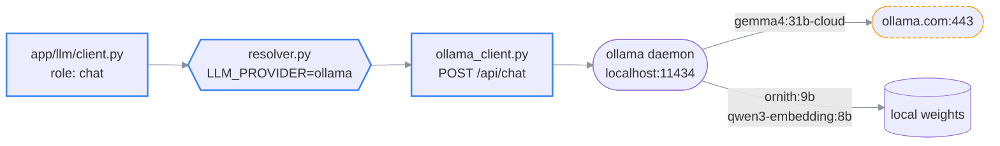

# Plan: Ollama on localhost, gemma4 cloud as the chat model

> **What this is:** the model-wiring decision for this machine: Ollama pinned at
> `localhost:11434`, chat served by the `gemma4:31b-cloud` tag, classification and embedding kept
> local. Applied, not proposed: `backend/.env` exists and every model below was verified
> responding.
>
> **How to read it:** §1 the routing surprise → §2 the applied config → §3 role split and why →
> §4 verification → §5 sharp edges → §6 Docker delta.
>
> **Companions (detail):**
> [ai-backend.md](../02-architecture/ai-backend.md): how `llm/resolver.py` picks a provider ·
> [configuration.md](../03-reference/configuration.md): canonical env-var table.
>
> **Status:** current · **Reflects code as of:** 2026-07-25 (`main`, ad43845)
> **Verified with:** `POST localhost:11434/api/chat` and `/api/embed` against all three models.

---

## 1. The routing surprise worth stating first

`gemma4:31b-cloud` is **not** a local model, and it is **not** a cloud provider in the sense that
[`llm/resolver.py`](../../backend/app/llm/resolver.py) means. It is an Ollama *cloud tag*: the
request goes to `localhost:11434` exactly like any local model, and the Ollama daemon on this
machine proxies it to `ollama.com`.

This matters because it cuts against the obvious reading of the config:

```text
                        what you'd assume                   what actually happens
                        ─────────────────                   ─────────────────────
LLM_PROVIDER=ollama  →  local weights, offline        →     localhost:11434 …which forwards
CHAT_MODEL=…-cloud   →  resolver picks a cloud path   →     resolver still sees "ollama"
```



Three consequences:

1. **`ollama signin` is a hard prerequisite.** Without it the cloud tag 401s while every local
   model keeps working, a confusing half-broken state.
2. **The app is not offline-capable in this configuration**, despite `LLM_PROVIDER=ollama`. The
   "everything runs locally" claim in the README does not hold for chat while this tag is active.
3. **The cloud-key fallback chain never fires.** Pinning to `ollama` means a `gemma4` outage
   returns an error rather than silently rerouting to OpenAI/Anthropic. That is the intent: see
   §3.

---

## 2. The applied config

Written to `backend/.env` (gitignored). Deltas from `.env.example` defaults only:

| Key | Value | Why not the default |
| --- | --- | --- |
| `LLM_PROVIDER` | `ollama` | Default `auto` silently falls through to any cloud key present. A provider that changes mid-session is the hardest failure in this app to diagnose. Pinned = loud. |
| `OLLAMA_BASE_URL` | `http://localhost:11434` | Same as default; stated explicitly because the compose services deliberately override it to `host.docker.internal`. |
| `CHAT_MODEL` | `gemma4:31b-cloud` | Default is `gemma4:26b`. The cloud tag has **vision** (the 26b tag does not, verified via `/api/tags`), which the LOCAL route needs to answer "what does this figure show?". |
| `VLM_MODEL` | (empty) | Empty reuses `CHAT_MODEL`, so figure description also runs on gemma4 cloud. See §5 for the cost edge. |
| `CLASSIFIER_MODEL` | `ornith:9b` | Default (empty) reuses `CHAT_MODEL`, putting two **cloud** round trips on the critical path of every question. |
| `EMBEDDING_MODEL` | `qwen3-embedding:8b` | ⚠ The default `qwen3-embedding` is a bare name with **no matching tag on this machine**: it would 404 on first embed. |
| `EMBEDDING_PROVIDER` | `ollama` | Pinned so a transient Ollama hiccup can never mix vectors from two models inside one library. |
| `VECTOR_DIMENSION` | `1024` | `qwen3-embedding:8b` emits **4096** dims (measured). Stored truncated + renormalized via MRL. Must stay ≤ 2000 or pgvector's HNSW index cannot exist. |

---

## 3. Role split: cloud where it thinks, local where it counts

```text
role         model                  where      per-/ask calls   rationale
──────────   ────────────────────   ────────   ──────────────   ─────────────────────────────
chat         gemma4:31b-cloud       CLOUD      1                quality + 262k ctx + vision
vlm          (= chat) cloud         CLOUD      0 (ingest-time)  runs per figure, not per ask
classifier   ornith:9b              local      2 → 0-1          router + guardrail; hot path
embedding    qwen3-embedding:8b     local      1 (GLOBAL only)  vectors must never leave/change
```

The shape of that table is the whole point. Routing and guardrail decisions are cheap
classification problems that a 9B local model answers in milliseconds; sending them to a cloud
endpoint would add two network round trips to **every single question** before the real answer
even starts. The orchestrator already runs those two concurrently
([`orchestrator.py`](../../backend/app/chat/orchestrator.py) `asyncio.gather`), and
`guardrail_skip_in_paper` defaults to `true`, so in-paper questions typically pay **one** local
classifier call and one cloud chat call.

Embeddings stay local for a different reason: correctness, not speed. Vectors from different
models are not comparable, so the library must be embedded by exactly one model for its lifetime.
A local model is the only one that cannot be changed by a billing event.

---

## 4. Verification

Run against the live daemon on 2026-07-25, all three passed:

```bash
# chat — cloud tag reachable and signed in
curl -s http://localhost:11434/api/chat -d '{
  "model":"gemma4:31b-cloud",
  "messages":[{"role":"user","content":"Reply with exactly: WIRED"}],
  "stream":false}' | jq -r '.model, .message.content'
# → gemma4:31b
# → WIRED                        note: .model echoes WITHOUT the -cloud suffix

# embedding — confirms the dimension that VECTOR_DIMENSION truncates from
curl -s http://localhost:11434/api/embed \
  -d '{"model":"qwen3-embedding:8b","input":"test"}' | jq '.embeddings[0] | length'
# → 4096

# classifier
curl -s http://localhost:11434/api/chat -d '{
  "model":"ornith:9b","messages":[{"role":"user","content":"Say OK"}],
  "stream":false}' | jq -r '.message.content'
# → OK
```

Then, once Postgres and Redis are up, the app-level check:

```bash
curl -s http://localhost:8000/api/v1/health | jq
# expect: database "ok", ollama "ok"
```

---

## 5. Known sharp edges

- ⚠ **`.model` in the response drops the `-cloud` suffix.** The chat call above echoes
  `gemma4:31b`, not `gemma4:31b-cloud`. That string is persisted to `conversation_turns.model` and
  `ask_traces.model`, so **the traces cannot distinguish a cloud-served answer from a local
  `gemma4:31b` one**. If cloud-vs-local attribution ever matters for cost accounting, it has to be
  recorded from config, not from the response.
- ⚠ **Figure description is the cost sink, not chat.** `generate_section_summaries` calls the VLM
  once per figure at ingestion. A figure-heavy paper is dozens of cloud vision calls before you
  ask anything. `VLM_MODEL=gemma4:12b` moves that entirely local (12b has vision, 262k context)
  at some quality cost. Change this first if the bill surprises you.
- ⚠ **`EMBEDDING_PROVIDER=ollama` is pinned, which arms the auto-wipe.** Per the startup sequence,
  a pinned provider whose model differs from what is stored **wipes all vectors and re-embeds the
  library**. That is correct behavior, but it means editing `EMBEDDING_MODEL` later is a
  destructive act with no confirmation prompt. Changing `VECTOR_DIMENSION` does the same.
- **`gemma4:26b` is still the code default** in [`config.py`](../../backend/app/core/config.py)
  and in every `docker-compose.yml` service block. This `.env` overrides it for host runs only:
  containers read the compose defaults. See §6.
- **No cloud API keys are set.** With `LLM_PROVIDER=ollama` that is deliberate, but it means an
  `ollama.com` outage takes chat down with no fallback. Adding one key does nothing while the
  provider is pinned; unpinning to `auto` is the deliberate opt-in to failover.

---

## 6. Docker delta [planned]

The compose services do **not** read `backend/.env` for model names: they hardcode defaults in
their `environment:` blocks, and deliberately override `OLLAMA_BASE_URL` to
`host.docker.internal:11434` (a container reaching `localhost` would find itself, not the host
daemon, the compose file comments this at length).

To make containers match this host config, both the `api` and `celery_worker` services need:

```yaml
CHAT_MODEL: ${CHAT_MODEL:-gemma4:31b-cloud}     # was gemma4:26b
CLASSIFIER_MODEL: ${CLASSIFIER_MODEL:-ornith:9b} # was empty
EMBEDDING_MODEL: ${EMBEDDING_MODEL:-qwen3-embedding:8b}  # was qwen3-embedding
```

⚠ Not yet applied: host-mode development works today, so this is deferred until someone runs the
`server` profile. Until then, **a `docker compose up` run will use different models than
`uvicorn` on the host**, which is exactly the kind of divergence that produces "it works on my
machine" bug reports against this repo.
