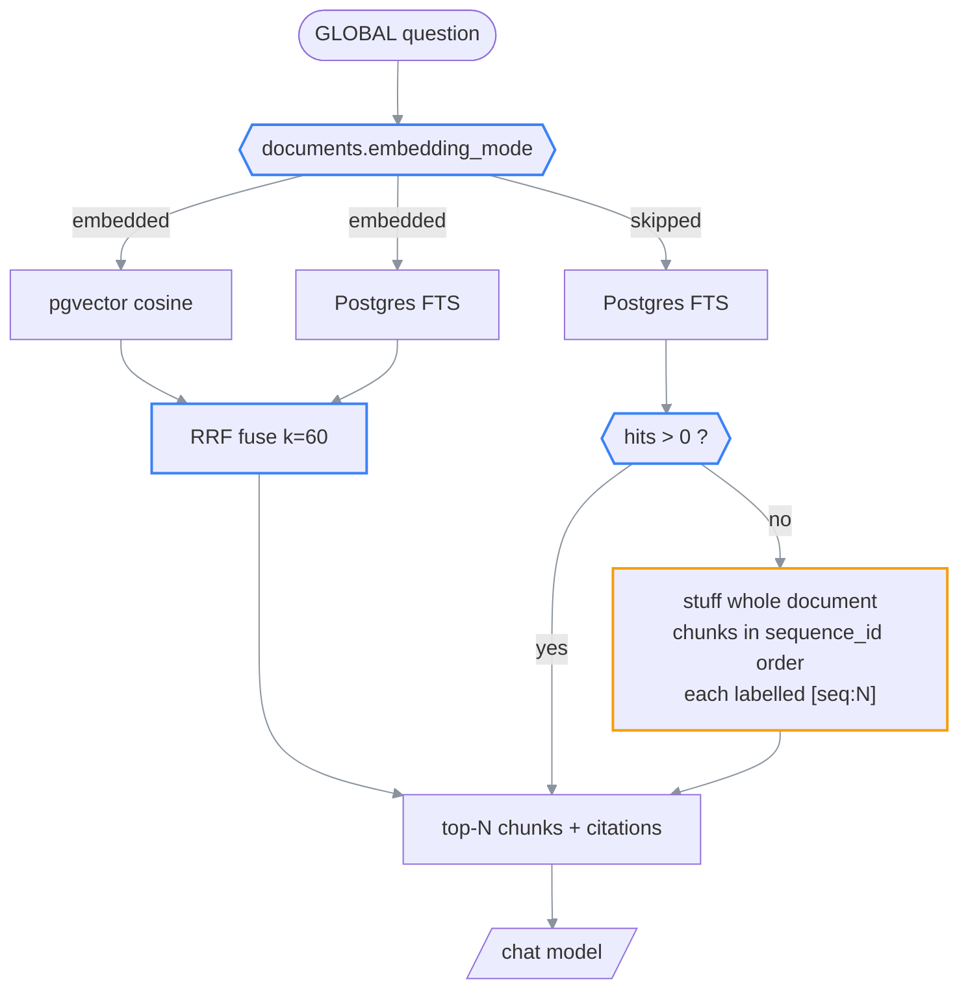

# Plan for paper-only mode: skip the embedding pass

> **What this is:** the design for skipping embedding generation on documents small enough to fit
> whole in the model's context, serving the GLOBAL route from full-text search + document stuffing
> instead of pgvector.
>
> **How to read it:** §1 the claim being tested → §2 why `doc_kind` is the wrong gate →
> §3 the gate → §4 what replaces GLOBAL → §5 the completion chain (read this one) →
> §6 code surface → §7 configuration → §8 what it actually saves → §9 failure catalog →
> §10 what never happens → §11 sharp edges → §12 segmentation.
>
> **Companions (detail):**
> [ai-backend.md](../02-architecture/ai-backend.md): the embedding lifecycle this bypasses ·
> [ingestion-pipeline.md](../02-architecture/ingestion-pipeline.md): the chain being cut ·
> [chat-and-ask.md](../02-architecture/chat-and-ask.md): the routes affected.
>
> **Status:** S1 landed · S2-S4 pending · **Reflects code as of:** 2026-07-26
> ⚠ `PAPER_ONLY_MODE` remains **off by default**: see §12 S2 before enabling it.
> **Prerequisite:** a chat model with a large context. Verified against `gemma4:31b-cloud`
> (262,144 tokens).

---

## Table of contents

1. [The claim being tested](#1-the-claim-being-tested)
2. [Why `doc_kind` is the wrong gate](#2-why-doc_kind-is-the-wrong-gate)
3. [The gate](#3-the-gate)
4. [What replaces GLOBAL](#4-what-replaces-global)
5. [⚠ The completion chain](#5--the-completion-chain)
6. [Code surface](#6-code-surface)
7. [Configuration](#7-configuration)
8. [What it actually saves](#8-what-it-actually-saves)
9. [Failure catalog](#9-failure-catalog)
10. [What never happens](#10-what-never-happens)
11. [Known sharp edges](#11-known-sharp-edges)
12. [Segmentation](#12-segmentation)

---

## 1. The claim being tested

> A 12-page research paper is roughly 12k tokens. `gemma4:31b-cloud` holds 262,144. Retrieval
> exists to select a subset of a corpus too large to read, but a paper is **5 % of the context
> window**. For documents that fit whole, the embedding pass is machinery serving no purpose.

This plan takes that claim seriously and bounds it. It does **not** propose removing embeddings
from the app: book mode makes them load-bearing, and the argument collapses the moment a document
exceeds the window. It proposes making the embedding pass **conditional on measured document
size**.

### Invariants

1. A document is either *embedded* or *skipped*, recorded explicitly, never inferred at read time.
2. A skipped document reaches `status='complete'` by the same path and in the same states as an
   embedded one. The UI must not be able to tell the difference.
3. Skipping is **reversible without re-extraction**: backfilling embeddings never re-runs MinerU.
4. LOCAL and OVERVIEW behave identically in both modes. They never touched embeddings.
5. No existing document changes behavior on upgrade. The feature is opt-in and forward-only.

---

## 2. Why `doc_kind` is the wrong gate

The obvious gate is `doc_kind == 'paper'`, since the upload flow already asks "Book or Research
paper?" and stores the answer. It is wrong for three reasons, and the third is a data-loss hazard.

| Problem | Detail |
| --- | --- |
| It is a user's intent, not a measurement | `doc_kind` selects the *reading UI*: linear reveal vs chapter navigation. It says nothing about token count. |
| "Paper" is not a size | A 90-page survey, a thesis, or a standards document is a `paper` by every UI meaning and does **not** fit alongside conversation history. |
| ⚠ **The default is `'paper'`** | `migrations.py:63`: `ADD COLUMN doc_kind TEXT NOT NULL DEFAULT 'paper'`, and `documents.py:40` falls back to `'paper'` for any unrecognised value. **Every document that predates the chooser is already labelled `paper`.** A naive `if doc_kind == 'paper': skip` would treat the entire existing library as skip-eligible and, combined with §5, could strand all of it. |

`doc_kind` survives as a **guard**, not the gate: `doc_kind == 'book'` disqualifies a document
from skipping regardless of size, because chapter navigation implies the user expects to move
around a long text.

---

## 3. The gate

Measure, then decide. `chunks.token_count` is already populated at chunk time.

```python
# [spec] app/services/ingestion.py
def should_skip_embeddings(session, document_id) -> tuple[bool, str]:
    """Decide at the end of chunking, record the reason, never re-derive later."""
    if not settings.paper_only_mode:
        return False, "feature_disabled"
    doc = get_document_sync(session, document_id)
    if doc["doc_kind"] == "book":
        return False, "doc_kind=book"
    total = session.execute(
        text("SELECT COALESCE(SUM(token_count), 0) FROM chunks WHERE document_id = :id"),
        {"id": document_id},
    ).scalar_one()
    if total > settings.paper_only_max_tokens:
        return False, f"too_large({total})"
    return True, f"fits({total})"
```

The decision is written to a new column `documents.embedding_mode` (`'embedded' | 'skipped'`) with
the reason in `documents.embedding_skip_reason`. ⚠ It is **never recomputed**: a threshold change
must not silently reclassify an existing library. Reclassification happens only via the explicit
backfill endpoint (§6).

### Threshold

`PAPER_ONLY_MAX_TOKENS` defaults to **50,000**, not 250,000. The headroom is deliberate:

| Consumer | Budget |
| --- | --- |
| Document body | ≤ 50k |
| System prompt + `DOMAIN_PREAMBLE` | ~1–2k |
| Conversation history (pre-compaction, up to 5 turns) | ~5–15k |
| Answer generation | uncapped by default (`CHAT_NUM_PREDICT=0`) |
| Safety margin for `token_count` error | see below |

⚠ `token_count` is `≈ len(plain_text) / 4`, a character heuristic, not a tokenizer. It
**undercounts math and tables badly**, which is exactly what this app's documents are full of. A
paper measured at 45k can be materially larger in real tokens. 50k against a 262k window absorbs
that; 250k would not.

---

## 4. What replaces GLOBAL

Today GLOBAL is a two-leg hybrid fused by reciprocal-rank fusion
([`retrieval.py:22-69`](../../backend/app/services/retrieval.py)). Skipping embeddings removes one
leg. The remaining leg already runs standalone: the code path
`if not fts_hits: return vec_hits[:limit]` proves the two are independent.

```text
EMBEDDED MODE (today, unchanged)
────────────────────────────────
query ──┬──► get_query_embedding ──► pgvector cosine  ──┐
        │                                               ├──► RRF fuse (k=60) ──► top-N chunks
        └──► websearch_to_tsquery ──► Postgres FTS    ──┘

SKIPPED MODE (this plan)
────────────────────────
query ──────► websearch_to_tsquery ──► Postgres FTS ──► top-N chunks
                                                          │
                                          ┌───────────────┴────────────────┐
                                    hits ≥ 1                         hits == 0
                                          │                                │
                                          ▼                                ▼
                                 cite those chunks              STUFF: all chunks in
                                 (normal citation chips)        sequence_id order,
                                                                labelled [seq:N]
                                                                     │
                                                                     ▼
                                                          model cites [seq:N] →
                                                          same citation chips
```

### (rendered)



> **Why FTS first rather than always stuffing.** Stuffing costs the whole document in prompt tokens
> on *every* GLOBAL question, which is the expensive path on a metered model, and long contexts
> measurably degrade attention to any single passage. FTS answers the literal questions cheaply;
> stuffing is the safety net for the paraphrase questions FTS structurally cannot answer, which is
> precisely the gap embeddings existed to fill.

**The citation requirement is load-bearing.** Stuffing must preserve provenance or it breaks the
citation chips in `ChatPane`, which jump the reader to a `sequence_id`. Each chunk must enter the
prompt with an explicit `[seq:N]` label and the system prompt must require the model to cite them,
the same contract `format_local_context` and `format_overview_context` already establish for their
routes. ⚠ Without this, skipped mode silently produces uncitable answers, and the regression is
invisible in testing unless someone clicks a chip.

---

## 5. ⚠ The completion chain

**This is the part that will break the app if handled carelessly.** Read it before writing code.

`_mark_document_and_job_complete` is called in exactly two places
([`tasks.py:29-45`](../../backend/app/workers/tasks.py)), and the normal path is a chain:

```text
pipeline_sync.py:266   job → EMBEDDING;  embed_document.delay()
                       doc → "processing"           ⚠ NOT complete
        │
        ▼
tasks.py:102  embed_document
        │  embeds chunks
        └─► tasks.py:129   generate_section_summaries.delay()
                    │
                    ▼
        tasks.py:156  generate_section_summaries
                    │  job → "summarizing"
                    │  section summaries + VLM figure descriptions
                    └─► tasks.py:207  _mark_document_and_job_complete()   ← the ONLY normal exit
```

Delete the `embed_document` link naively and **nothing ever marks the document complete.** It sits
at `status='processing'` with the job at `EMBEDDING` forever, and the frontend overlay, which
polls `/progress` every second, spins indefinitely with no error. There is no timeout.

The fix is to make the *dispatcher* conditional, not the chain:

```python
# [spec] app/extraction/pipeline_sync.py: replacing the unconditional dispatch at L266
skip, reason = should_skip_embeddings(session, document_id)
set_embedding_mode_sync(session, document_id, "skipped" if skip else "embedded", reason)
session.commit()

if skip:
    update_job_status_sync(session, job_id, JobStatus.SUMMARIZING)
    session.commit()
    generate_section_summaries.delay(str(document_id))   # ← chain re-attached here
else:
    update_job_status_sync(session, job_id, JobStatus.EMBEDDING)
    session.commit()
    embed_document.delay(str(document_id))
```

`generate_section_summaries` needs no changes: it reads chunks by heading and never consults
`chunk_embeddings`. It still ends by calling `_mark_document_and_job_complete`, so completion
semantics are identical in both modes. Invariant 2 holds.

### The second severed link

[`lifecycle.py:20-49`](../../backend/app/core/lifecycle.py) `_requeue_all_embeddings` dispatches
`embed_document` for **every document that has chunks**, with no filter. It fires after a
vector-dimension migration.

⚠ Left alone, a single `VECTOR_DIMENSION` change would re-embed every skipped document, silently
undoing the skip for the whole library and burning the full embedding cost, while
`documents.embedding_mode` still reads `'skipped'`, so the state becomes a lie. The query must gain
`WHERE embedding_mode = 'embedded'`.

---

## 6. Code surface

| To add/change | Touch these files (in order) | What to verify |
| --- | --- | --- |
| Mode columns | `database/schema.sql`, `database/migrations.py` (`_ensure_recent_columns`) | `embedding_mode` defaults to `'embedded'`: ⚠ existing rows must not become `'skipped'` |
| Gate | `services/ingestion.py` (new `should_skip_embeddings`) | Returns `False` for `doc_kind='book'` and for oversized docs, with the reason recorded |
| Dispatcher | `extraction/pipeline_sync.py` (~L266) | **Both branches reach `complete`**, the single most important test in this plan |
| Backfill guard | `core/lifecycle.py` (`_requeue_all_embeddings`) | Skipped docs are excluded from the re-queue |
| GLOBAL fallback | `services/retrieval.py`, `chat/global_context.py` | FTS-only path; stuffing when FTS is empty; budget enforced |
| Citation labels | `chat/prompts.py` | Stuffed chunks carry `[seq:N]`; the model is instructed to cite them |
| Figure lookup | `services/retrieval.py::search_figure_chunks` | Doc-order fallback (already present at L121-147) becomes the primary path when skipped |
| Backfill endpoint | `api/v1/endpoints/documents.py` | `POST /papers/{id}/backfill-embeddings` → flips mode, dispatches `embed_document` |
| Debug endpoint | `api/v1/endpoints/search.py` | `GET /search/vector` returns an explicit "document has no embeddings" signal, not silent `[]` |
| Config | `core/config.py`, `.env.example` | New keys in §7 |
| Docs | `ai-backend.md`, `ingestion-pipeline.md`, `configuration.md` | Same unit of work as the code |

---

## 7. Configuration

| Key | Default | Purpose |
| --- | --- | --- |
| `PAPER_ONLY_MODE` | `false` | Master switch. ⚠ Default `false` so upgrading changes nothing, per invariant 5. |
| `PAPER_ONLY_MAX_TOKENS` | `50000` | Skip threshold, measured as `SUM(chunks.token_count)`. See §3 for why not 250k. |
| `PAPER_ONLY_STUFF_BUDGET_CHARS` | `160000` | Hard ceiling on the stuffed block (≈ 40k tokens). Exceeded ⇒ truncate in `sequence_id` order and log. |
| `PAPER_ONLY_FTS_MIN_HITS` | `1` | Below this, fall through to stuffing. Raise to `3` to stuff more eagerly. |

---

## 8. What it actually saves

Per 10-page paper, against the baselines in
[operations.md §4](../01-orientation/operations.md#4-performance-baselines):

| Saving | Amount | Confidence |
| --- | --- | --- |
| Ingestion wall-clock | **30–60 s** (the whole embedding phase) | Measured baseline |
| Embedding model calls | ~80 chunks ÷ 20 per batch = 4 calls | Structural |
| Storage | ~80 rows × 1024 float32 ≈ 320 KB/paper | Arithmetic |
| Operational hazards removed | `VECTOR_DIMENSION` mismatch auto-wipe, HNSW 2000-dim limit, embedding-model pinning, all inert for skipped docs | Structural |

**The bigger prize, only if the library is *entirely* skip-eligible:** `qwen3-embedding:8b` (4.7 GB)
stops being a prerequisite at all: one fewer model to pull, one fewer thing in the "why is this
broken" surface for a new user, and the `EMBEDDING_MODEL` 404 trap in
[setup.md §6](../01-orientation/setup.md#6-first-run-traps) disappears.

**What it costs.** Every GLOBAL question that FTS cannot answer now pays the whole document in
prompt tokens instead of ~3 chunks. On a metered model that inverts the economics: cheaper
ingestion, more expensive questions. ⚠ For a paper you ask 50 questions about, skipping is probably
a net loss. For a library you ingest broadly and query rarely, it is a clear win. **The plan does
not resolve this: the threshold and the switch let the operator choose, and §12 S4 requires the
comparison be measured rather than assumed.**

---

## 9. Failure catalog

| Failure | Detected by | Behavior | User-visible | Recovery |
| --- | --- | --- | --- | --- |
| Skip decided, dispatcher not re-chained | Doc stuck at `processing` | ⚠ Overlay spins forever, no error | Upload never finishes | This is §5. Test both branches to `complete`. |
| `_requeue_all_embeddings` unfiltered | Vector-dimension change | Skipped docs silently re-embedded; `embedding_mode` becomes a lie | Slow startup, unexpected cost | Add the `WHERE` clause |
| FTS returns nothing, stuffing disabled | `fts_hits == []` | GLOBAL answers with no context | Vague, uncited answer | Enable stuffing, or backfill embeddings |
| Stuffed block exceeds the window | Char count vs budget | Truncated in `sequence_id` order | Later sections missing from the answer | Lower the skip threshold |
| Stuffing without `[seq:N]` labels | n/a | ⚠ **Silent.** Answers are correct but uncitable | Citation chips vanish | Covered by §12 S2's done-criteria |
| `token_count` undercounts a math-heavy paper | n/a | Doc classified skippable but overflows in practice | Slow/truncated answers | Lower `PAPER_ONLY_MAX_TOKENS` |
| User asks "show me a figure" on a skipped doc | n/a | Doc-order fallback returns the first figures, not the relevant ones | Wrong figure surfaced | Known limitation: §11 |
| Small chat model configured | Context overflow at request time | Provider error | Chat fails on GLOBAL only | ⚠ Do not enable this mode without a large-context model |

---

## 10. What never happens

1. **An existing document never changes mode on upgrade.** `PAPER_ONLY_MODE` defaults `false`, and
   `embedding_mode` defaults `'embedded'`.
2. **A skipped document is never stuck.** Both dispatcher branches terminate at
   `_mark_document_and_job_complete`.
3. **LOCAL and OVERVIEW never change.** Neither ever read `chunk_embeddings`.
4. **Backfilling never re-runs MinerU.** It dispatches `embed_document` against existing chunks,
   which is idempotent (`get_chunks_without_embeddings_sync` + `ON CONFLICT DO UPDATE`).
5. **A book is never skipped**, whatever its measured size.
6. **The mode is never re-derived at read time**: it is a stored fact, so changing the threshold
   cannot retroactively reclassify a library.

---

## 11. Known sharp edges

- ⚠ **Figure retrieval degrades quietly.** `search_figure_chunks` uses embeddings to find figures
  *semantically relevant* to the question and falls back to "the first figure-bearing chunks in
  document order" ([`retrieval.py:121-147`](../../backend/app/services/retrieval.py)). In skipped
  mode the fallback is the only path, so *"show me the architecture diagram"* returns Figure 1
  whether or not it is the architecture diagram. This is the clearest functional regression in the
  plan and it produces no error.
- ⚠ **Cross-paper search becomes impossible for skipped documents.** Library-wide GLOBAL is listed
  in [roadmap.md](../roadmap.md) as nearly free: `search_chunks` already accepts
  `document_id=None`. Skipped documents are invisible to it, and stuffing does not generalise
  across a library. **Adopting this plan forecloses that feature for anything skipped**, until
  backfilled.
- **Two retrieval paths must be maintained.** RRF-fused and FTS-only. Every future change to GLOBAL
  has to be reasoned about twice, and only one of them is exercised by whichever mode the
  developer happens to be running.
- **`GET /search/vector` becomes conditionally meaningless.** It must say so explicitly rather than
  returning `[]`, or it will be read as "vector search is broken".
- **The pgvector extension is still required** even with an all-skipped library: the
  `chunk_embeddings` table and its `vector` column are created unconditionally at startup. Dropping
  the dependency entirely is a larger schema change and is out of scope here.
- **This is a bet on large-context models staying cheap.** The whole argument rests on 262k
  contexts. If the deployment moves to a small local model, skipped documents become the worst of
  both worlds: no vectors *and* no room to stuff. `PAPER_ONLY_MODE` should be re-evaluated whenever
  `CHAT_MODEL` changes.

---

## 12. Segmentation

| Seg | Scope | Done when |
| --- | --- | --- |
| ~~**S1**~~ | ✅ **DONE 2026-07-26.** Schema columns, gate, conditional dispatcher, `_requeue_all_embeddings` filter, `CHUNKING→SUMMARIZING` transition. | ✅ Verified by `backend/tests/test_paper_only_mode.py`: 10 tests, all passing, including that a skipped document reaches `complete` with zero embeddings and is excluded from the re-queue. |
| **S2** | FTS-only GLOBAL + stuffing fallback + `[seq:N]` citation labels. | On a skipped paper: a literal question is answered from FTS hits; a paraphrase question falls through to stuffing; **both produce citation chips that jump the reader to the right chunk.** |
| **S3** | `POST /papers/{id}/backfill-embeddings`, figure-lookup fallback made explicit, `/search/vector` signalling. | A skipped paper can be promoted to embedded with no re-extraction, and behaves identically to one embedded at ingestion. |
| **S4** | Measure it. Same paper both ways: ingestion wall-clock, per-question prompt tokens, answer quality on the §4 question pairs. | A table of real numbers lands in this doc, and the default for `PAPER_ONLY_MODE` is chosen from it rather than assumed. |

**Not in scope:** removing pgvector, changing LOCAL/OVERVIEW/EXTERNAL, book mode, and cross-paper
search. This plan makes one pass conditional; it does not redesign retrieval.
